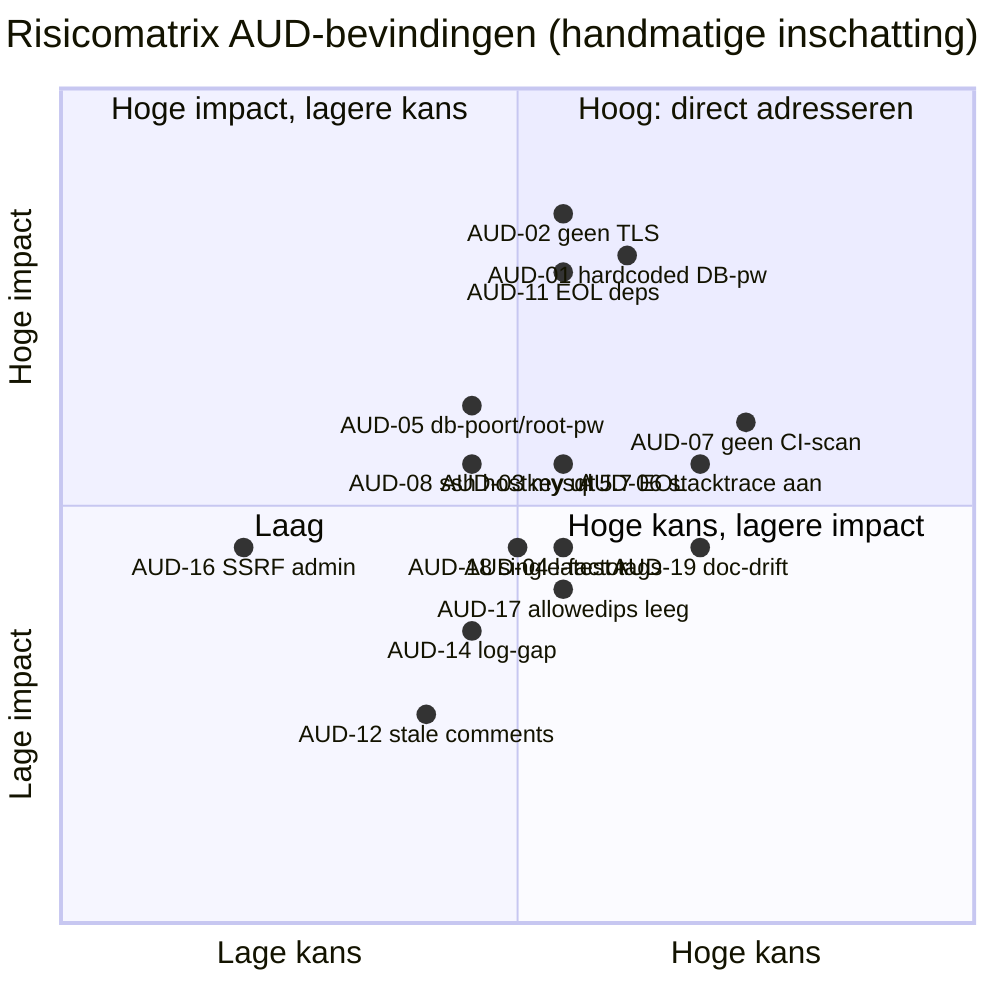
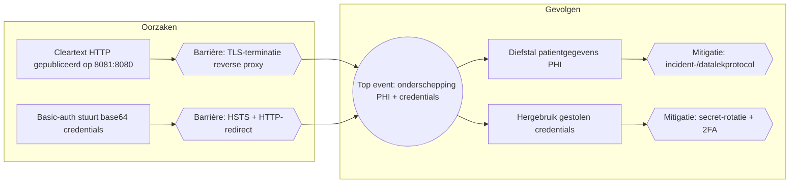
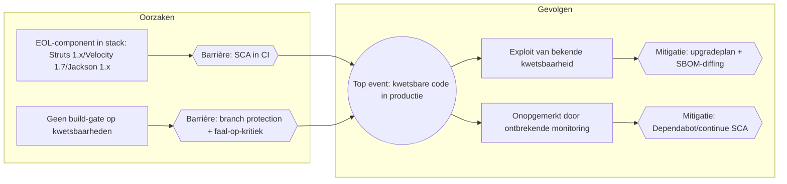
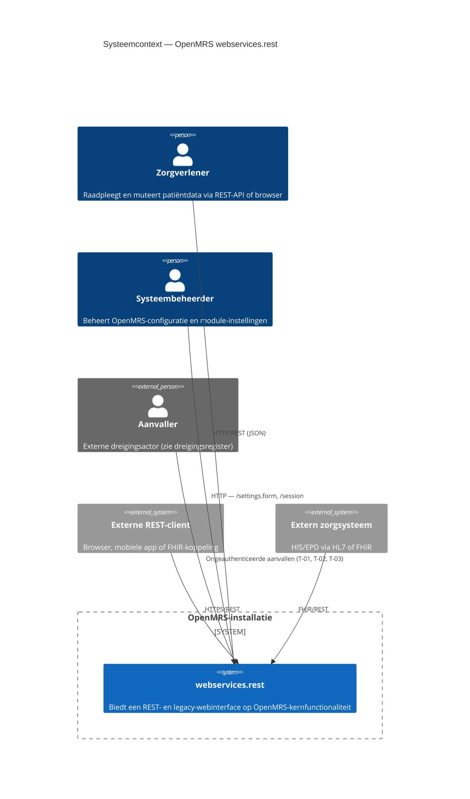
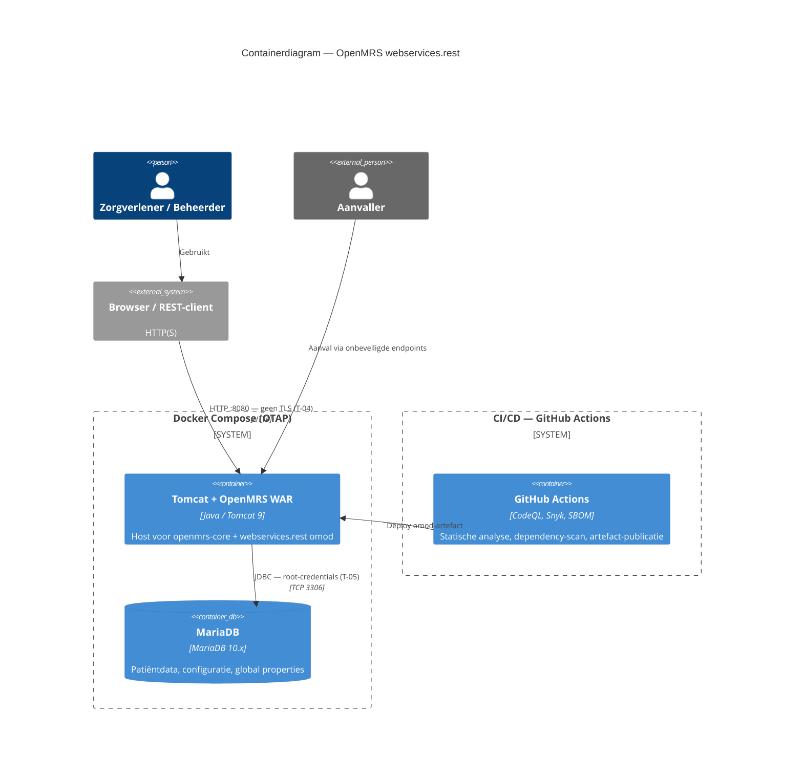
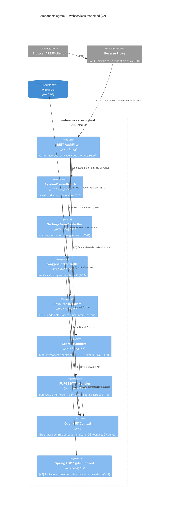
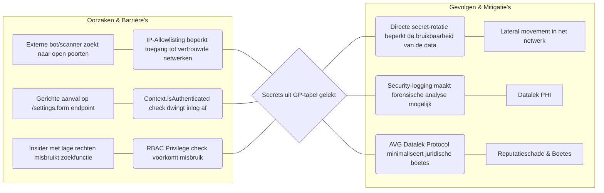
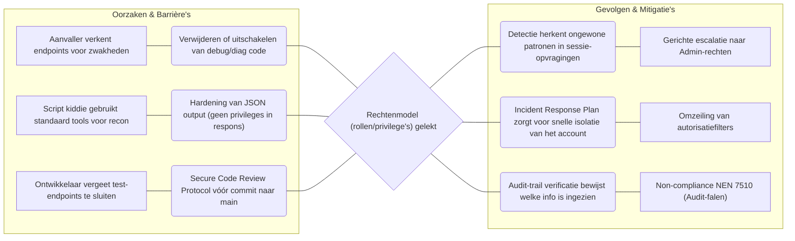

# Security- & CRA-Compliance Auditrapport — OpenMRS-module `webservices.rest`

**Object van onderzoek:** OpenMRS-module `webservices.rest` (Maven multi-module: `omod`, `omod-common`, `integration-tests`)
**Versie (module):** 3.2.0 — `pom.xml:6-7`
**Onderzochte commit:** `19d1b21a09019d2defbdcc20ca2ef961f3ad117f` (branch `Development`)
**Datum audit:** 2026-06-19
**Type audit:** *evidence-only* — elke uitspraak is herleidbaar naar een bestand:regel of een opgeslagen bijlage in `audit/bijlagen/`.
**Auditor-omgeving:** Windows 11, JDK 21, Node 22, npm/npx aanwezig; **geen** `mvn` en **geen** security-scanners lokaal beschikbaar (zie `bijlagen/tool-inventory.txt`).

> **Leeswijze (hardregel).** Dit rapport bevat uitsluitend bevindingen die met concreet projectbewijs zijn onderbouwd. Waar iets niet kon worden vastgesteld, staat dat letterlijk als **`Niet vastgesteld — [reden]`**. Ernst-niveaus zijn **handmatige inschattingen** (kwalitatief); er is **geen** CVSS berekend en er zijn **geen** CVE-nummers toegekend, omdat lokaal geen SCA-tool kon draaien (geautomatiseerde SAST gebeurt wEl in CI via CodeQL — zie §7.3/§9.3). CWE's zijn handmatige mappings op basis van het waargenomen codepatroon.

---

## 1. Executive Summary

De module `webservices.rest` is de REST-API-laag van OpenMRS. De auditscope omvat de broncode (676 `.java`-bestanden), de dependency-inventaris (SBOM + pom's) en de meegeleverde deployment-/CI-configuratie. Het project is herkenbaar als een onderwijs-/oefenproject (Avans Hogeschool, fork `OpenMRS13`) met **bewust ingebrachte zwakheden** die door het team zelf zijn gedocumenteerd in `documentation/`.

Belangrijkste, feitelijk vastgestelde observaties:

1. **De broncode van de module zelf is opvallend schoon** voor klassieke kwetsbaarheidsklassen: geen eigen cryptografie, geen rauwe SQL/command-injectie, geen native Java-deserialisatie, geen eigen XXE-parsers en geen uitgeschakelde TLS-validatie (codereview, consistent met de CodeQL-SAST; `bijlagen/sast-codeql.md`).
2. **De drie eerder gedocumenteerde "ingebrachte" kwetsbaarheden zijn in de huidige code grotendeels geremedieerd** (XSS HTML-escaped, global-property-zoek achter privilege + JSON via serializer, diagnostics-endpoint achter privilege). De bijbehorende *waarschuwende commentaarregels in de code zijn echter niet bijgewerkt* en spreken de implementatie nu tegen.
3. **Een nieuw, gestructureerd audit-logmechanisme (`RestAuditLog`) is daadwerkelijk geïmplementeerd** en goed ontworpen (log-injectie-sanitatie, geen secrets/PHI). De dekking is echter **inconsistent**: de logging ontbreekt op exact de gevoelige endpoints waarvan de projectdocumentatie claimt dat ze "opgelost" zijn.
4. **De reële, actuele risico's zitten vooral in de deployment- en CI/CD-configuratie**: een hardcoded zwak databasewachtwoord in een gecommit `docker-compose.prod.yml`, ontbrekende TLS, EOL-componenten (MySQL 5.7, en in de afhankelijkheden Struts 1.x e.a.) en het **ontbreken van SCA/secret-/SBOM-scanning in de pijplijn** (SAST is wEl aanwezig via CodeQL code scanning) — terwijl de procesdocumentatie een uitgebreide beveiligde pijplijn beschrijft die in de repository **niet bestaat**.

In totaal zijn **19 bevindingen** vastgesteld (geen vooraf bepaald aantal): 3× Hoog, 8× Middel, 8× Laag/Informatief, plus een aantal expliciet benoemde **positieve controls**. Geen enkele bevinding is met een geautomatiseerde scanner bevestigd; alle ernst-classificaties zijn handmatige inschattingen.

---

## 2. Scope en Context

### 2.1 Onderzochte versie
- **Commit:** `19d1b21a09019d2defbdcc20ca2ef961f3ad117f`, branch `Development` (vastgesteld via `git rev-parse HEAD`).
- **Module-versie:** 3.2.0 (`pom.xml:6-7`); platform-afhankelijkheid `openmrs.version = 2.8.3` (`pom.xml:42`).
- **Licentie:** Mozilla Public License 2.0 (`LICENSE`, `license-header.txt`).

### 2.2 Wel onderzocht
| Onderdeel | Bron |
| :--- | :--- |
| Broncode (676 `.java`) | `git ls-files '*.java'` |
| Dependency-manifesten | `pom.xml`, `omod/pom.xml`, `omod-common/pom.xml`, `integration-tests/pom.xml` |
| SBOM (bestaand, getrackt) | `webservices-rest-sbom.json` (CycloneDX 1.5, Snyk) |
| Deployment | `deployment/environments/docker-compose.prod.yml`, `…/docker-compose.test.yml`, `deployment/secrets/*` |
| CI/CD | `bamboo-specs/bamboo.yaml` |
| Module-configuratie | `omod/src/main/resources/config.xml` |
| Projectdocumentatie (als context, geverifieerd tegen code) | `documentation/**` |

### 2.3 Niet onderzocht / buiten scope
- **Dynamische analyse (DAST/pentest):** niet uitgevoerd — de applicatie is niet gedraaid.
- **Upstream OpenMRS-core (`openmrs-api`/`openmrs-web` 2.8.3):** alleen voor zover via deze module aangeroepen; de kernplatformcode valt buiten scope (scope `provided`).
- **Runtime-/loganalyse:** niet uitgevoerd.

### 2.4 Expliciete lijst "Niet vastgesteld"
| # | Punt | Reden |
| :--- | :--- | :--- |
| NV-1 | Concrete CVE's/CVSS van dependencies | Geen SCA-tool kon draaien (snyk/osv-scanner/trivy/grype/dependency-check **afwezig**; `mvn` afwezig) — `bijlagen/tool-inventory.txt` |
| NV-2 | Exacte CodeQL-trigger-/branchdekking en build-gating | CodeQL-SAST draait aantoonbaar (screenshot, branch `main`), maar de workflow-/triggerconfig is niet uit de repo te verifiEren (waarschijnlijk GitHub default setup) — `bijlagen/sast-codeql.md` |
| NV-3 | Volledige, verse SBOM | `mvn` afwezig → `cdxgen` viel terug op pom-parsing en leverde slechts 4 van de 203 componenten (`bijlagen/cdxgen-run.log`); de getrackte Snyk-SBOM is als basis gebruikt |
| NV-4 | Runtime-effectiviteit van `RestAuditLog` (daadwerkelijke logoutput) | Geen runtime-/loganalyse; build kon niet lokaal draaien (geen `mvn`) |
| NV-5 | Of unit-/integratietests slagen | Build niet uitvoerbaar (geen `mvn`); ook het team meldt dit (`GAP_ANALYSE_LOGGING.md:214`) |
| NV-6 | Bestaan/effectiviteit van TLS, reverse proxy, secret-store in de *werkelijke* productieomgeving | Niet in de repo aantoonbaar; deployment-/platformzaak |
| NV-7 | Branch protection / GitHub-instellingen | Niet in de repo te bewijzen; procesdoc claimt dat dit **uit** staat (`test&productie.md:41`) |
| NV-8 | Coordinated Vulnerability Disclosure-beleid | Geen `SECURITY.md`/disclosure-policy aangetroffen (`git ls-files`) |
| NV-9 | Toepasselijkheid CRA op deze module | Juridische kwalificatie als "product met digitale elementen" is geen technische vaststelling; CRA-mapping (§7) is indicatief |

---

## 3. Audit-methodologie

### 3.1 Aanpak
1. **Fase 1 — Inventarisatie (read-only):** projectstructuur, manifesten, entrypoints, secrets/auth/crypto-locaties in kaart gebracht via `git`, `Glob`, `Grep` en `Read`.
2. **Fase 2 — Analyse & tooling:** poging tot geautomatiseerde SBOM/SCA/SAST/secret-scan; bij afwezigheid van tooling **handmatige** analyse, expliciet als zodanig gelabeld.
3. **Fase 3 — Verificatie & rapportage:** elke claim uit de projectdocumentatie is onafhankelijk getoetst tegen de actuele broncode; alleen wat in de code/config aantoonbaar is, is overgenomen.

### 3.2 Tooling — uitgevoerd / gepland-maar-niet-uitvoerbaar
| Categorie | Tool | Uitgevoerd? | Versie | Resultaat / bijlage |
| :--- | :--- | :--- | :--- | :--- |
| SBOM | `cdxgen` (via `npx @cyclonedx/cdxgen@^10`) | **Ja, maar incompleet** | cdxgen 10.x (npx) | exit 0; **4/203 componenten** (mvn ontbreekt) → `bijlagen/sbom.cdxgen.cyclonedx.json`, `bijlagen/cdxgen-run.log` |
| SBOM (bestaand) | Snyk SBOM Export (door team) | n.v.t. (niet door auditor gedraaid) | snyk-cli 1.1305.1 | getrackt artefact `webservices-rest-sbom.json` → extract in `bijlagen/sbom-componenten.md` |
| SCA | snyk / osv-scanner / trivy / grype / dependency-check | **Nee** | — | Allen afwezig (`bijlagen/tool-inventory.txt`) → vulnerabilities **Niet vastgesteld** |
| SAST | **CodeQL (GitHub code scanning)** | **Ja — in CI** | CodeQL (GitHub default setup) | Actief op branch `main` (All tools working); 3 open + 2 closed alerts → `bijlagen/sast-codeql.md`, `bijlagen/sast-codeql-codescanning.png` |
| Secret-scan | gitleaks / trufflehog | **Nee** | — | Afwezig; **handmatige** patroon-grep i.p.v. → `bijlagen/secret-scan.txt` |
| Build/test | `mvn` | **Nee** | — | `mvn` afwezig; tests niet uitvoerbaar (NV-5) |

> Conform de hardregel is **geen** tool-output nagebootst. Waar een tool niet liep, is dat hierboven en in de bijlagen gemarkeerd.

---

## 4. Risico-analyse en bevindingen

**Ernst-schaal (kwalitatief, handmatige inschatting):** Kritiek · Hoog · Middel · Laag · Informatief.
**Bron van ernst:** voor *alle* bevindingen geldt "handmatige inschatting (geen geautomatiseerde tool)", tenzij anders vermeld.

### Overzicht
| ID | Bevinding | Ernst | Locatie (kern) |
| :--- | :--- | :--- | :--- |
| AUD-01 | Hardcoded zwak DB-wachtwoord in gecommit `docker-compose.prod.yml` | **Hoog** | `docker-compose.prod.yml:33,39` |
| AUD-02 | Geen TLS/transportbeveiliging in deployment | **Hoog** | `docker-compose.prod.yml:19-20` |
| AUD-03 | EOL-database-image `mysql:5.7` | Middel | `docker-compose.prod.yml:4` |
| AUD-04 | Ongepinde container-images (`:latest`) | Middel | `docker-compose.prod.yml:17` |
| AUD-05 | DB-poort publiek + gedeeld root/app-wachtwoord | Middel | `docker-compose.prod.yml:7-8`; `secrets/prod.env` |
| AUD-06 | Stacktrace-details standaard AAN → information disclosure | Middel | `config.xml:64-67`; `RestUtil.java:855-865` |
| AUD-07 | Onvolledige CI-security: SAST (CodeQL) aanwezig, maar SCA/secret/SBOM niet aangetoond | Middel | `bamboo.yaml`; `bijlagen/sast-codeql.md` |
| AUD-08 | CI-release: SSH host-key-verificatie uitgeschakeld | Middel | `bamboo.yaml:109` |
| AUD-09 | CI: `chmod -R 777` | Laag | `bamboo.yaml:39` |
| AUD-10 | Build/test op EOL JDK 8 | Laag/Info | `bamboo.yaml:13,37`; `pom.xml:43-44` |
| AUD-11 | EOL/verouderde dependencies (CVE niet geverifieerd) | **Hoog** (handmatig) | SBOM / `bijlagen/sbom-componenten.md` |
| AUD-12 | Stale security-commentaren die implementatie tegenspreken | Laag | `SessionController1_9.java:168`; `SettingsFormController.java:44-45` |
| AUD-13 | Dode/ongebruikte `token`-parameter (schijnbeveiliging) | Laag/Info | `SessionController1_9.java:172` |
| AUD-14 | Audit-logging ontbreekt op gevoelige endpoints (docs claimen "opgelost") | Laag | `SettingsFormController.java`, `SwaggerDocController.java`, `SessionController1_9.java` |
| AUD-15 | Kale `NullPointerException` als control-flow | Laag/Info | `ChangePasswordController1_8.java:84` |
| AUD-16 | Mogelijke SSRF in module-install (admin-gated, upstream) | Laag/Info | `ModuleActionResource1_8.java:159` |
| AUD-17 | IP-allowlist standaard leeg ("iedereen toegestaan") | Laag/Info | `config.xml:54-57` |
| AUD-18 | Authenticatie single-factor (HTTP Basic) | Laag/Info | `AuthorizationFilter.java:88-115` |
| AUD-19 | Documentatie spreekt de implementatie tegen (drift) | Middel | `documentation/**` vs. code |
| AUD-20 | Te ruime reguliere-expressie-range (`[A-z]`) in logparser | Middel (CodeQL) | `ServerLogActionWrapper.java:70` |

---

### AUD-01 — Hardcoded zwak databasewachtwoord in gecommitte productie-compose
**Ernst:** Hoog (handmatig) · **CWE-798 / CWE-259 (handmatige mapping)** · **Bron:** `docker-compose.prod.yml` (getrackt: `git ls-files`), `bijlagen/secret-scan.txt` sectie A.

**Locatie & letterlijk fragment** — `deployment/environments/docker-compose.prod.yml:33` en `:39`:
```yaml
      - DB_PASSWORD=openmrs
...
      - JAVA_OPTS=-Dconnection.url=jdbc:mysql://db:3306/openmrs?... -Dconnection.username=openmrs -Dconnection.password=openmrs -Dauto_update_database=true
```
**Impact/exploiteerbaarheid:** het productie-databasewachtwoord (`openmrs`, tevens een triviaal default) staat **letterlijk in een in git gecommit bestand**. Iedereen met leestoegang tot de repository kent het productie-DB-wachtwoord. In tegenstelling tot `docker-compose.test.yml` (dat variabelen `${DB_PASSWORD}` gebruikt, regels 39/45) is de productie-compose hard gecodeerd. Dit ondermijnt de overigens correcte secret-aanpak (zie positieve control P-3).
**Remediatie:** verwijder alle hardcoded wachtwoorden uit `docker-compose.prod.yml`; gebruik uitsluitend `env_file`/secrets (zoals in test); roteer het wachtwoord; kies een sterk, uniek wachtwoord.

---

### AUD-02 — Geen TLS / transportbeveiliging in deployment
**Ernst:** Hoog (handmatig) · **CWE-319 (cleartext transmission)** · **Bron:** `docker-compose.prod.yml`, `docker-compose.test.yml`.

**Locatie & fragment** — `deployment/environments/docker-compose.prod.yml:16-20`:
```yaml
  openmrs:
    image: openmrs/openmrs-reference-application-distro:latest
    ports:
      - "8081:8080"
```
**Impact/exploiteerbaarheid:** de container publiceert HTTP (8080) zonder TLS-terminatie of reverse proxy in de compose. De module authenticeert via **HTTP Basic** (`AuthorizationFilter.java:88-115`), waarbij credentials base64-gecodeerd — *niet versleuteld* — worden meegestuurd. Bij cleartext-transport zijn zowel Basic-auth-credentials als patiëntgegevens (PHI) onderschepbaar (MITM). Het `JAVA_OPTS` bevat bovendien `connection.url=jdbc:mysql://…` zonder TLS-parameters.
**Remediatie:** TLS-terminatie via reverse proxy/ingress; HTTP→HTTPS-redirect + HSTS; poort 8080 niet direct publiceren.
**Opmerking t.o.v. documentatie:** `THREAT_MODEL.md:138` en `security.md:145` beschrijven "poort 80"; de *actuele* compose gebruikt `8081:8080` (vandaar dit op de feitelijke regel gecorrigeerd).

---

### AUD-03 — End-of-Life database-image `mysql:5.7`
**Ernst:** Middel (handmatig) · **CWE-1104 (use of unmaintained components)** · **Bron:** `docker-compose.prod.yml:4`, `docker-compose.test.yml:4`.

**Locatie & fragment** — `deployment/environments/docker-compose.prod.yml:3-4`:
```yaml
  db:
    image: mysql:5.7
```
**Impact:** MySQL 5.7 heeft het einde van de premier/extended support bereikt (gedocumenteerd: Oracle EOL oktober 2023). EOL betekent geen security-patches meer. *De exacte CVE-status is niet geverifieerd (geen scanner).* De versie zelf is hard bewijs uit het bestand; de EOL-kwalificatie is publiek gedocumenteerd algemeen feit.
**Remediatie:** migreer naar een ondersteunde versie (bijv. MySQL 8.x of MariaDB LTS) en pin de digest.

---

### AUD-04 — Ongepinde container-images (`:latest`)
**Ernst:** Middel (handmatig) · **CWE-1357 (reliance on uncontrolled component)** · **Bron:** `docker-compose.prod.yml:17`, `docker-compose.test.yml:24`.

**Fragment** — `docker-compose.prod.yml:17`:
```yaml
    image: openmrs/openmrs-reference-application-distro:latest
```
**Impact:** `:latest` is niet-reproduceerbaar; builds kunnen ongemerkt van inhoud veranderen → supply-chain-/reproduceerbaarheidsrisico en moeilijke forensiek.
**Remediatie:** pin op een specifieke versie + image-digest (`@sha256:…`).

---

### AUD-05 — DB-poort publiek geëxposeerd + gedeeld root/app-wachtwoord
**Ernst:** Middel (handmatig) · **CWE-668 / ontbrekende functiescheiding** · **Bron:** `docker-compose.prod.yml:7-8`; `deployment/secrets/prod.env` (lokaal, gitignored — `bijlagen/secret-scan.txt` sectie D).

**Fragment** — `docker-compose.prod.yml:6-8`:
```yaml
    command: --character-set-server=utf8 ... --lower_case_table_names=1
    ports:
      - "3306:3306"
```
en `deployment/secrets/prod.env:5-6,10` (lokaal aanwezig, niet gecommit):
```
MYSQL_PASSWORD=openmrs
MYSQL_ROOT_PASSWORD=openmrs
DB_PASSWORD=openmrs
```
**Impact:** de MySQL-poort 3306 wordt naar de host gepubliceerd (vergroot aanvalsoppervlak), en het **root-wachtwoord is gelijk aan het applicatie-wachtwoord** (geen functiescheiding) → compromittering van het app-account = DB-root.
**Remediatie:** DB-poort niet publiceren (alleen interne Docker-netwerktoegang); apart least-privilege app-account; sterke, unieke wachtwoorden per rol.

---

### AUD-06 — Stacktrace-details standaard AAN → information disclosure
**Ernst:** Middel (handmatig) · **CWE-209 (information exposure through an error message)** · **Bron:** `config.xml`, `RestUtil.java`.

**Locatie & fragment 1** — `omod/src/main/resources/config.xml:64-68` (registratie global property, **default `true`**):
```xml
	<globalProperty>
		<property>@MODULE_ID@.enableStackTraceDetails</property>
		<defaultValue>true</defaultValue>
		<description>If the value of this setting is "true", then the details of the stackTrace would be shown in the error response. However, the recommendation is to keep it as "false", from the Security perspective, to avoid leaking implementation details.</description>
	</globalProperty>
```
**Locatie & fragment 2** — `omod-common/.../RestUtil.java:855-865`:
```java
		map.put("code", stackTraceElement.getClassName() + ":" + stackTraceElement.getLineNumber());
		if ("true".equalsIgnoreCase(stackTraceDetailsEnabledGp)) {
			map.put("detail", ExceptionUtils.getStackTrace(ex));
		} else {
			map.put("detail", "");
		}
	} else { ... }
	map.put("rawMessage", ex.getMessage());
```
**Impact/exploiteerbaarheid:** de global property wordt **met default `true` geregistreerd** (`config.xml:66`), terwijl de beschrijving in dezelfde regel `false` aanraadt "from the Security perspective". De in-code fallback (`RestUtil.java:850`, `getGlobalProperty(..., "false")`) geldt alleen als de property *helemaal niet bestaat*; door de registratie bestaat hij wél en staat hij op `true`. Gevolg: **volledige stacktraces** worden standaard in elke foutrespons teruggegeven, plus altijd `code` = `klasse:regelnummer` (regel 855) en `rawMessage` = ruwe exceptie-message (regel 865). Dit lekt interne klassenamen, regelnummers, frameworkversies en mogelijk ingezonden data.
**Opmerking t.o.v. documentatie:** `security.md:136-140` (S-4) stelt dat de default `false` is ("goed"); de *feitelijke* config-default is `true`. Deze audit corrigeert dat op basis van `config.xml:66`.
**Remediatie:** zet `enableStackTraceDetails` default op `false`; laat `code`/`rawMessage` weg in productie; geef een generieke clientmelding en log details uitsluitend server-side.

---

### AUD-07 — Onvolledige security-scanning in CI/CD (SAST aanwezig; SCA/secret/SBOM niet aangetoond)
**Ernst:** Middel (handmatig) · **Proces-/CRA-gap** · **Bron:** `bamboo-specs/bamboo.yaml`; CodeQL-screenshot (`bijlagen/sast-codeql.md`).

**Bewijs — wat er WEL is:** GitHub **Code Scanning met CodeQL** draait aantoonbaar op de repository (screenshot, branch `main`: "All tools are working as expected", 3 open + 2 closed alerts) → `bijlagen/sast-codeql.md`, `bijlagen/sast-codeql-codescanning.png`. CodeQL is hoogstwaarschijnlijk geconfigureerd via GitHub **default setup** (geen `.github/workflows/`-bestand in `main`/`Development`/`CodeQL`-branch; `git ls-tree`), wat verklaart waarom een bestand-gebaseerde controle geen workflow vond.
**Bewijs — wat ONTBREEKT / niet aangetoond is:** de getrackte CI-definitie `bamboo-specs/bamboo.yaml` (stages *Build and Test*, *Deploy*, *Release*) bevat **geen** SCA-, secret- of SBOM-stap; er is **geen** `dependabot.yml` en **geen** aangetoonde SCA/secret-scan/SBOM-generatie in CI. Of de build/PR wordt **geblokkeerd** bij CodeQL High-alerts is niet uit de repo te verifiEren; `test&productie.md:41` meldt dat branch protection **uit** staat.
**Impact:** code-issues worden door CodeQL gedetecteerd (SAST OK), maar **kwetsbare dependencies (CVE) en gelekte secrets** worden niet automatisch tegengehouden vóór deploy/release, en zonder build-gating kan een High-alert alsnog doorstromen.
**Remediatie:** vul de CI aan met SCA (OWASP Dependency-Check/Trivy/osv-scanner), secret-scanning en SBOM-generatie; activeer branch protection + build-gating op CodeQL High-alerts.

---

### AUD-08 — CI-release: SSH host-key-verificatie uitgeschakeld
**Ernst:** Middel (handmatig) · **CWE-295 (improper certificate/host validation)** · **Bron:** `bamboo.yaml`.

**Fragment** — `bamboo-specs/bamboo.yaml:109`:
```
          -e GIT_SSH_COMMAND='ssh -i /root/.ssh/id_rsa -o UserKnownHostsFile=/dev/null -o StrictHostKeyChecking=no' \
```
**Impact:** in de release-job wordt SSH-host-key-verificatie volledig uitgeschakeld (`StrictHostKeyChecking=no` + `UserKnownHostsFile=/dev/null`). Hierdoor is een man-in-the-middle op de git-push (release-commit met tags) niet te detecteren.
**Remediatie:** gebruik een vastgelegde `known_hosts` met de juiste host-key; verwijder `StrictHostKeyChecking=no`.

---

### AUD-09 — CI: overmatig brede permissies (`chmod -R 777`)
**Ernst:** Laag (handmatig) · **CWE-732 (incorrect permission assignment)** · **Bron:** `bamboo.yaml`.

**Fragment** — `bamboo-specs/bamboo.yaml:39`:
```
        docker run -v m2-repo:/root/.m2/repository -v ${PWD}:/module --rm -w="/module" ${IMAGE} bash -c 'mvn clean package && chmod -R 777 .'
```
**Impact:** `chmod -R 777` op de hele workspace zet world-writable rechten; in een gedeelde build-omgeving vergroot dit het risico op manipulatie van build-artefacten. (Hier ingegeven door eigenaarschapsproblemen van Docker-volumes.)
**Remediatie:** gebruik gerichte eigenaarschaps-/permissiecorrectie (bv. `--user`/`chown` op specifieke paden) i.p.v. recursief 777.

---

### AUD-10 — Build/test op End-of-Life JDK 8
**Ernst:** Laag/Informatief (handmatig) · **Bron:** `bamboo.yaml`, `pom.xml`.

**Fragment** — `bamboo.yaml:37` en `pom.xml:43-44`:
```
        export IMAGE="maven:3.9.9-amazoncorretto-8"
```
```xml
		<maven.compiler.source>1.8</maven.compiler.source>
		<maven.compiler.target>1.8</maven.compiler.target>
```
**Impact:** de module wordt gebouwd/getest tegen Java 8. Dit is een onderhoudbaarheids- en (indirect) beveiligingsaandachtspunt; let wel: dit is grotendeels bepaald door de OpenMRS-platformcompatibiliteit (`openmrs.version 2.8.3`).
**Remediatie:** volg de OpenMRS-platformroadmap richting een ondersteunde JDK-LTS.

---

### AUD-11 — EOL/verouderde dependencies in de afhankelijkheidsstack
**Ernst:** Hoog (handmatige inschatting o.b.v. EOL-status; **CVE/CVSS Niet vastgesteld — geen SCA-tool**) · **Bron:** `webservices-rest-sbom.json` → `bijlagen/sbom-componenten.md`.

**Bewijs (versies hard uit SBOM, met purl):**
| Component | Versie | Status (publiek gedocumenteerd) |
| :--- | :--- | :--- |
| `org.apache.struts:struts-core` / `struts-taglib` / `struts-tiles` | 1.3.8 | **Struts 1.x — EOL sinds 2013** |
| `org.apache.velocity:velocity` | 1.7 | **EOL** |
| `org.codehaus.jackson:jackson-core-asl` / `jackson-mapper-asl` | 1.9.14-MULE-002 | **Jackson 1.x — EOL** |
| `org.springframework:spring-core/web/webmvc/beans` | 5.3.30 | 5.3.x (OSS-EOL-lijn) |
| `org.codehaus.groovy:groovy-all` | 2.4.21 | oude major |
| `commons-lang:commons-lang` | 2.4 | **EOL** (vervangen door `commons-lang3`) |
| `mysql:mysql-connector-java` | 8.0.30 | verouderd binnen 8.0 |
| `org.hibernate:hibernate-core` | 5.6.15.Final | 5.x |
| `xerces:xercesImpl` | 2.12.2 | te verifiëren |
| `org.yaml:snakeyaml` | 2.4 | recent (ok) |
| `org.apache.logging.log4j:log4j-core` | 2.22.1 | post-Log4Shell (ok) |

**Aanvullend codebewijs:** Jackson 1.x wordt **actief in de code gebruikt** — `SettingsFormController.java:61` instantieert `org.codehaus.jackson.map.ObjectMapper`.
**Impact/exploiteerbaarheid:** Struts 1.x/Velocity 1.7/Jackson 1.x staan bekend om kwetsbaarheidsklassen (deserialisatie, template-injectie) maar krijgen geen patches. De meeste van deze componenten komen **transitief via `openmrs-api`/`openmrs-web` 2.8.3 (`provided`)** binnen (`pom.xml:60-83`); mitigatie ligt deels upstream. **Zonder SCA zijn geen concrete CVE's bevestigd.**
**Remediatie:** voer OWASP Dependency-Check/Trivy/osv-scanner in CI; stel een upgradeplan op (eerst Struts/Velocity/Jackson 1.x), in afstemming met de platformversie; verwijder ongebruikte `commons-lang` 2.4.

---

### AUD-12 — Stale security-commentaren die de implementatie tegenspreken
**Ernst:** Laag (handmatig) · **CWE-1116 (inaccurate comments) — handmatige mapping** · **Bron:** `SessionController1_9.java`, `SettingsFormController.java`.

**Fragment 1** — `SessionController1_9.java:165-173`:
```java
	 * NOTE: No authorization check — accessible to any caller (authenticated or not).
	 */
	@RequestMapping(value = "/diag", method = RequestMethod.GET)
	@ResponseBody
	public Object getDiagnostics(@org.springframework.web.bind.annotation.RequestParam(value = "token", required = false) String token) {
		Context.requirePrivilege(RestConstants.PRIV_VIEW_RESTWS);
```
**Fragment 2** — `SettingsFormController.java:44-53`:
```java
	 * NOTE: No authorization check — any unauthenticated caller can enumerate global properties,
	 * potentially leaking sensitive configuration values (A01 Broken Access Control).
	 ...
	public String searchProperties(...) throws Exception {
		requireManageGlobalPropertiesPrivilege();
```
**Impact:** het commentaar beschrijft een kwetsbaarheid ("geen autorisatiecheck") die in de code **wél** wordt afgedwongen (`Context.requirePrivilege(...)`, resp. `requireManageGlobalPropertiesPrivilege()` → `Context.requirePrivilege("Manage Global Properties")`, `SettingsFormController.java:65`). Misleidende commentaren vergroten het risico op regressie (een ontwikkelaar die "fixt" wat al gefixt is, of de check verwijdert "omdat het commentaar zegt dat hij er niet is").
**Remediatie:** werk de commentaarregels bij zodat ze de geïmplementeerde autorisatie weergeven.

---

### AUD-13 — Dode/ongebruikte `token`-parameter (schijnbeveiliging)
**Ernst:** Laag/Informatief (handmatig) · **Bron:** `SessionController1_9.java:172`.

**Fragment** — `SessionController1_9.java:172` (de `token`-parameter wordt nergens gelezen of gevalideerd):
```java
	public Object getDiagnostics(@org.springframework.web.bind.annotation.RequestParam(value = "token", required = false) String token) {
```
**Impact:** suggereert beveiliging die er niet is (de parameter wordt niet gebruikt); verwarrend en onderhoudsrisico. De feitelijke toegangscontrole loopt via `Context.requirePrivilege` (regel 173).
**Remediatie:** verwijder de ongebruikte parameter, of implementeer en valideer hem expliciet.

---

### AUD-14 — Audit-logging ontbreekt op de gevoelige endpoints die de documentatie als "opgelost" markeert
**Ernst:** Laag (handmatig) · **Bron:** `git grep "RestAuditLog\."` (zie onder) vs. `GAP_ANALYSE_LOGGING.md` STAP 5.

**Bewijs:** `RestAuditLog` wordt aangeroepen in `AuthorizationFilter.java`, `MainResourceController.java`, `ChangePasswordController1_8.java`, `PasswordResetController2_2.java`, `ClearDbCacheController2_0.java`, `SearchIndexController2_0.java` (geverifieerd met `git grep`). Het wordt **niet** aangeroepen in:
- `SettingsFormController.java` (volledige file gelezen; `searchProperties`/`handleSubmission` bevatten geen `RestAuditLog`-aanroep),
- `SwaggerDocController.java` (volledige file gelezen; geen `RestAuditLog`-aanroep),
- `SessionController1_9.java` (`getDiagnostics`/`delete` bevatten geen `RestAuditLog`-aanroep).

`GAP_ANALYSE_LOGGING.md:172-173` (STAP 5, G4/G5) claimt echter dat juist voor `gp-search`, `session-diag`, `apidocs-debug` en `logout` **compenserende** audit-logging is toegevoegd ("Opgelost").
**Impact:** voor exact de historisch gevoelige/ingebrachte endpoints is er geen audittrail; misbruik blijft onzichtbaar — terwijl de documentatie het tegendeel suggereert. (8.15/8.16 NEN 7510; CRA "security info via logging".)
**Remediatie:** voeg de geclaimde `RestAuditLog.sensitiveAccess(...)`/`write(...)`-aanroepen daadwerkelijk toe aan deze drie controllers, of corrigeer de documentatie.

---

### AUD-15 — Kale `NullPointerException` als control-flow
**Ernst:** Laag/Informatief (handmatig) · **CWE-476-patroon / code smell** · **Bron:** `ChangePasswordController1_8.java`.

**Fragment** — `ChangePasswordController1_8.java:83-90`:
```java
		if (user == null || user.getUserId() == null) {
			throw new NullPointerException();
		} else {
			userService.changePassword(user, newPassword);
			...
		}
```
**Impact:** een `NullPointerException` wordt gebruikt om "niet gevonden" te signaleren; weliswaar opgevangen door `handleNotFound` (`:94-100`) en omgezet naar HTTP 404, maar dit is fragiel en verbergt de werkelijke intentie. Geen direct beveiligingslek (faalt naar 404).
**Remediatie:** gooi een betekenisvolle, specifieke exceptie (bv. een "object not found"-exceptie).

---

### AUD-16 — Mogelijke SSRF in module-install (admin-gated, upstream)
**Ernst:** Laag/Informatief (handmatig) · **CWE-918 (SSRF)** · **Bron:** `ModuleActionResource1_8.java`.

**Fragment** — `ModuleActionResource1_8.java:159-162`:
```java
			URL downloadUrl = new URL(installUri);
			String fileName = FilenameUtils.getName(downloadUrl.getPath());
			InputStream inputStream = ModuleUtil.getURLStream(downloadUrl);
			moduleFile = ModuleUtil.insertModuleFile(inputStream, fileName);
```
**Impact/exploiteerbaarheid:** de server haalt een door de aanroeper opgegeven URL op (klassieke SSRF-vector). De functionaliteit is echter **module-installatie**, die in OpenMRS een super-admin-privilege vereist; een actor met dat recht kan sowieso al willekeurige (module-)code uitvoeren. De marginale extra impact is daarom laag. Dit is upstream OpenMRS-functionaliteit.
**Remediatie:** indien gewenst: allowlist van toegestane download-hosts; netwerk-egress-restricties; bevestig de privilege-gate.

---

### AUD-17 — IP-allowlist standaard leeg ("iedereen toegestaan")
**Ernst:** Laag/Informatief (handmatig) · **Bron:** `config.xml`.

**Fragment** — `config.xml:53-57`:
```xml
    <globalProperty>
        <property>@MODULE_ID@.allowedips</property>
        <defaultValue></defaultValue>
        <description>A comma-separate list of IP addresses that are allowed to access the web services. An empty string allows everyone to access all ws.
```
**Impact:** de enige netwerkbegrenzing (IP-allowlist in `AuthorizationFilter`) staat standaard **open**. De filter gebruikt overigens `request.getRemoteAddr()` (`AuthorizationFilter.java:70`) — het werkelijke socket-IP, dus **niet** direct spoofbaar via `X-Forwarded-For` op applicatieniveau (positief; let wel op `RemoteIpValve`/proxyconfiguratie op platformniveau).
**Remediatie:** documenteer en, waar passend, configureer een restrictieve allowlist; borg dat een eventuele reverse proxy `X-Forwarded-For` correct afhandelt.

---

### AUD-18 — Authenticatie is single-factor (HTTP Basic)
**Ernst:** Laag/Informatief (handmatig) · **Bron:** `AuthorizationFilter.java`, `BaseRestController.java`.

**Fragment** — `AuthorizationFilter.java:103-113` en `BaseRestController.java:69`:
```java
				String decoded = new String(Base64.decodeBase64(basicAuth), Charset.forName("UTF-8"));
				...
				String[] userAndPass = decoded.split(":");
				Context.authenticate(userAndPass[0], userAndPass[1]);
```
```java
				response.addHeader("WWW-Authenticate", "Basic realm=\"OpenMRS at " + RestConstants.URI_PREFIX + "\"");
```
**Impact:** de REST-laag leunt op single-factor Basic-authenticatie. Voor een systeem dat gezondheidsgegevens verwerkt is dit een aandachtspunt (NEN 7510 A.8.5 noemt 2FA voor PHI). De module kan dit niet zelfstandig afdwingen (platform-/IdP-zaak).
**Remediatie:** 2FA/OIDC op platform-/gatewayniveau.

---

### AUD-19 — Documentatie spreekt de actuele implementatie tegen (drift)
**Ernst:** Middel (handmatig) · **Bron:** diverse `documentation/**` vs. code (zie verwijzingen).

**Bewijs (samengevat; alle individueel geverifieerd):**
| Documentclaim | Actuele code | Bewijs |
| :--- | :--- | :--- |
| Reflected XSS in `/apiDocs/debug` (S-2/T-03) | **Geremedieerd** — `HtmlUtils.htmlEscape(tag)` | `SwaggerDocController.java:28` |
| Global-property-zoek zonder autorisatie + JSON via string-concat (S-3/T-01) | **Geremedieerd** — privilege-check + `ObjectMapper` | `SettingsFormController.java:53,61,65` |
| `/session/diag` zonder autorisatie (S-1/T-02) | **Geremedieerd** — `Context.requirePrivilege(PRIV_VIEW_RESTWS)` | `SessionController1_9.java:173` |
| Stacktrace-default = `false` ("goed", S-4) | **Onjuist** — default = `true` | `config.xml:66` |
| Audit-logging op gp-search/diag/debug "Opgelost" | **Niet in code** voor die endpoints | zie AUD-14 |
| GitHub Actions security-pijplijn (CodeQL/Snyk/SonarCloud/Dependabot) | **Deels:** CodeQL-codescanning draait (GitHub default setup, geen workflow-bestand); Snyk/SonarCloud/Dependabot niet aangetoond | CodeQL-screenshot (`bijlagen/sast-codeql.md`); afwezigheid `.github/`/`dependabot.yml` |

**Impact:** beslissers die op de documentatie afgaan, krijgen een onjuist beeld (zowel te negatief — de drie "ingebrachte" lekken zijn al gedicht — als te positief — pijplijn/logging bestaan deels niet). Voor CRA/NEN-compliance is **accurate, herleidbare documentatie** een eis op zich.
**Remediatie:** synchroniseer `documentation/**` met de actuele code (datum/commit per document); behandel security-documentatie als versioned artefact.

---

### AUD-20 — Te ruime reguliere-expressie-range (`[A-z]`) in serverlog-parser
**Ernst:** Middel — **bron van ernst: CodeQL (geautomatiseerde SAST), niet handmatig** · **CWE-1333 (ReDoS) / CWE-185 (incorrecte regex) — handmatige mapping; CodeQL-regel "overly permissive regular expression range"** · **Bron:** CodeQL code scanning (`bijlagen/sast-codeql.md`, screenshot `sast-codeql-codescanning.png`), in code geverifieerd.

**Locatie & letterlijk fragment** — `omod-common/.../helper/ServerLogActionWrapper.java:70`:
```java
String regExPatternType = "(INFO|ERROR|WARN|DEBUG)\\s.*?[-].*?\\s((?:[A-z][A-z].+))\\s[|](.*?)[|]\\s((.*\\n*)+)";
```
**Impact/exploiteerbaarheid:** de tekenklasse `[A-z]` is te ruim: hij omvat naast letters ook de zes ASCII-tekens tussen `Z` en `a`. Het patroon bevat bovendien geneste/overlappende kwantoren (zie fragment) die bij geprepareerde invoer tot catastrofale backtracking (ReDoS) kunnen leiden. CodeQL meldt twee Medium-alerts (#4/#5) op deze regel. De parser verwerkt serverlog-regels (admin-/diagnostiekfunctionaliteit).
**Remediatie:** vervang `[A-z]` door `[A-Za-z]`; vereenvoudig de geneste kwantoren of begrens de invoer / gebruik een lineaire matcher.

---

### 4.1 Positieve controls (aantoonbaar aanwezig)
| ID | Positieve control | Bewijs |
| :--- | :--- | :--- |
| P-1 | Gestructureerde audit-logging met log-injectie-sanitatie, numeriek user-id i.p.v. naam, geen secrets/PHI | `RestAuditLog.java:108-152`; geïntegreerd in `AuthorizationFilter.java:72-121`, `MainResourceController.java:77-259` |
| P-2 | Eerder gedocumenteerde lekken geremedieerd (XSS-escape, privilege-checks, serializer) | `SwaggerDocController.java:28`; `SettingsFormController.java:53,61`; `SessionController1_9.java:173` |
| P-3 | Echte secrets correct uit git gehouden | `.gitignore` (`deployment/secrets/*.env`, `*.properties`); alleen `*.example` getrackt (`git ls-files`) |
| P-4 | Module-broncode vrij van eigen crypto / rauwe SQL/command-injectie / native deserialisatie / XXE / TLS-bypass | Codereview, consistent met CodeQL (geen alerts in die klassen). NB: CodeQL vond wEl een te ruime regex-range (AUD-20) en XSS op `main` |
| P-5 | CycloneDX-SBOM aanwezig (supply-chain-inventaris) | `webservices-rest-sbom.json` (203 componenten) |
| P-6 | Wachtwoord wordt nooit gelogd bij wachtwoordwijziging | `ChangePasswordController1_8.java:58-59`; `RestAuditLog`-ontwerp (`RestAuditLog.java:28-31`) |

---

## 5. SBOM en Supply Chain Security

**Primaire bron:** `webservices-rest-sbom.json` — CycloneDX **1.5**, gegenereerd door **Snyk** (`snyk-cli 1.1305.1`) op **2026-06-03**, subject `org.openmrs.module:webservices.rest@3.2.0`, **203 componenten**, **geen** `vulnerabilities`-sectie. Volledige componentenlijst: `bijlagen/sbom-componenten.md`.

**Verse SBOM-poging (deze audit):** `cdxgen` (npx) gedraaid; door het ontbreken van `mvn` viel het terug op pom-parsing en leverde slechts **4 van de 203** componenten op (`bijlagen/sbom.cdxgen.cyclonedx.json`, log `bijlagen/cdxgen-run.log`). Een volledige verse SBOM is daarom **Niet vastgesteld** (NV-3).

**Direct gedeclareerde dependencies (grondwaarheid uit de pom's):**
| Component | Versie | Scope | Bron |
| :--- | :--- | :--- | :--- |
| `commons-codec` | 1.14 | compile/provided | `pom.xml:143-145,224` |
| `com.fasterxml.jackson.core:*` | 2.19.1 (`jacksonVersion`) | provided | `pom.xml:52,162-176` |
| `jackson-dataformat-yaml` | 2.13.3 | test | `omod/pom.xml:34-37` |
| `joda-time` | 2.12.5 | compile | `omod-common/pom.xml:22-24` |
| `org.atteo:evo-inflector` | 1.2.2 | compile | `omod-common/pom.xml:28-30` |
| `io.swagger:swagger-core` | 1.6.2 | compile | `omod-common/pom.xml:34-36` |
| `org.apache.tomcat:jasper` | 6.0.53 (`apacheTomcatVersion`) | provided | `omod-common/pom.xml:15-18`; `pom.xml:50` |
| `javax.mail` | 1.6.2 | provided | `pom.xml:157-158` |
| `legacyui-omod` | 1.23.0 | provided | `pom.xml:181-182` |
| `mockito-core` | 3.12.4 | test | `pom.xml:187-188` |
| `openmrs-api`/`openmrs-web`/`openmrs-test`/`openmrs-tools` | 2.8.3 (`openmrs.version`) | provided/test | `pom.xml:42,60-140` |

**Supply-chain-observaties:**
- Het grootste deel van de zware componenten komt **transitief via het OpenMRS-platform 2.8.3 (`provided`)** en wordt op runtime door het platform geleverd; mitigatie ligt deels upstream.
- **Kwetsbaarheden in deze componenten zijn Niet vastgesteld** (geen SCA-tool; de SBOM bevat geen vuln-data). Zie AUD-11 voor de versie-/EOL-evidence.
- **Geen Software Composition Analysis in CI** (AUD-07) → geen continue bewaking van nieuwe CVE's.
- **Geen `dependabot.yml`** in de repo (terwijl de procesdocumentatie dat claimt; AUD-19).

---

## 6. Conclusie en Advies

### 6.1 Oordeel
De **module-broncode zelf** is, op de bewust ingebrachte (en inmiddels grotendeels geremedieerde) endpoints na, van degelijke beveiligingshygiëne: geen eigen crypto, geen injectie-/deserialisatiepatronen, en een goed ontworpen audit-logvoorziening. De **reële, actuele risico's** liggen in de **deployment-/CI-laag** en in **verouderde dependencies**:

- **Direct te adresseren (Hoog):** hardcoded DB-wachtwoord in productie-compose (AUD-01), ontbrekende TLS (AUD-02), en de EOL-dependencystack (AUD-11, met CVE-verificatie als vervolg).
- **Belangrijk (Middel):** stacktrace-default `true` (AUD-06), onvolledige CI-security: SAST (CodeQL) aanwezig, SCA/secret/SBOM niet aangetoond (AUD-07), SSH-host-keyverificatie uit (AUD-08), EOL DB-image/ongepinde images (AUD-03/04/05), en de **documentatie-drift** (AUD-19).
- **Opruimen/hardening (Laag):** stale commentaren (AUD-12), inconsistente audit-logdekking (AUD-14), dode parameter (AUD-13), NPE-flow (AUD-15) en de informatieve aandachtspunten (AUD-16/17/18).

### 6.2 Prioritering
1. **Onmiddellijk:** verwijder hardcoded credentials uit `docker-compose.prod.yml`, roteer secrets (AUD-01); schakel TLS in (AUD-02); zet `enableStackTraceDetails` default op `false` (AUD-06).
2. **Kort:** vul de CI aan met SCA (OWASP Dependency-Check/Trivy/osv-scanner), secret-scan en SBOM-generatie (SAST via CodeQL is reeds aanwezig); activeer branch protection en build-gating op CodeQL High-alerts (AUD-07); herstel SSH-host-keyverificatie (AUD-08). Dit dekt meteen de CVE-verificatie voor AUD-11.
3. **Middellange termijn:** upgradeplan EOL-componenten (Struts/Velocity/Jackson 1.x) in afstemming met de platformversie (AUD-11); image-/digest-pinning en DB-credentialscheiding (AUD-03/04/05); 2FA op platformniveau (AUD-18).
4. **Doorlopend:** synchroniseer documentatie met code (AUD-19); maak de audit-logdekking consistent (AUD-14); ruim code-smells/stale commentaren op (AUD-12/13/15).

### 6.3 Vervolg (bewijsvoering)
Voer met daadwerkelijke tooling (SCA + SAST + secret-scan) een herhaling uit om AUD-11 met CVE/CVSS te bevestigen en de handmatige bevindingen onafhankelijk te valideren; overweeg een geautoriseerde pentest op een test-/acceptatieomgeving voor AUD-01/02/06.

---

## 7. Bijlagen

> **De volledige, letterlijke inhoud van alle hieronder genoemde bijlagebestanden is in dit rapport ingesloten in §9 (Ingesloten bijlagen).** De `audit/bijlagen/`-bestanden blijven het bronbewijs.

### 7.1 Traceability matrix (bevinding ↔ control ↔ bewijs)
Controls: NEN 7510-1:2024 / ISO 27001:2023 Bijlage A (Axx) en CRA (Regulation (EU) 2024/2847) Annex I.

| Bevinding | NEN/ISO-control | CRA Annex I | Bewijs (bestand:regel / bijlage) |
| :--- | :--- | :--- | :--- |
| AUD-01 | A.8.9, A.5.17, A.8.24 | Part I (2)(a) secure-by-default | `docker-compose.prod.yml:33,39`; `bijlagen/secret-scan.txt` |
| AUD-02 | A.8.24, A.5.14 | Part I (2)(c) vertrouwelijkheid | `docker-compose.prod.yml:19-20` |
| AUD-03 | A.8.8 | Part I (1) geen bekende kwetsbaarheden | `docker-compose.prod.yml:4` |
| AUD-04 | A.8.9, A.5.23 | Part II (1) SBOM/supply chain | `docker-compose.prod.yml:17` |
| AUD-05 | A.8.2, A.8.9, A.8.20 | Part I (2)(b) toegang | `docker-compose.prod.yml:7-8`; `secrets/prod.env` |
| AUD-06 | A.8.26, A.8.28, A.5.34 | Part I (2)(a)/(g) | `config.xml:66`; `RestUtil.java:855-865` |
| AUD-07 | A.8.25, A.8.29, A.8.8 | Part II (3) tests & reviews | `bamboo.yaml`; `bijlagen/sast-codeql.md` |
| AUD-20 | A.8.28 | Part I (2)(g) | `ServerLogActionWrapper.java:70`; CodeQL (`bijlagen/sast-codeql.md`) |
| AUD-08 | A.8.21, A.8.25 | Part I (2)(c) integriteit toelevering | `bamboo.yaml:109` |
| AUD-09 | A.8.9, A.8.4 | Part I (2)(b) | `bamboo.yaml:39` |
| AUD-10 | A.8.8 | Part I (1) | `bamboo.yaml:37`; `pom.xml:43-44` |
| AUD-11 | A.8.8 | Part I (1); Part II (1)(2) | `bijlagen/sbom-componenten.md`; `SettingsFormController.java:61` |
| AUD-12 | A.8.28 | Part I (2)(j) | `SessionController1_9.java:168`; `SettingsFormController.java:44-45` |
| AUD-13 | A.8.28 | Part I (2)(g) attack surface | `SessionController1_9.java:172` |
| AUD-14 | A.8.15, A.8.16 | Part I (2)(i) logging | `git grep RestAuditLog`; `GAP_ANALYSE_LOGGING.md:172-173` |
| AUD-15 | A.8.28 | Part I (2)(j) | `ChangePasswordController1_8.java:84` |
| AUD-16 | A.8.28, A.8.20 | Part I (2)(g) | `ModuleActionResource1_8.java:159` |
| AUD-17 | A.8.20, A.8.22 | Part I (2)(a) | `config.xml:54-57` |
| AUD-18 | A.8.5 | Part I (2)(b) auth | `AuthorizationFilter.java:103-113` |
| AUD-19 | A.5.37, A.8.28 | Part II (documentatie) | zie AUD-19-tabel |
| P-1 | A.8.15, A.8.16, A.8.11 | Part I (2)(i)/(e) | `RestAuditLog.java:108-152` |
| P-3 | A.8.9, A.5.17 | Part I (2)(a) | `.gitignore`; `git ls-files` |
| P-4 | A.8.28 | Part I (2)(g) | codereview; CodeQL (`bijlagen/sast-codeql.md`) |

### 7.2 SBOM
- `webservices-rest-sbom.json` (repo-root, getrackt; Snyk/CycloneDX 1.5; 203 componenten) — extract: `bijlagen/sbom-componenten.md` (**volledig ingesloten in §9.4**).
- `bijlagen/sbom.cdxgen.cyclonedx.json` (verse poging, **incompleet: 4 componenten**, **ingesloten in §9.5**) + `bijlagen/cdxgen-run.log` (**ingesloten in §9.6**).

### 7.3 SAST-output
- **CodeQL (GitHub code scanning)** is de actieve SAST in CI — bewijs: `bijlagen/sast-codeql-codescanning.png` + `bijlagen/sast-codeql.md` (**volledig ingesloten in §9.3**). Branch `main`: 3 open (1× XSS High, 2× te ruime regex-range Medium) + 2 closed. De High XSS staat nog open op `main` maar is op `Development` geremedieerd (`SwaggerDocController.java:28`); de regex-range is bevestigd op `ServerLogActionWrapper.java:70` → **AUD-20**.
- *(De eerdere handmatige grep-sweep is op verzoek verwijderd nu volwaardige CodeQL-SAST in CI draait.)*

### 7.4 Risicomatrix (kans × impact — alleen werkelijk gevonden bevindingen)
Kwalitatieve, **handmatige** scores (1-5). Rood ≥ 12 · Oranje 6-11 · Groen ≤ 5.



### 7.5 Bow-tie & STRIDE (alleen risico's uit het waargenomen aanvalsoppervlak)

**Bow-tie 1 — Onderschepping van PHI/credentials door ontbrekende TLS (AUD-02).** Gebaseerd op de feitelijke deployment (`docker-compose.prod.yml:19-20`) + Basic-auth (`AuthorizationFilter.java:103-113`).


**Bow-tie 2 — Gecompromitteerde/onveilige dependency in productie (AUD-07 + AUD-11).** Gebaseerd op SBOM-evidence en het ontbreken van CI-scanning.


**STRIDE-koppeling (AUD-bevindingen):**
| STRIDE | Relevante bevinding(en) | Bewijs |
| :--- | :--- | :--- |
| Spoofing | AUD-18 (single-factor), AUD-17 (open IP-allowlist) | `AuthorizationFilter.java:103-113`; `config.xml:54-57` |
| Tampering | AUD-08 (SSH no host-key), AUD-04 (`:latest`) | `bamboo.yaml:109`; `docker-compose.prod.yml:17` |
| Repudiation | AUD-14 (log-gap gevoelige endpoints) | `git grep RestAuditLog` |
| Information Disclosure | AUD-01, AUD-02, AUD-06 | `docker-compose.prod.yml:19-33`; `RestUtil.java:855-865` |
| Denial of Service | AUD-17 (open allowlist) + ontbrekende rate-limiting (*Niet vastgesteld in module-code*) | `config.xml:54-57` |
| Elevation of Privilege | AUD-05 (root=app-pw), AUD-16 (SSRF admin) | `secrets/prod.env`; `ModuleActionResource1_8.java:159` |

### 7.6 Snyk-rapport
**Niet uitgevoerd in deze audit** — Snyk is niet beschikbaar in de auditomgeving (`bijlagen/tool-inventory.txt`). De getrackte `webservices-rest-sbom.json` is wel **door het projectteam met Snyk** gegenereerd (metadata: `snyk-cli 1.1305.1`), maar bevat **geen** vulnerability-sectie. Een Snyk-vulnerabilityrapport is daarom **Niet vastgesteld**.

### 7.7 CRA-mapping (Regulation (EU) 2024/2847, Annex I)
> Toepasselijkheid van de CRA op deze module is een juridische kwalificatie (NV-9); onderstaande mapping is indicatief en koppelt **uitsluitend waargenomen** controls/gaps aan CRA-eisen.

**Annex I, Deel I — Essentiële cybersecurity-eigenschappen**
| CRA-eis (samengevat) | Status | Onderbouwing |
| :--- | :--- | :--- |
| (1) Geen bekende exploiteerbare kwetsbaarheden | **Niet vastgesteld** | Geen SCA; EOL-deps wel zichtbaar (AUD-11) |
| (2)(a) Secure-by-default-configuratie | **Voldoet deels niet** | AUD-06 (stacktrace `true`), AUD-01 (zwak default), AUD-17 (open allowlist) |
| (2)(b) Bescherming tegen ongeautoriseerde toegang | Gedeeltelijk | Privilege-checks + filter aanwezig (P-2); single-factor (AUD-18) |
| (2)(c) Vertrouwelijkheid (encryptie in transit) | **Voldoet niet** (deployment) | AUD-02 (geen TLS) |
| (2)(d) Integriteit | Gedeeltelijk | Audit-logging (P-1); gat AUD-14 |
| (2)(e) Dataminimalisatie | Gedeeltelijk/positief | `RestAuditLog` logt numeriek id, geen PHI (`RestAuditLog.java:108-118`) |
| (2)(f) Beschikbaarheid / DoS-weerbaarheid | **Niet vastgesteld** | `maxResults` aanwezig (`config.xml:39-48`); geen rate-limiting in module-code |
| (2)(g) Minimaliseren aanvalsoppervlak | Gedeeltelijk | Debug/diag-endpoints aanwezig (AUD-13); XSS gemitigeerd (P-2) |
| (2)(i) Security via logging/monitoring | Gedeeltelijk | P-1 aanwezig; geen log-config/retentie in module (`GAP_ANALYSE_LOGGING.md:136-139`); AUD-14 |
| (2)(j) Beveiligde updates | **Voldoet deels niet** | SAST (CodeQL) aanwezig; SCA/secret/SBOM + build-gating niet aangetoond (AUD-07) |

**Annex I, Deel II — Kwetsbaarhedenbeheer**
| CRA-eis (samengevat) | Status | Onderbouwing |
| :--- | :--- | :--- |
| (1) SBOM aanwezig | Gedeeltelijk | SBOM getrackt (P-5) maar zonder vuln-data; geen continue generatie (AUD-07) |
| (2) Kwetsbaarheden tijdig verhelpen | Gedeeltelijk | Enkele fixes doorgevoerd (P-2); geen aantoonbaar proces |
| (3) Regelmatige tests & reviews | Gedeeltelijk | SAST (CodeQL) draait in CI (`bijlagen/sast-codeql.md`); SCA/DAST/secret-scan niet aangetoond (AUD-07) |
| (4) Coordinated Vulnerability Disclosure-beleid | **Niet vastgesteld** | Geen `SECURITY.md`/disclosure-policy aangetroffen (NV-8) |
| (5) Verspreiding van security-updates | **Niet vastgesteld** | Geen release-/update-securitykanaal aantoonbaar in repo |

### 7.8 Overige bewijsstukken
*(Alle onderstaande bestanden zijn letterlijk ingesloten in §9.)*
- `bijlagen/tool-inventory.txt` — tool-aanwezigheid en versies → **§9.1**.
- `bijlagen/secret-scan.txt` — handmatige secret-scan (4 secties) → **§9.2**.
- `bijlagen/sast-codeql.md` + `bijlagen/sast-codeql-codescanning.png` — CodeQL-SAST (CI) bewijs → **§9.3**.
- `bijlagen/sbom-componenten.md` — 203 componenten uit de Snyk-SBOM → **§9.4**.
- `bijlagen/sbom.cdxgen.cyclonedx.json` + `bijlagen/cdxgen-run.log` — verse (incomplete) SBOM-poging → **§9.5 / §9.6**.

### 7.9 Geraadpleegde projectdocumentatie (gekopieerd naar `audit/bijlagen/documentatie/`)

De onderstaande, **door het projectteam opgestelde** documenten zijn als context geraadpleegd en **gekopieerd** naar `audit/bijlagen/documentatie/` (origineel: `documentation/`). De security-relevante documenten zijn bovendien **onverkort ingesloten** in §9.7–§9.17.

> **Evidence-only-disclaimer:** deze documenten zijn **geen onafhankelijk bewijs** van de beveiligingsstaat en bevatten claims die deels **niet overeenkomen met de actuele code** (zie **AUD-19**). De bevindingen in §4 berusten uitsluitend op code/config, niet op deze documenten.

| Document (kopie in `audit/bijlagen/documentatie/`) | Doel / inhoud | Aangehaald bij | Ingesloten |
| :--- | :--- | :--- | :--- |
| `gap-analyse/security.md` | NEN 7510 gap-analyse + bevindingen S-1..S-10 | AUD-06, AUD-12, AUD-14, AUD-19 | §9.7 |
| `THREAT_MODEL.md` | STRIDE + risicoregister T-01..T-20 + C4 | AUD-02, §7.5 | §9.8 |
| `Attack_Surface_Mapping.md` | Aanvalsoppervlak / entry points / trust | §7.5 | §9.9 |
| `risk assessment.md` | Risico-register + bow-tie + kostenraming | §7.4, §7.5 | §9.10 |
| `gap-analyse/GAP_ANALYSE_LOGGING.md` | Logging-gap + implementatie `RestAuditLog` | AUD-14, CRA 2(i) | §9.11 |
| `risico evaluatie ci-cd proces.md` | CI/CD-risico (beschreven, niet-bestaande pijplijn) | AUD-07, AUD-19 | §9.12 |
| `test&productie.md` | OTAP/branch-strategie (branch protection uit) | AUD-07, AUD-19, NV-7 | §9.13 |
| `SysteemAnalyse.md` | Assets / CIA-classificatie | §2.3, §3 | §9.14 |
| `Pentesten.md` | Pentest-context/voorstellen | §6.3 | §9.15 |
| `traceability_matrix.md` | Team-traceability matrix | §7.1 | §9.16 |
| `Update_advies.md` | Update-advies dependencies | AUD-11 | §9.17 |
| `maintainability/1_analyse_en_backlog.md` | Onderhoudbaarheid (buiten security-scope) | — | gekopieerd, niet ingesloten |
| `maintainability/2_ontwerp.md` | Onderhoudbaarheid | — | gekopieerd, niet ingesloten |
| `maintainability/3_test_en_validatie.md` | Onderhoudbaarheid | — | gekopieerd, niet ingesloten |
| `Systeemanalyse onderhoudbaarheid.md` | Onderhoudbaarheid | — | gekopieerd, niet ingesloten |

---

## 8. Verificatie-overzicht

### 8.1 Tool/stap-status
| Stap / tool | Uitgevoerd? | Bron-bestand / bewijs |
| :--- | :--- | :--- |
| Commit-/versievaststelling | Ja | `git rev-parse HEAD` → `19d1b21…` |
| Inventarisatie projectstructuur | Ja | `git ls-files`, `Glob`, `Read` |
| Handmatige code-review (kernbestanden) | Ja | §4 (file:line-citaten) |
| SAST via CI (CodeQL code scanning) | **Ja** (branch `main`) | `bijlagen/sast-codeql.md`, `bijlagen/sast-codeql-codescanning.png` |
| Handmatige secret-scan | Ja | `bijlagen/secret-scan.txt` |
| SBOM (Snyk, bestaand) — geanalyseerd | Ja | `bijlagen/sbom-componenten.md` |
| SBOM (cdxgen, vers) | Ja, **incompleet (4/203)** | `bijlagen/sbom.cdxgen.cyclonedx.json`, `cdxgen-run.log` |
| SCA (CVE-scan) | **Nee** | geen tool (`bijlagen/tool-inventory.txt`) |
| Geautomatiseerde SAST lokaal door auditor | **Nee** | geen lokale SAST-tool; CI dekt dit via CodeQL |
| gitleaks/trufflehog secret-scan | **Nee** | geen tool |
| Snyk-vulnerabilityrapport | **Nee** | geen tool |
| Build/unit-tests | **Nee** | geen `mvn` |
| Dynamische test/pentest | **Nee** | buiten scope |

### 8.2 Alle "Niet vastgesteld"-punten
NV-1 CVE's/CVSS · NV-2 geautomatiseerde SAST · NV-3 volledige verse SBOM · NV-4 runtime-effectiviteit `RestAuditLog` · NV-5 testresultaten · NV-6 productie-TLS/secret-store · NV-7 branch protection/GitHub-instellingen · NV-8 disclosure-beleid · NV-9 CRA-toepasselijkheid. (Zie §2.4 voor reden per punt.)

---

*Einde rapport. Alle bevindingen verwijzen naar bestand:regel in de onderzochte commit of naar een opgeslagen bijlage in `audit/bijlagen/`. Ernst-niveaus zijn handmatige inschattingen; er zijn geen CVE/CVSS-waarden toegekend en geen tool-output nagebootst.*

---

## 9. Ingesloten bijlagen (volledige inhoud)

> Deze sectie bevat de **volledige, letterlijke inhoud** van alle bestanden in `audit/bijlagen/`, ingesloten zodat dit rapport zelfstandig leesbaar is. De losse bestanden blijven het bronbewijs. Kruisverwijzingen: §3.2 (tooling), §4 (bevindingen), §5 (SBOM), §7 (bijlage-index).

| § | Bijlage | Bronbestand | Verwezen vanuit |
| :-- | :-- | :-- | :-- |
| 9.1 | Tool-inventaris | `audit/bijlagen/tool-inventory.txt` | §3.2, NV-1/NV-2, §7.8 |
| 9.2 | Handmatige secret-scan | `audit/bijlagen/secret-scan.txt` | AUD-01, AUD-05, §7.8 |
| 9.3 | CodeQL-SAST (CI) — bewijs + screenshot | `audit/bijlagen/sast-codeql.md` + `sast-codeql-codescanning.png` | AUD-07, AUD-20, P-4, §7.3 |
| 9.4 | SBOM-componentoverzicht (203) | `audit/bijlagen/sbom-componenten.md` | AUD-11, §5, §7.2 |
| 9.5 | Verse SBOM (cdxgen, incompleet 4/203) | `audit/bijlagen/sbom.cdxgen.cyclonedx.json` | §5, NV-3, §7.2 |
| 9.6 | cdxgen run-log | `audit/bijlagen/cdxgen-run.log` | §5, NV-3, §7.2 |

---

### 9.1 — Bijlage: `audit/bijlagen/tool-inventory.txt`
*Verwezen vanuit: §3.2, NV-1, NV-2, §7.8.*

```text
TOOL-INVENTARIS & UITVOERSTATUS — security/SCA/SAST/SBOM tooling
Omgeving: Windows 11, MINGW64_NT-10.0-26200. Datum: 2026-06-19
Commit: 19d1b21a09019d2defbdcc20ca2ef961f3ad117f
============================================================
TOOL                   STATUS     PAD/VERSIE
mvn                    AFWEZIG    -
java                   AANWEZIG   /c/Program Files/Eclipse Adoptium/jdk-21.0.3.9-hotspot/bin/java
node                   AANWEZIG   /c/Users/Ralph/AppData/Roaming/JetBrains/WebStorm2025.2/node/versions/22.20.0/node
npm                    AANWEZIG   /c/Users/Ralph/AppData/Roaming/JetBrains/WebStorm2025.2/node/versions/22.20.0/npm
npx                    AANWEZIG   /c/Users/Ralph/AppData/Roaming/JetBrains/WebStorm2025.2/node/versions/22.20.0/npx
python                 AFWEZIG    -
pip                    AFWEZIG    -
snyk                   AFWEZIG    -
syft                   AFWEZIG    -
cdxgen                 AFWEZIG    -
osv-scanner            AFWEZIG    -
semgrep                AFWEZIG    -
gitleaks               AFWEZIG    -
trivy                  AFWEZIG    -
grype                  AFWEZIG    -
bandit                 AFWEZIG    -
gosec                  AFWEZIG    -
codeql                 AFWEZIG    -
trufflehog             AFWEZIG    -
dependency-check       AFWEZIG    -
sonar-scanner          AFWEZIG    -
------------------------------------------------------------
Versies van aanwezige relevante tools:
java   : openjdk version "21.0.3" 2024-04-16 LTS
node   : v22.20.0
npm    : 10.9.3
git    : git version 2.44.0.windows.1
============================================================
```

---

### 9.2 — Bijlage: `audit/bijlagen/secret-scan.txt`
*Verwezen vanuit: AUD-01, AUD-05, §7.8.*

```text
================================================================
 MANUELE SECRET SCAN (gitleaks-stijl regex-grep)
 Tool: GNU grep / git grep  (geen gitleaks/trufflehog beschikbaar)
 Methode: HANDMATIG GEVERIFIEERD (geen geautomatiseerde secret-scanner)
 Commit: 19d1b21a09019d2defbdcc20ca2ef961f3ad117f (branch Development)
 Scope: git-getrackte bestanden; vendored JS (swagger-ui, *.min.js) uitgesloten
 Regels >240 tekens afgekapt. Datum run: 2026-06-19
================================================================

### A. Credential-TOEWIJZINGEN met waarde, in getrackte CONFIG/DEPLOY-bestanden ###
deployment/environments/docker-compose.prod.yml:33:      - DB_PASSWORD=openmrs
deployment/environments/docker-compose.prod.yml:39:      - JAVA_OPTS=-Dconnection.url=jdbc:mysql://db:3306/openmrs?autoReconnect=true&sessionVariables=default_storage_engine=InnoDB&useUnicode=true&characterEncoding=UTF-8 -Dconnection.userna
deployment/environments/docker-compose.test.yml:17:      MYSQL_PASSWORD: ${DB_PASSWORD}
deployment/environments/docker-compose.test.yml:18:      MYSQL_ROOT_PASSWORD: ${DB_ROOT_PASSWORD}
deployment/environments/docker-compose.test.yml:39:      - DB_PASSWORD=${DB_PASSWORD}
deployment/environments/docker-compose.test.yml:45:      - JAVA_OPTS=-Dconnection.url=jdbc:mysql://${DB_HOST}:3306/${DB_NAME}?autoReconnect=true&sessionVariables=default_storage_engine=InnoDB&useUnicode=true&characterEncoding=UTF-8 -Dconnec
deployment/secrets/prod.env.example:5:MYSQL_PASSWORD=
deployment/secrets/prod.env.example:6:MYSQL_ROOT_PASSWORD=
deployment/secrets/prod.env.example:10:DB_PASSWORD=
deployment/secrets/test.env.example:5:MYSQL_PASSWORD=
deployment/secrets/test.env.example:6:MYSQL_ROOT_PASSWORD=
deployment/secrets/test.env.example:10:DB_PASSWORD=
omod/src/test/resources/sessionControllerTestDataset.xml:16:    <users user_id="601" person_id="601" system_id="7-5" username="test_user" password="4a1750c8607d0fa237de36c6305715c223415189" salt="c788c6ad82a157b712392ca695dfcf2eed193d7f" cr

### B. Credential-literal in JAVA broncode (incl. tests) ###
omod-common/src/test/java/org/openmrs/module/webservices/rest/web/RestAuditLogTest.java:67:		String password = "S3cr3tP@ss";
omod/src/test/java/org/openmrs/module/webservices/rest/web/v1_0/controller/openmrs1_8/ChangePasswordController1_8Test.java:49:		final String newPassword = "SomeOtherPassword123";
omod/src/test/java/org/openmrs/module/webservices/rest/web/v1_0/controller/openmrs1_8/ChangePasswordController1_8Test.java:72:		String oldPassword = "SomeOtherPassword123";
omod/src/test/java/org/openmrs/module/webservices/rest/web/v1_0/controller/openmrs1_8/ChangePasswordController1_8Test.java:73:		String newPassword = "newPassword9";
omod/src/test/java/org/openmrs/module/webservices/rest/web/v1_0/controller/openmrs1_8/ChangePasswordController1_8Test.java:84:		String oldPassword = "SomeOtherPassword123";
omod/src/test/java/org/openmrs/module/webservices/rest/web/v1_0/controller/openmrs1_8/ChangePasswordController1_8Test.java:85:		String newPassword = "newPassword9";
omod/src/test/java/org/openmrs/module/webservices/rest/web/v1_0/controller/openmrs1_8/ChangePasswordController1_8Test.java:98:		String wrongOldPassword = "WrongPassword";
omod/src/test/java/org/openmrs/module/webservices/rest/web/v1_0/controller/openmrs1_8/ChangePasswordController1_8Test.java:99:		String newPassword = "newPassword9";
omod/src/test/java/org/openmrs/module/webservices/rest/web/v1_0/controller/openmrs1_8/ChangePasswordController1_8Test.java:123:		String newPassword = "newTest9453!#$";
omod/src/test/java/org/openmrs/module/webservices/rest/web/v1_0/controller/openmrs1_8/ChangePasswordController1_8Test.java:135:		String newPassword = "newPassword9";
omod/src/test/java/org/openmrs/module/webservices/rest/web/v1_0/controller/openmrs1_8/ChangePasswordController1_8Test.java:148:		String newPassword = "newPassword9";
omod/src/test/java/org/openmrs/module/webservices/rest/web/v1_0/controller/openmrs1_8/ChangePasswordController1_8Test.java:157:		final String newPassword = "SomeOtherPassword123";
omod/src/test/java/org/openmrs/module/webservices/rest/web/v1_0/controller/openmrs1_8/UserController1_8Test.java:443:		final String newPassword = "SomeOtherPassword123";
omod/src/test/java/org/openmrs/module/webservices/rest/web/v1_0/controller/openmrs2_2/PasswordResetController2_2Test.java:126:		String newPassword = "newPasswordString123";
omod/src/test/java/org/openmrs/module/webservices/rest/web/v1_0/controller/openmrs2_2/PasswordResetController2_2Test.java:136:		final String newPassword = "SomeOtherPassword123";

### C. Private keys / cloud-tokens (alle getrackte bestanden, vendored JS uitgesloten) ###
(leeg hierboven = GEEN private keys / cloud-tokens aangetroffen)

### D. NIET-getrackte lokale secret-bestanden (gitignored, wel op schijf) ###
  --- deployment/secrets/prod.env  [niet getrackt (gitignored)] ---
      5:MYSQL_PASSWORD=openmrs
      6:MYSQL_ROOT_PASSWORD=openmrs
      10:DB_PASSWORD=openmrs
  --- deployment/secrets/test.env  [niet getrackt (gitignored)] ---
      5:MYSQL_PASSWORD=openmrs
      6:MYSQL_ROOT_PASSWORD=openmrs
      10:DB_PASSWORD=openmrs
  --- deployment/secrets/openmrs-runtime.properties  [niet getrackt (gitignored)] ---
      7:encryption.vector=n/wTpyXdd9khN3eHFrOa1A\=\=
      8:connection.password=openmrs
      12:encryption.key=Ki/cFO8h3UFH3MAns8XExQ\=\=

================================================================
SAMENVATTING:
- Geen private keys of cloud-API-tokens in getrackte bestanden (sectie C leeg).
- Hardcoded DB-wachtwoord 'openmrs' in getrackte docker-compose.prod.yml (sectie A).
- Java-'secrets' (sectie B) zijn uitsluitend TESTFIXTURES.
- Echte runtime-secrets (sectie D) zijn gitignored en NIET gecommit, maar bevatten
  zwakke/default waarden + hardcoded encryption.key/vector in openmrs-runtime.properties.
================================================================
```

---

### 9.3 — Bijlage: `audit/bijlagen/sast-codeql.md` + screenshot (letterlijk ingesloten)
*Verwezen vanuit: AUD-07, AUD-20, P-4, §7.3. Vervangt de eerdere handmatige SAST-sweep (op verzoek verwijderd; CodeQL is volwaardige SAST). Screenshot-bestand: `audit/bijlagen/sast-codeql-codescanning.png` (binair, niet inline weergeefbaar).*

# SAST in CI — GitHub Code Scanning (CodeQL)

**Methode:** GEAUTOMATISEERDE SAST via **GitHub Code Scanning met CodeQL** (geen handmatige tool).
**Bewijs:** screenshot `audit/bijlagen/sast-codeql-codescanning.png` (door opdrachtgever aangeleverd, 2026-06-19).
**Repository:** `openmrs-module-webservices.rest` · **Branch in screenshot:** `main` · **Query:** `is:open branch:main tool:CodeQL`
**Status:** "All tools are working as expected" · **Tools:** 1 (CodeQL) · **Alerts:** 3 open + 2 closed.

> **Configuratie.** In geen van de branches (`main`, `Development`, `CodeQL`) is een `.github/workflows/`-CodeQL-bestand aangetroffen (`git ls-tree -r origin/main`, `origin/CodeQL`). CodeQL draait daarom hoogstwaarschijnlijk via GitHub **"default setup"** (configuratie in de repo-instellingen, géén workflow-bestand). Dit verklaart waarom de eerdere bestand-gebaseerde controle (zie AUD-07/AUD-19) geen workflow vond, terwijl CodeQL feitelijk **wél** actief is. Er bestaat ook een aparte branch `origin/CodeQL`.

## Alerts uit de screenshot, geverifieerd tegen de code

| # | Alert | Ernst (CodeQL) | Locatie (screenshot) | Code-verificatie (deze audit) |
| :-- | :-- | :-- | :-- | :-- |
| #3 | Cross-site scripting | **High** | `.../controller/SwaggerDocController.java:27` (branch `main`) | Op `Development` (audit-commit `19d1b21`) is dit **geremedieerd**: `SwaggerDocController.java:28` gebruikt `HtmlUtils.htmlEscape(tag)`. Het open alert weerspiegelt branch `main` — de productiebranch **loopt achter** op Development. |
| #5 | Overly permissive regular expression range | **Medium** | `.../helper/ServerLogActionWrapper.java:70` | **Bevestigd** op `Development`: `ServerLogActionWrapper.java:70` bevat `[A-z]` (te ruime range — omvat ` [ \ ] ^ _ ` `). Zie bevinding **AUD-20**. |
| #4 | Overly permissive regular expression range | **Medium** | `.../helper/ServerLogActionWrapper.java:70` | Idem #5 — tweede `[A-z]`-match op dezelfde regel (`((?:[A-z][A-z].+))`). Zie **AUD-20**. |
| (closed) | 2 gesloten alerts | — | n.v.t. | Inhoud niet zichtbaar in de screenshot; vermoedelijk eerder geremedieerde bevindingen. **Niet vastgesteld** welke exact. |

Letterlijk codefragment — `omod-common/.../helper/ServerLogActionWrapper.java:70`:
```java
		String regExPatternType = "(INFO|ERROR|WARN|DEBUG)\\s.*?[-].*?\\s((?:[A-z][A-z].+))\\s[|](.*?)[|]\\s((.*\\n*)+)";
```

## Conclusie
CodeQL is een **volwaardige, automatische SAST** en draait aantoonbaar in CI. Dit **vervangt** de eerder door de auditor uitgevoerde handmatige grep-sweep (op verzoek verwijderd, want CodeQL is sterker en heeft o.a. de te ruime regex-range gevonden die de handmatige sweep miste).

**Beperkingen (Niet vastgesteld):** de exacte CodeQL-trigger-/branchdekking (draait het op elke PR/branch?) en of de build/PR wordt **geblokkeerd** bij High-alerts, zijn niet uit de repository te verifiëren; de screenshot is een momentopname. **SCA (dependency-CVE's), secret-scanning en SBOM-generatie** zijn in deze screenshot **niet** aangetoond — die CI-onderdelen blijven open (zie AUD-07).

---

### 9.4 — Bijlage: `audit/bijlagen/sbom-componenten.md` (letterlijk ingesloten)
*Verwezen vanuit: AUD-11, §5, §7.2.*

# SBOM — Componentoverzicht (extract uit webservices-rest-sbom.json)

**Bron:** `webservices-rest-sbom.json` (in repo, getrackt; commit 4a6b22b "sbom gegenereerd").
**Formaat:** CycloneDX 1.5  ·  **Generator:** Snyk snyk-cli 1.1305.1  ·  **Timestamp:** 2026-06-03T11:18:15Z
**Subject:** undefined:org.openmrs.module:webservices.rest@3.2.0
**Aantal componenten:** 203  ·  **vulnerabilities-sectie aanwezig:** false

> Let op: deze SBOM is door het projectteam met Snyk gegenereerd en GECOMMIT; hij is in deze audit NIET opnieuw gegenereerd (mvn/cdxgen/syft niet beschikbaar). Geen vulnerability-data aanwezig in de SBOM.

| # | Component (group:name) | Versie |
|---:|:---|:---|
| 1 | `antlr:antlr:antlr` | 2.7.7 |
| 2 | `ca.uhn.hapi:ca.uhn.hapi:hapi-base` | 2.1 |
| 3 | `ca.uhn.hapi:ca.uhn.hapi:hapi-structures-v23` | 2.1 |
| 4 | `ca.uhn.hapi:ca.uhn.hapi:hapi-structures-v24` | 2.1 |
| 5 | `ca.uhn.hapi:ca.uhn.hapi:hapi-structures-v25` | 2.1 |
| 6 | `ca.uhn.hapi:ca.uhn.hapi:hapi-structures-v26` | 2.1 |
| 7 | `com.carrotsearch:com.carrotsearch:hppc` | 0.8.1 |
| 8 | `com.fasterxml:com.fasterxml:classmate` | 1.5.1 |
| 9 | `com.fasterxml.jackson.core:com.fasterxml.jackson.core:jackson-annotations` | 2.19.1 |
| 10 | `com.fasterxml.jackson.core:com.fasterxml.jackson.core:jackson-core` | 2.19.1 |
| 11 | `com.fasterxml.jackson.core:com.fasterxml.jackson.core:jackson-databind` | 2.19.1 |
| 12 | `com.fasterxml.jackson.datatype:com.fasterxml.jackson.datatype:jackson-datatype-jsr310` | 2.19.1 |
| 13 | `com.github.ben-manes.caffeine:com.github.ben-manes.caffeine:caffeine` | 2.8.4 |
| 14 | `com.google.code.gson:com.google.code.gson:gson` | 2.9.1 |
| 15 | `com.google.errorprone:com.google.errorprone:error_prone_annotations` | 2.36.0 |
| 16 | `com.google.guava:com.google.guava:failureaccess` | 1.0.3 |
| 17 | `com.google.guava:com.google.guava:guava` | 33.4.8-jre |
| 18 | `com.google.guava:com.google.guava:listenablefuture` | 9999.0-empty-to-avoid-conflict-with-guava |
| 19 | `com.google.j2objc:com.google.j2objc:j2objc-annotations` | 3.0.0 |
| 20 | `com.google.protobuf:com.google.protobuf:protobuf-java` | 3.19.4 |
| 21 | `com.ibm.icu:com.ibm.icu:icu4j` | 71.1 |
| 22 | `com.mchange:com.mchange:c3p0` | 0.9.5.5 |
| 23 | `com.mchange:com.mchange:mchange-commons-java` | 0.2.19 |
| 24 | `com.opencsv:com.opencsv:opencsv` | 5.11 |
| 25 | `com.sun.activation:com.sun.activation:javax.activation` | 1.2.0 |
| 26 | `com.sun.istack:com.sun.istack:istack-commons-runtime` | 3.0.7 |
| 27 | `com.sun.mail:com.sun.mail:javax.mail` | 1.6.2 |
| 28 | `com.sun.mail:com.sun.mail:javax.mail` | 1.6.2 |
| 29 | `com.sun.xml.fastinfoset:com.sun.xml.fastinfoset:FastInfoset` | 1.2.15 |
| 30 | `com.thoughtworks.xstream:com.thoughtworks.xstream:xstream` | 1.4.21 |
| 31 | `commons-beanutils:commons-beanutils:commons-beanutils` | 1.11.0 |
| 32 | `commons-chain:commons-chain:commons-chain` | 1.1 |
| 33 | `commons-codec:commons-codec:commons-codec` | 1.14 |
| 34 | `commons-collections:commons-collections:commons-collections` | 3.2.2 |
| 35 | `commons-digester:commons-digester:commons-digester` | 2.1 |
| 36 | `commons-fileupload:commons-fileupload:commons-fileupload` | 1.6.0 |
| 37 | `commons-io:commons-io:commons-io` | 2.19.0 |
| 38 | `commons-lang:commons-lang:commons-lang` | 2.4 |
| 39 | `commons-logging:commons-logging:commons-logging` | 1.3.5 |
| 40 | `commons-validator:commons-validator:commons-validator` | 1.10.0 |
| 41 | `io.github.x-stream:io.github.x-stream:mxparser` | 1.2.2 |
| 42 | `io.netty:io.netty:netty-buffer` | 4.1.118.Final |
| 43 | `io.netty:io.netty:netty-codec` | 4.1.118.Final |
| 44 | `io.netty:io.netty:netty-codec-http` | 4.1.118.Final |
| 45 | `io.netty:io.netty:netty-codec-http2` | 4.1.118.Final |
| 46 | `io.netty:io.netty:netty-common` | 4.1.118.Final |
| 47 | `io.netty:io.netty:netty-handler` | 4.1.118.Final |
| 48 | `io.netty:io.netty:netty-resolver` | 4.1.118.Final |
| 49 | `io.netty:io.netty:netty-transport` | 4.1.118.Final |
| 50 | `io.netty:io.netty:netty-transport-classes-epoll` | 4.1.118.Final |
| 51 | `io.netty:io.netty:netty-transport-native-unix-common` | 4.1.118.Final |
| 52 | `io.reactivex.rxjava3:io.reactivex.rxjava3:rxjava` | 3.0.4 |
| 53 | `jakarta.activation:jakarta.activation:jakarta.activation-api` | 2.1.3 |
| 54 | `jakarta.transaction:jakarta.transaction:jakarta.transaction-api` | 1.3.3 |
| 55 | `jakarta.validation:jakarta.validation:jakarta.validation-api` | 2.0.2 |
| 56 | `jakarta.xml.bind:jakarta.xml.bind:jakarta.xml.bind-api` | 4.0.2 |
| 57 | `javax.activation:javax.activation:activation` | 1.1 |
| 58 | `javax.activation:javax.activation:javax.activation-api` | 1.2.0 |
| 59 | `javax.annotation:javax.annotation:javax.annotation-api` | 1.3.2 |
| 60 | `javax.persistence:javax.persistence:javax.persistence-api` | 2.2 |
| 61 | `javax.servlet:javax.servlet:javax.servlet-api` | 4.0.1 |
| 62 | `javax.servlet.jsp.jstl:javax.servlet.jsp.jstl:javax.servlet.jsp.jstl-api` | 1.2.2 |
| 63 | `javax.validation:javax.validation:validation-api` | 2.0.1.Final |
| 64 | `javax.xml.bind:javax.xml.bind:jaxb-api` | 2.3.1 |
| 65 | `joda-time:joda-time:joda-time` | 2.14.0 |
| 66 | `mysql:mysql:mysql-connector-java` | 8.0.30 |
| 67 | `net.bytebuddy:net.bytebuddy:byte-buddy` | 1.11.13 |
| 68 | `org.apache.commons:org.apache.commons:commons-collections4` | 4.5.0 |
| 69 | `org.apache.commons:org.apache.commons:commons-lang3` | 3.18.0 |
| 70 | `org.apache.commons:org.apache.commons:commons-text` | 1.13.1 |
| 71 | `org.apache.httpcomponents:org.apache.httpcomponents:httpasyncclient` | 4.1.5 |
| 72 | `org.apache.httpcomponents:org.apache.httpcomponents:httpclient` | 4.5.13 |
| 73 | `org.apache.httpcomponents:org.apache.httpcomponents:httpcore` | 4.4.13 |
| 74 | `org.apache.httpcomponents:org.apache.httpcomponents:httpcore-nio` | 4.4.13 |
| 75 | `org.apache.logging.log4j:org.apache.logging.log4j:log4j-1.2-api` | 2.22.1 |
| 76 | `org.apache.logging.log4j:org.apache.logging.log4j:log4j-api` | 2.22.1 |
| 77 | `org.apache.logging.log4j:org.apache.logging.log4j:log4j-core` | 2.22.1 |
| 78 | `org.apache.logging.log4j:org.apache.logging.log4j:log4j-slf4j-impl` | 2.22.1 |
| 79 | `org.apache.lucene:org.apache.lucene:lucene-analyzers-common` | 8.11.2 |
| 80 | `org.apache.lucene:org.apache.lucene:lucene-analyzers-phonetic` | 8.11.2 |
| 81 | `org.apache.lucene:org.apache.lucene:lucene-core` | 8.11.2 |
| 82 | `org.apache.lucene:org.apache.lucene:lucene-facet` | 8.11.2 |
| 83 | `org.apache.lucene:org.apache.lucene:lucene-highlighter` | 8.11.2 |
| 84 | `org.apache.lucene:org.apache.lucene:lucene-join` | 8.11.2 |
| 85 | `org.apache.lucene:org.apache.lucene:lucene-memory` | 8.11.2 |
| 86 | `org.apache.lucene:org.apache.lucene:lucene-queries` | 8.11.2 |
| 87 | `org.apache.lucene:org.apache.lucene:lucene-queryparser` | 8.11.2 |
| 88 | `org.apache.struts:org.apache.struts:struts-core` | 1.3.8 |
| 89 | `org.apache.struts:org.apache.struts:struts-taglib` | 1.3.8 |
| 90 | `org.apache.struts:org.apache.struts:struts-tiles` | 1.3.8 |
| 91 | `org.apache.velocity:org.apache.velocity:velocity` | 1.7 |
| 92 | `org.apache.velocity:org.apache.velocity:velocity-tools` | 2.0.1-atlassian-2 |
| 93 | `org.aspectj:org.aspectj:aspectjrt` | 1.9.24 |
| 94 | `org.aspectj:org.aspectj:aspectjweaver` | 1.9.24 |
| 95 | `org.checkerframework:org.checkerframework:checker-qual` | 3.49.3 |
| 96 | `org.codehaus.groovy:org.codehaus.groovy:groovy-all` | 2.4.21 |
| 97 | `org.codehaus.jackson:org.codehaus.jackson:jackson-core-asl` | 1.9.14-MULE-002 |
| 98 | `org.codehaus.jackson:org.codehaus.jackson:jackson-mapper-asl` | 1.9.14-MULE-002 |
| 99 | `org.dom4j:org.dom4j:dom4j` | 2.1.3 |
| 100 | `org.elasticsearch.client:org.elasticsearch.client:elasticsearch-rest-client` | 8.10.4 |
| 101 | `org.elasticsearch.client:org.elasticsearch.client:elasticsearch-rest-client-sniffer` | 8.10.4 |
| 102 | `org.glassfish.jaxb:org.glassfish.jaxb:jaxb-runtime` | 2.3.1 |
| 103 | `org.glassfish.jaxb:org.glassfish.jaxb:txw2` | 2.3.1 |
| 104 | `org.graalvm.js:org.graalvm.js:js` | 20.3.17 |
| 105 | `org.graalvm.js:org.graalvm.js:js-scriptengine` | 20.3.17 |
| 106 | `org.graalvm.regex:org.graalvm.regex:regex` | 20.3.17 |
| 107 | `org.graalvm.sdk:org.graalvm.sdk:graal-sdk` | 20.3.17 |
| 108 | `org.graalvm.truffle:org.graalvm.truffle:truffle-api` | 20.3.17 |
| 109 | `org.hibernate:org.hibernate:hibernate-c3p0` | 5.6.15.Final |
| 110 | `org.hibernate:org.hibernate:hibernate-core` | 5.6.15.Final |
| 111 | `org.hibernate:org.hibernate:hibernate-envers` | 5.6.15.Final |
| 112 | `org.hibernate.common:org.hibernate.common:hibernate-commons-annotations` | 5.1.2.Final |
| 113 | `org.hibernate.search:org.hibernate.search:hibernate-search-backend-elasticsearch` | 6.2.4.Final |
| 114 | `org.hibernate.search:org.hibernate.search:hibernate-search-backend-lucene` | 6.2.4.Final |
| 115 | `org.hibernate.search:org.hibernate.search:hibernate-search-engine` | 6.2.4.Final |
| 116 | `org.hibernate.search:org.hibernate.search:hibernate-search-mapper-orm` | 6.2.4.Final |
| 117 | `org.hibernate.search:org.hibernate.search:hibernate-search-mapper-pojo-base` | 6.2.4.Final |
| 118 | `org.hibernate.search:org.hibernate.search:hibernate-search-util-common` | 6.2.4.Final |
| 119 | `org.hibernate.validator:org.hibernate.validator:hibernate-validator` | 6.2.0.Final |
| 120 | `org.infinispan:org.infinispan:infinispan-commons` | 13.0.22.Final |
| 121 | `org.infinispan:org.infinispan:infinispan-core` | 13.0.22.Final |
| 122 | `org.infinispan:org.infinispan:infinispan-hibernate-cache-commons` | 13.0.22.Final |
| 123 | `org.infinispan:org.infinispan:infinispan-hibernate-cache-spi` | 13.0.22.Final |
| 124 | `org.infinispan:org.infinispan:infinispan-hibernate-cache-v53` | 13.0.22.Final |
| 125 | `org.infinispan:org.infinispan:infinispan-jboss-marshalling` | 13.0.22.Final |
| 126 | `org.infinispan:org.infinispan:infinispan-spring5-common` | 13.0.22.Final |
| 127 | `org.infinispan:org.infinispan:infinispan-spring5-embedded` | 13.0.22.Final |
| 128 | `org.infinispan.protostream:org.infinispan.protostream:protostream` | 4.4.4.Final |
| 129 | `org.infinispan.protostream:org.infinispan.protostream:protostream-types` | 4.4.4.Final |
| 130 | `org.javassist:org.javassist:javassist` | 3.30.2-GA |
| 131 | `org.jboss:org.jboss:jandex` | 2.4.2.Final |
| 132 | `org.jboss.logging:org.jboss.logging:jboss-logging` | 3.4.3.Final |
| 133 | `org.jboss.marshalling:org.jboss.marshalling:jboss-marshalling-osgi` | 2.0.12.Final |
| 134 | `org.jboss.spec.javax.transaction:org.jboss.spec.javax.transaction:jboss-transaction-api_1.2_spec` | 1.1.1.Final |
| 135 | `org.jboss.threads:org.jboss.threads:jboss-threads` | 2.3.3.Final |
| 136 | `org.jgroups:org.jgroups:jgroups` | 4.2.18.Final |
| 137 | `org.jspecify:org.jspecify:jspecify` | 1.0.0 |
| 138 | `org.jvnet.staxex:org.jvnet.staxex:stax-ex` | 1.8 |
| 139 | `org.liquibase:org.liquibase:liquibase-core` | 4.32.0 |
| 140 | `org.mariadb.jdbc:org.mariadb.jdbc:mariadb-java-client` | 3.5.4 |
| 141 | `org.openmrs.api:org.openmrs.api:openmrs-api` | 2.8.3 |
| 142 | `org.openmrs.web:org.openmrs.web:openmrs-web` | 2.8.3 |
| 143 | `org.owasp:org.owasp:csrfguard` | 4.2.1 |
| 144 | `org.owasp:org.owasp:csrfguard-extension-session` | 4.2.1 |
| 145 | `org.owasp.encoder:org.owasp.encoder:encoder` | 1.3.1 |
| 146 | `org.postgresql:org.postgresql:postgresql` | 42.7.7 |
| 147 | `org.reactivestreams:org.reactivestreams:reactive-streams` | 1.0.4 |
| 148 | `org.slf4j:org.slf4j:jcl-over-slf4j` | 1.7.36 |
| 149 | `org.slf4j:org.slf4j:slf4j-api` | 1.7.36 |
| 150 | `org.springframework:org.springframework:spring-aop` | 5.3.30 |
| 151 | `org.springframework:org.springframework:spring-beans` | 5.3.30 |
| 152 | `org.springframework:org.springframework:spring-context` | 5.3.30 |
| 153 | `org.springframework:org.springframework:spring-context-support` | 5.3.30 |
| 154 | `org.springframework:org.springframework:spring-core` | 5.3.30 |
| 155 | `org.springframework:org.springframework:spring-expression` | 5.3.30 |
| 156 | `org.springframework:org.springframework:spring-jcl` | 5.3.30 |
| 157 | `org.springframework:org.springframework:spring-jdbc` | 5.3.30 |
| 158 | `org.springframework:org.springframework:spring-orm` | 5.3.30 |
| 159 | `org.springframework:org.springframework:spring-oxm` | 5.3.30 |
| 160 | `org.springframework:org.springframework:spring-tx` | 5.3.30 |
| 161 | `org.springframework:org.springframework:spring-web` | 5.3.30 |
| 162 | `org.springframework:org.springframework:spring-webmvc` | 5.3.30 |
| 163 | `org.wildfly.common:org.wildfly.common:wildfly-common` | 1.3.0.Final |
| 164 | `org.yaml:org.yaml:snakeyaml` | 2.4 |
| 165 | `oro:oro:oro` | 2.0.8 |
| 166 | `software.amazon.awssdk:software.amazon.awssdk:annotations` | 2.31.50 |
| 167 | `software.amazon.awssdk:software.amazon.awssdk:apache-client` | 2.31.50 |
| 168 | `software.amazon.awssdk:software.amazon.awssdk:arns` | 2.31.50 |
| 169 | `software.amazon.awssdk:software.amazon.awssdk:auth` | 2.31.50 |
| 170 | `software.amazon.awssdk:software.amazon.awssdk:aws-core` | 2.31.50 |
| 171 | `software.amazon.awssdk:software.amazon.awssdk:aws-query-protocol` | 2.31.50 |
| 172 | `software.amazon.awssdk:software.amazon.awssdk:aws-xml-protocol` | 2.31.50 |
| 173 | `software.amazon.awssdk:software.amazon.awssdk:checksums` | 2.31.50 |
| 174 | `software.amazon.awssdk:software.amazon.awssdk:checksums-spi` | 2.31.50 |
| 175 | `software.amazon.awssdk:software.amazon.awssdk:crt-core` | 2.31.50 |
| 176 | `software.amazon.awssdk:software.amazon.awssdk:endpoints-spi` | 2.31.50 |
| 177 | `software.amazon.awssdk:software.amazon.awssdk:http-auth` | 2.31.50 |
| 178 | `software.amazon.awssdk:software.amazon.awssdk:http-auth-aws` | 2.31.50 |
| 179 | `software.amazon.awssdk:software.amazon.awssdk:http-auth-aws-eventstream` | 2.31.50 |
| 180 | `software.amazon.awssdk:software.amazon.awssdk:http-auth-spi` | 2.31.50 |
| 181 | `software.amazon.awssdk:software.amazon.awssdk:http-client-spi` | 2.31.50 |
| 182 | `software.amazon.awssdk:software.amazon.awssdk:identity-spi` | 2.31.50 |
| 183 | `software.amazon.awssdk:software.amazon.awssdk:json-utils` | 2.31.50 |
| 184 | `software.amazon.awssdk:software.amazon.awssdk:metrics-spi` | 2.31.50 |
| 185 | `software.amazon.awssdk:software.amazon.awssdk:netty-nio-client` | 2.31.50 |
| 186 | `software.amazon.awssdk:software.amazon.awssdk:profiles` | 2.31.50 |
| 187 | `software.amazon.awssdk:software.amazon.awssdk:protocol-core` | 2.31.50 |
| 188 | `software.amazon.awssdk:software.amazon.awssdk:regions` | 2.31.50 |
| 189 | `software.amazon.awssdk:software.amazon.awssdk:retries` | 2.31.50 |
| 190 | `software.amazon.awssdk:software.amazon.awssdk:retries-spi` | 2.31.50 |
| 191 | `software.amazon.awssdk:software.amazon.awssdk:s3` | 2.31.50 |
| 192 | `software.amazon.awssdk:software.amazon.awssdk:sdk-core` | 2.31.50 |
| 193 | `software.amazon.awssdk:software.amazon.awssdk:third-party-jackson-core` | 2.31.50 |
| 194 | `software.amazon.awssdk:software.amazon.awssdk:utils` | 2.31.50 |
| 195 | `software.amazon.eventstream:software.amazon.eventstream:eventstream` | 1.0.1 |
| 196 | `sslext:sslext:sslext` | 1.2-0 |
| 197 | `taglibs:taglibs:page` | 1.0.1 |
| 198 | `taglibs:taglibs:request` | 1.0.1 |
| 199 | `taglibs:taglibs:response` | 1.0.1 |
| 200 | `taglibs:taglibs:standard` | 1.1.2 |
| 201 | `xerces:xerces:xercesImpl` | 2.12.2 |
| 202 | `xml-apis:xml-apis:xml-apis` | 1.4.01 |
| 203 | `xmlpull:xmlpull:xmlpull` | 1.1.3.1 |

---

### 9.5 — Bijlage: `audit/bijlagen/sbom.cdxgen.cyclonedx.json`
*Verwezen vanuit: §5, NV-3, §7.2. Verse SBOM-poging; incompleet (4/203) door ontbrekende `mvn`.*

```json
{"bomFormat":"CycloneDX","specVersion":"1.6","serialNumber":"urn:uuid:93b4dfeb-c777-465c-991c-0264c8fe288e","version":1,"metadata":{"timestamp":"2026-06-19T19:28:17Z","tools":{"components":[{"group":"@cyclonedx","name":"cdxgen","version":"10.11.0","purl":"pkg:npm/%40cyclonedx/cdxgen@10.11.0","type":"application","bom-ref":"pkg:npm/@cyclonedx/cdxgen@10.11.0","publisher":"OWASP Foundation","authors":[{"name":"OWASP Foundation"}]}]},"authors":[{"name":"OWASP Foundation"}],"lifecycles":[{"phase":"build"}],"properties":[{"name":"cdx:bom:componentTypes","value":"maven"},{"name":"cdx:bom:componentNamespaces","value":"com.fasterxml.jackson.dataformat\\nio.swagger\\njoda-time\\norg.atteo"}]},"components":[{"group":"joda-time","name":"joda-time","version":"2.12.5","purl":"pkg:maven/joda-time/joda-time@2.12.5?type=jar","type":"library","bom-ref":"pkg:maven/joda-time/joda-time@2.12.5?type=jar","evidence":{"identity":[{"field":"purl","confidence":1,"methods":[{"technique":"manifest-analysis","confidence":1,"value":"C:\\Users\\Ralph\\Documents\\openmrs-module-webservices.rest\\openmrs-module-webservices.rest\\omod-common\\pom.xml"}]}]},"properties":[{"name":"SrcFile","value":"C:\\Users\\Ralph\\Documents\\openmrs-module-webservices.rest\\openmrs-module-webservices.rest\\omod-common\\pom.xml"}]},{"group":"org.atteo","name":"evo-inflector","version":"1.2.2","purl":"pkg:maven/org.atteo/evo-inflector@1.2.2?type=jar","type":"library","bom-ref":"pkg:maven/org.atteo/evo-inflector@1.2.2?type=jar","evidence":{"identity":[{"field":"purl","confidence":1,"methods":[{"technique":"manifest-analysis","confidence":1,"value":"C:\\Users\\Ralph\\Documents\\openmrs-module-webservices.rest\\openmrs-module-webservices.rest\\omod-common\\pom.xml"}]}]},"properties":[{"name":"SrcFile","value":"C:\\Users\\Ralph\\Documents\\openmrs-module-webservices.rest\\openmrs-module-webservices.rest\\omod-common\\pom.xml"}]},{"group":"io.swagger","name":"swagger-core","version":"1.6.2","purl":"pkg:maven/io.swagger/swagger-core@1.6.2?type=jar","type":"library","bom-ref":"pkg:maven/io.swagger/swagger-core@1.6.2?type=jar","evidence":{"identity":[{"field":"purl","confidence":1,"methods":[{"technique":"manifest-analysis","confidence":1,"value":"C:\\Users\\Ralph\\Documents\\openmrs-module-webservices.rest\\openmrs-module-webservices.rest\\omod-common\\pom.xml"}]}]},"properties":[{"name":"SrcFile","value":"C:\\Users\\Ralph\\Documents\\openmrs-module-webservices.rest\\openmrs-module-webservices.rest\\omod-common\\pom.xml"}]},{"group":"com.fasterxml.jackson.dataformat","name":"jackson-dataformat-yaml","version":"2.13.3","purl":"pkg:maven/com.fasterxml.jackson.dataformat/jackson-dataformat-yaml@2.13.3?type=jar","type":"library","bom-ref":"pkg:maven/com.fasterxml.jackson.dataformat/jackson-dataformat-yaml@2.13.3?type=jar","evidence":{"identity":[{"field":"purl","confidence":1,"methods":[{"technique":"manifest-analysis","confidence":1,"value":"C:\\Users\\Ralph\\Documents\\openmrs-module-webservices.rest\\openmrs-module-webservices.rest\\omod\\pom.xml"}]}]},"properties":[{"name":"SrcFile","value":"C:\\Users\\Ralph\\Documents\\openmrs-module-webservices.rest\\openmrs-module-webservices.rest\\omod\\pom.xml"}]}],"dependencies":[]}```

---

### 9.6 — Bijlage: `audit/bijlagen/cdxgen-run.log`
*Verwezen vanuit: §5, NV-3, §7.2. Logt waarom de verse SBOM incompleet is (geen `mvn`).*

```text
Executing 'mvn -fn org.cyclonedx:cyclonedx-maven-plugin:2.8.0:makeAggregateBom -DoutputName=bom -DincludeTestScope=true -q' in C:\Users\Ralph\Documents\openmrs-module-webservices.rest\openmrs-module-webservices.rest
Executing 'mvn dependency:tree -DoutputFile=C:\Users\Ralph\AppData\Local\Temp\cdxmvn-o9lXpM\mvn-tree.txt' in C:\Users\Ralph\Documents\openmrs-module-webservices.rest\openmrs-module-webservices.rest

Falling back to parsing pom.xml files. Only direct dependencies would get included!
Executing 'mvn -fn org.cyclonedx:cyclonedx-maven-plugin:2.8.0:makeAggregateBom -DoutputName=bom -DincludeTestScope=true -q' in C:\Users\Ralph\Documents\openmrs-module-webservices.rest\openmrs-module-webservices.rest\omod-common
Executing 'mvn dependency:tree -DoutputFile=C:\Users\Ralph\AppData\Local\Temp\cdxmvn-ljPJET\mvn-tree.txt' in C:\Users\Ralph\Documents\openmrs-module-webservices.rest\openmrs-module-webservices.rest\omod-common

Falling back to parsing pom.xml files. Only direct dependencies would get included!
Executing 'mvn -fn org.cyclonedx:cyclonedx-maven-plugin:2.8.0:makeAggregateBom -DoutputName=bom -DincludeTestScope=true -q' in C:\Users\Ralph\Documents\openmrs-module-webservices.rest\openmrs-module-webservices.rest\omod
Executing 'mvn dependency:tree -DoutputFile=C:\Users\Ralph\AppData\Local\Temp\cdxmvn-hr7gJj\mvn-tree.txt' in C:\Users\Ralph\Documents\openmrs-module-webservices.rest\openmrs-module-webservices.rest\omod

Falling back to parsing pom.xml files. Only direct dependencies would get included!
Executing 'mvn -fn org.cyclonedx:cyclonedx-maven-plugin:2.8.0:makeAggregateBom -DoutputName=bom -DincludeTestScope=true -q' in C:\Users\Ralph\Documents\openmrs-module-webservices.rest\openmrs-module-webservices.rest\integration-tests
Executing 'mvn dependency:tree -DoutputFile=C:\Users\Ralph\AppData\Local\Temp\cdxmvn-sO2Cme\mvn-tree.txt' in C:\Users\Ralph\Documents\openmrs-module-webservices.rest\openmrs-module-webservices.rest\integration-tests

Falling back to parsing pom.xml files. Only direct dependencies would get included!
Multiple errors occurred while building this project with maven. The SBOM is therefore incomplete!
```

---

## 9bis. Ingesloten projectdocumentatie (§9.7–§9.17)

> **Belangrijk (evidence-only).** De onderstaande documenten zijn **door het projectteam** opgesteld en worden hier **onverkort gereproduceerd** als geraadpleegde context (zie §7.9). Zij bevatten claims die deels **niet overeenkomen met de actuele code** — zie **AUD-19**. Ze zijn **geen onafhankelijk bewijs**; de bevindingen in §4 berusten op code/config. Origineel: `documentation/`; kopieën: `audit/bijlagen/documentatie/`.

---

### 9.7 — Projectdocument: `documentation/gap-analyse/security.md`
*NEN 7510 gap-analyse + S-1..S-10. Aangehaald bij AUD-06, AUD-12, AUD-14, AUD-19.  ·  Kopie: `audit/bijlagen/documentatie/gap-analyse/security.md`.*

# Gap-analyse Deel 2 – Security & NEN-7510:2024-compliance

**Object van onderzoek:** OpenMRS-module `webservices.rest` (versie 3.2.0)
**Repository:** OpenMRS13/openmrs-module-webservices.rest – branch `Development`
**Norm:** NEN 7510-1:2024 (Managementsysteem; control-nummering volgens
NEN-EN-ISO/IEC 27001:2023 Bijlage A, in deze repo: `documentation/NEN 7510-1_2024 nl.pdf`)
**Datum:** 11-06-2026
**Status:** concept – geschikt als auditbijlage

> **Belangrijke afwijking t.o.v. de opdracht.** Het aangekondigde
> `docs/norm/gekozen-controls.md` ontbreekt in de repository. In overleg is
> besloten dat wij zelf een relevante set beheersmaatregelen uit Bijlage A van
> NEN 7510-1 **voorstellen** (§6); deze is gemarkeerd als *voorgesteld* en kan
> later worden vervangen door de definitieve keuze. De norm-PDF in de repo is
> **Deel 1 (Managementsysteem)**; de feitelijke implementatierichtlijnen per
> beheersmaatregel staan in **NEN 7510-2** (niet aanwezig). Wij citeren daarom de
> control-titels en -doelen uit Bijlage A.

---

## 1. Scope en methodologie

- **In scope:** broncode van de module (`omod`, `omod-common`), de
  dependency-inventaris (SBOM), en de meegeleverde deployment-/CI-configuratie
  (`deployment/`, `documentation/test&productie.md`).
- **Statische review** + dependency-analyse. **Geen** dynamische test
  (pentest/DAST) en **geen** vulnerability-scanner uitgevoerd.
- **`mvn` was niet beschikbaar**; de CycloneDX-plugin
  (`mvn org.cyclonedx:cyclonedx-maven-plugin:makeAggregateBom`) kon **niet** worden
  gedraaid. In plaats daarvan gebruiken we de **reeds in de repo aanwezige SBOM**
  `webservices-rest-sbom.json` (CycloneDX 1.5, gegenereerd door Snyk op
  2026-06-03, 203 componenten) als inventarisbasis.

### 1.1 Expliciete aannames
1. CVE-/CVSS-waarden zijn **niet** geverifieerd. Waar we "waarschijnlijk bekende
   CVE's" noemen, betreft het een **risicocategorie** op basis van versie/EOL-
   status. **Exacte CVE/CVSS-verificatie moet nog gebeuren met OWASP
   Dependency-Check of Trivy** (zie §3/§8). Wij noemen bewust **geen** specifieke
   CVE-nummers om geen ongeverifieerde claims te doen.
2. Het merendeel van de zware dependencies wordt **transitief via `openmrs-api`/
   `openmrs-web` 2.8.3 (`provided` scope)** binnengehaald en op runtime door het
   OpenMRS-platform geleverd. Mitigatie van die componenten ligt deels **upstream**
   (OpenMRS-core / platformversie), niet uitsluitend in deze module.
3. Drie endpoints (zie S-1/S-2/S-3) bevatten expliciete commentaarregels die op
   bewust ingebrachte zwakheden wijzen ("NOTE: No authorization check …"). Wij
   behandelen ze als reële bevindingen.

---

## 2. Dependency-inventarisatie (SBOM-basis)

De volledige resolved component-lijst staat in `webservices-rest-sbom.json`
(203 componenten). **Direct gedeclareerd** in de module-poms (selectie):

| Component | Versie | Scope | Bron |
| :--- | :--- | :--- | :--- |
| `commons-codec` | 1.14 | compile | `pom.xml:143` |
| `com.fasterxml.jackson.*` (core/databind/annotations) | 2.13.x | provided | `pom.xml` |
| `jackson-dataformat-yaml` | 2.13.3 | compile | `omod/pom.xml:35` |
| `joda-time` | 2.12.5 | compile | `omod-common/pom.xml:22` |
| `io.swagger:swagger-core` | 1.6.2 | compile | `omod-common/pom.xml:34` |
| `org.atteo:evo-inflector` | 1.2.2 | compile | `omod-common/pom.xml:28` |
| `org.apache.tomcat:jasper` | (platform) | provided | `omod-common/pom.xml:15` |
| `openmrs-api` / `openmrs-web` | 2.8.3 | provided | `pom.xml:60/81` |

**Transitief (via platform 2.8.3), relevant voor risico** – versies uit de SBOM:
Spring 5.3.30, Hibernate ORM 5.6.15, Hibernate Search 6.2.4, Struts 1.3.8,
Velocity 1.7, Groovy 2.4.21, XStream 1.4.21, dom4j 2.1.3, xercesImpl 2.12.2,
commons-collections 3.2.2, commons-beanutils 1.11.0, commons-lang 2.4,
log4j 2.22.1, jackson-databind 2.19.1, jackson-mapper-asl 1.9.14 (codehaus, Jackson 1.x),
snakeyaml 2.4, mysql-connector-java 8.0.30, mariadb-java-client 3.5.4,
postgresql 42.7.7, netty 4.1.118, guava 33.4.8, lucene 8.11.2,
elasticsearch-rest-client 8.10.4.

---

## 3. Verouderde dependencies en CVE-risicocategorieën

> Inschatting o.b.v. versie/EOL-status. **Geen CVE-nummers geverifieerd** –
> bevestiging vereist via OWASP Dependency-Check/Trivy (control **A.8.8**).

| Component | Versie | Status | Risico-inschatting (categorie) |
| :--- | :--- | :--- | :--- |
| Apache **Struts 1** (`struts-core/taglib/tiles`) | 1.3.8 | **EOL sinds 2013** | **Hoog** – Struts 1.x kent meerdere bekende kritieke kwetsbaarheden (o.a. RCE via class-/ActionForm-manipulatie). Geen patches meer. Zwaarste signaal in de stack. |
| **Spring Framework** | 5.3.30 | OSS-EOL-lijn | **Hoog** – 5.3.x kent meerdere bekende kwetsbaarheidscategorieën (request-/URL-parsing, data-binding). Exacte CVE's te verifiëren. |
| Apache **Velocity Engine** | 1.7 | **EOL** | **Middel/Hoog** – oude template-engine; bekende risico's rond template-injection. |
| **Jackson 1.x** (`org.codehaus.jackson:*-asl`) | 1.9.14 | **EOL** | **Middel/Hoog** – Jackson 1.x kent bekende deserialisatiekwetsbaarheden; vervangen door Jackson 2.x. |
| **Groovy** | 2.4.21 | oude major | **Middel** – Groovy 2.4-lijn; bekende risico's rond expressie-/scripting. |
| **XStream** | 1.4.21 | actueel binnen 1.4 | **Middel** – historisch zeer kwetsbaar (deserialisatie); 1.4.21 is recent maar verdient verificatie. |
| `commons-lang` | 2.4 | **EOL (1.x/2.x)** | **Laag/Middel** – vervangen door `commons-lang3` (ook aanwezig, 3.18.0). Opruimen. |
| `mysql-connector-java` | 8.0.30 | verouderd binnen 8.0 | **Middel** – oudere 8.0.x; verbindingsgerelateerde CVE-categorie; upgraden. |
| `Hibernate ORM` | 5.6.15 | 5.x | **Laag/Middel** – verifiëren. |
| `log4j-core` | 2.22.1 | post-Log4Shell | **Laag** – ruim na de bekende Log4Shell-reeks; ok, monitoren. |
| `jackson-databind` | 2.19.1 | recent | **Laag** – actueel. |
| `snakeyaml` | 2.4 | recent | **Laag** – na de bekende 1.x-deserialisatieproblematiek. |

**Aanbeveling:** draai OWASP Dependency-Check of Trivy in CI en koppel de output
aan control **A.8.8**; behandel Struts 1.x, Spring 5.3.x, Velocity 1.7 en
Jackson 1.x als eerste te adresseren (deels via een platform-upgrade upstream).

---

## 4. Security code review – bevindingen

### S-1 — Ongeautoriseerd diagnostics-endpoint lekt gebruikers-/rechteninfo
**Locatie:** `omod/.../v1_0/controller/openmrs1_9/SessionController1_9.java:170-182`
(`GET /rest/v1/session/diag`).
Het endpoint heeft **geen autorisatiecheck** (commentaar regel 168 bevestigt dit),
declareert een **ongebruikte `token`-parameter** (schijnbeveiliging, regel 172) en
retourneert bij een geauthenticeerde sessie **gebruikersnaam, rollen én
privileges** (regels 177-179), plus servertijd. Dit is *Broken Access Control* +
*information disclosure*: het versnelt het in kaart brengen van rechten/rollen
door een aanvaller en lekt interne autorisatiestructuur.

### S-2 — Reflected Cross-Site Scripting (XSS) in debug-endpoint
**Locatie:** `omod/.../controller/SwaggerDocController.java:24-28`
(`GET /module/webservices/rest/apiDocs/debug?tag=…`).
De `tag`-parameter wordt **ongesanitiseerd** teruggegeven in een HTML-respons
(`return "<h1>Debugging Tag: " + tag + "</h1>"`). Een waarde als
`<script>…</script>` wordt door de browser uitgevoerd → *reflected XSS*. Geen
output-encoding, geen `Content-Type`-beperking, geen autorisatie.

### S-3 — Ongeautoriseerde global-property-zoekfunctie lekt configuratie/secrets
**Locatie:** `omod/.../controller/SettingsFormController.java:50-63`
(`GET /module/webservices/rest/settings.form/search?prefix=…`).
Het endpoint mist een `Context.isAuthenticated()`-check (regels 44-53) en
retourneert **naam én waarde** van global properties die op `prefix` matchen
(regels 57-58). Global properties bevatten in OpenMRS regelmatig **gevoelige
configuratie** (SMTP-/API-credentials, sleutels). Resultaat: *Broken Access
Control* met direct *secret/PHI-config-disclosure*. De JSON wordt bovendien via
**string-concatenatie** opgebouwd zonder escaping (JSON-injection mogelijk).

### S-4 — Informatielekkage in elke foutrespons
**Locatie:** `omod-common/.../RestUtil.java:820-870` (`wrapErrorResponse`).
Volledige stacktraces zijn standaard **uit** (gated door global property
`ENABLE_STACK_TRACE_DETAILS`, default `false` – goed). Echter: **elke** foutrespons
bevat altijd `code` = `klasse:regelnummer` (regel 855) en `rawMessage` = de ruwe
exception-message (regel 865). Dit lekt interne klassenamen, regelnummers en
mogelijk gevoelige messages aan de client. Ernst laag-middel, maar relevant voor
informatiebeperking. (Upstream-gedrag.)

### S-5 — Geen transportbeveiliging (TLS) in productie-deployment
**Locatie:** `deployment/environments/docker-compose.prod.yml`.
De productie-container publiceert **poort 80 (HTTP)** zonder TLS-terminatie/reverse
proxy. REST-verkeer met persoonlijke gezondheidsinformatie en Basic-auth-
credentials zou onversleuteld over het netwerk gaan. (Proces/platform.)

### S-6 — Configuratie-/secret-hygiëne in deployment
**Locatie:** `deployment/environments/docker-compose.prod.yml`,
`deployment/secrets/prod.env.example`.
- MySQL **root-wachtwoord = applicatie-wachtwoord** (`MYSQL_ROOT_PASSWORD: ${OPENMRS_DB_PASSWORD}`):
  geen functiescheiding tussen DB-root en app-account.
- Container-image met tag **`:latest`** (`openmrs/...:latest`, `mysql:8.0`):
  niet reproduceerbaar, geen vastgepinde digest → supply-chain-/configuratierisico.
Positief: secrets staan in `.env`/GitHub Environments, niet in code
(`test&productie.md`). (Proces/platform.)

### S-7 — Verouderde/EOL-componenten zonder geautomatiseerde kwetsbaarhedenscan
Zie §3. Er is **geen** dependency-scan in een pipeline (zie S-9). Control **A.8.8**.

### S-8 — Authenticatie is single-factor (HTTP Basic)
**Locatie:** `omod-common/.../BaseRestController.java` (WWW-Authenticate `Basic`).
De REST-laag leunt op platform-**Basic authentication** (één factor). NEN 7510
**A.8.5** stelt zorgspecifiek: *"Er moet ten minste tweefactorauthenticatie worden
gebruikt voor systemen die persoonlijke gezondheidsinformatie verwerken."* De
module zelf kan dit niet volledig afdwingen (platform-/IdP-zaak), maar het is een
relevante gap. (Architectuur/platform.)

### S-9 — Geen secure CI-pipeline / kwetsbaarhedenscan aanwezig
`documentation/test&productie.md` beschrijft een GitHub Actions-pipeline en
branch protection, maar er is **geen `.github/workflows/`-map in enige branch**
(`Development`, `main`, `OTAP`, `SysteemAnalyse`, `cicd`). De pipeline is dus
**beschreven maar niet geïmplementeerd**; bovendien staat branch protection volgens
het document zelf **uit** ("omdat we niet een betaalde versie hebben van GitHub").
Controls **A.8.25/A.8.29/A.8.32**. (Proces/platform.)

### S-10 — Overige codehygiëne met beveiligingsraakvlak (laag)
- `ChangePasswordController1_8.changeOthersPassword:69-85` gooit een kale
  `NullPointerException` als "niet gevonden" en doet geen expliciete
  authenticatiecheck (steunt op service-privilege `EDIT_USER_PASSWORDS`).
- `SettingsFormController` onderdrukt validatiefouten met lege catch-blokken
  (`:151`, `:160`).

---

## 5. Gap-tabel security

Ernst-schaal: **Kritiek / Hoog / Middel / Laag** (kwalitatief; CVSS niet berekend).

| ID | Bevinding | Locatie (bestand:regel) | Risico-omschrijving | Ernst | Control(s) | Aanbevolen mitigatie |
| :--- | :--- | :--- | :--- | :--- | :--- | :--- |
| S-1 | Ongeautoriseerd `/session/diag` lekt rollen/privileges | `SessionController1_9.java:170-182` | Broken Access Control + info disclosure; ondersteunt privilege-mapping | **Hoog** | A.5.15, A.8.3, A.5.18, A.8.2 | Endpoint verwijderen of achter authenticatie + privilege zetten; geen rollen/privileges teruggeven |
| S-2 | Reflected XSS via `tag` | `SwaggerDocController.java:24-28` | Uitvoer van scripts in browser van slachtoffer; sessiediefstal/CSRF-opstap | **Hoog** | A.8.26, A.8.28 | Endpoint verwijderen; anders output-encoding (OWASP Encoder, al in stack) + `Content-Type` + autorisatie |
| S-3 | Ongeautoriseerde GP-zoek lekt secrets | `SettingsFormController.java:50-63` | Broken Access Control + secret/PHI-config-disclosure + JSON-injection | **Kritiek** | A.5.15, A.8.3, A.8.5, A.5.34, A.8.11 | Authenticatie + privilege afdwingen; waarden niet teruggeven/maskeren; JSON via serializer |
| S-4 | Interne details in elke foutrespons | `RestUtil.java:855,865` | Klassenamen/regelnummers + ruwe messages lekken | Laag/Middel | A.8.26, A.8.28, A.5.34 | `code`/`rawMessage` weglaten in prod; generieke clientmelding, details alleen in serverlog |
| S-5 | Geen TLS in prod-deployment | `docker-compose.prod.yml` | Onversleuteld PHI + credentials over netwerk | **Hoog** | A.8.24, A.5.14 | TLS-terminatie (reverse proxy/ingress), HTTP→HTTPS-redirect, HSTS |
| S-6 | Secret-/image-hygiëne | `docker-compose.prod.yml`, `prod.env.example` | DB-root = app-pw; `:latest`-tags | Middel | A.8.9, A.5.17 | Aparte DB-credentials; image-tags/digests pinnen |
| S-7 | EOL/verouderde dependencies | SBOM / §3 | Bekende kwetsbaarheidscategorieën (Struts 1.x e.a.) | **Hoog** | A.8.8 | Scanner in CI; platform/transitieve upgrades; Struts/Velocity/Jackson 1.x adresseren |
| S-8 | Single-factor (Basic) auth | `BaseRestController.java` | Geen 2FA voor PHI-verwerkend systeem | Middel | A.8.5 | 2FA/OAuth2/OIDC op platform-/gateway-niveau |
| S-9 | Geen secure CI-pipeline/scan | (afwezig) + `test&productie.md` | Geen geautomatiseerde test/scan; branch protection uit | **Hoog** | A.8.25, A.8.29, A.8.32 | Pipeline implementeren (build+test+SAST+SCA); branch protection activeren |
| S-10 | Codehygiëne (NPE-flow, lege catch) | `ChangePasswordController1_8.java:81`, `SettingsFormController.java:151/160` | Onverwachte 500's / verborgen fouten | Laag | A.8.28 | Specifieke excepties; geen lege catch |

### Onderbouwing control-koppeling (citaten uit Bijlage A)
- **S-1, S-3 → A.5.15 Toegangsbeveiliging** ("regels … om de fysieke en logische
  toegang tot informatie … te beheersen") en **A.8.3 Beperking toegang tot
  informatie**: beide endpoints geven toegang zonder enige toegangsregel.
- **S-3 → A.8.11 Maskeren van gegevens** ("Gegevens moeten worden gemaskeerd …")
  en **A.5.34 Privacy en bescherming van [persoonsgegevens]**: secret-/configwaarden
  worden onbeperkt prijsgegeven.
- **S-2, S-4, S-10 → A.8.28 Veilig coderen** ("principes voor veilig coderen …
  toegepast op softwareontwikkeling") en **A.8.26 Toepassingsbeveiligingseisen**:
  ontbrekende inputvalidatie/outputencoding en informatielekkage.
- **S-5 → A.8.24 Gebruik van cryptografie** + **A.5.14 Overdragen van informatie**:
  vertrouwelijke overdracht zonder versleuteling.
- **S-7 → A.8.8 Beheer van technische kwetsbaarheden** ("informatie over technische
  kwetsbaarheden … evalueren … passende maatregelen treffen").
- **S-8 → A.8.5 Beveiligde authenticatie** (zorgspecifiek: ten minste 2FA voor PHI).
- **S-9 → A.8.25 Beveiligen tijdens de ontwikkelcyclus** + **A.8.29 Testen van de
  beveiliging tijdens ontwikkeling en acceptatie**.

---

## 6. Voorgestelde set beheersmaatregelen (Bijlage A NEN 7510-1:2024)

*Voorgesteld* in afwezigheid van `gekozen-controls.md`; te bevestigen door het team.

**Op codeniveau (mede) beoordeelbaar:**
A.5.15 Toegangsbeveiliging · A.5.16 Identiteitsbeheer · A.5.17 Authenticatie-
informatie · A.5.18 Toegangsrechten · A.8.2 Speciale toegangsrechten · A.8.3
Beperking toegang tot informatie · A.8.5 Beveiligde authenticatie · A.8.8 Beheer
van technische kwetsbaarheden · A.8.11 Maskeren van gegevens · A.8.15 Logging ·
A.8.16 Monitoren van activiteiten · A.8.24 Gebruik van cryptografie · A.8.26
Toepassingsbeveiligingseisen · A.8.28 Veilig coderen · A.5.34 Privacy en
bescherming van persoonsgegevens.

**Proces-/platformcontrols (niet op codeniveau, apart aantonen):**
A.8.25 Beveiligen tijdens de ontwikkelcyclus · A.8.29 Testen van de beveiliging ·
A.8.31 Scheiding van ontwikkel-, test- en productieomgevingen · A.8.32
Wijzigingsbeheer · A.8.33 Testgegevens · A.8.9 Configuratiebeheer.

---

## 7. Compliance-matrix

**Legenda status:** Voldoet · Gedeeltelijk · Voldoet niet · Niet beoordeelbaar op
codeniveau (proces/platform).

### 7a. Op codeniveau beoordeelbare controls

| Control | Status | Onderbouwing (verwijzing naar bevinding) | Benodigde actie |
| :--- | :--- | :--- | :--- |
| **A.5.15** Toegangsbeveiliging | **Voldoet niet** | S-1 en S-3: endpoints zonder enige toegangsregel | Authenticatie + autorisatie afdwingen op alle endpoints |
| **A.5.16** Identiteitsbeheer | Niet beoordeelbaar | Identiteits-lifecycle is platformfunctie | Aantonen via OpenMRS-/IdP-inrichting |
| **A.5.17** Authenticatie-informatie | Gedeeltelijk | Wachtwoordwijziging via `ChangePasswordController`/`PasswordResetController` aanwezig en redelijk; S-6 (credential-hygiëne deployment) | DB-credentials scheiden; wachtwoordbeleid op platform |
| **A.5.18** Toegangsrechten | Gedeeltelijk | Privilege-model bestaat (proxy-privileges), maar S-1 omzeilt het | Endpoints conform privilege-model brengen |
| **A.8.2** Speciale toegangsrechten | Gedeeltelijk | S-1 lekt privilege-overzicht | Endpoint dichtzetten |
| **A.8.3** Beperking toegang tot informatie | **Voldoet niet** | S-1, S-3 | Toegangsbeperking implementeren |
| **A.8.5** Beveiligde authenticatie (2FA voor PHI) | **Voldoet niet** | S-8: alleen Basic (single-factor) | 2FA/OIDC op platform-/gatewayniveau |
| **A.8.8** Beheer technische kwetsbaarheden | **Voldoet niet** | S-7: EOL-deps, geen scan | Dependency-Check/Trivy in CI; upgradeplan |
| **A.8.11** Maskeren van gegevens | **Voldoet niet** | S-3: GP-waarden onbeperkt teruggegeven | Maskeren/niet teruggeven van gevoelige waarden |
| **A.8.15** Logging | Gedeeltelijk | Foutlogging in `BaseRestController.handleException` (5xx→error, 4xx→info); geen aantoonbare security-/audit-logging van toegang | Security-/audittrail op gevoelige acties; geen secrets loggen |
| **A.8.16** Monitoren van activiteiten | Niet beoordeelbaar | Monitoring is platform/SOC | Aantonen via platform/pipeline-monitoring |
| **A.8.24** Gebruik van cryptografie | **Voldoet niet** (deployment) | S-5: geen TLS in prod-compose | TLS afdwingen |
| **A.8.26** Toepassingsbeveiligingseisen | **Voldoet niet** | S-2, S-3, S-4 | Beveiligingseisen + reviewchecklist |
| **A.8.28** Veilig coderen | **Voldoet niet** | S-2 (XSS), S-3 (injection/access), S-10 | Secure-coding-richtlijn + SAST in CI |
| **A.5.34** Privacy/bescherming persoonsgegevens | Gedeeltelijk | S-3, S-4: lekrisico's; geen PHI hard aangetoond gelekt | Disclosure-risico's mitigeren |

### 7b. Proces-/platformcontrols (niet op codeniveau – apart aantonen)

> Deze controls gaan over de inrichting van het ontwikkelplatform en proces en
> moeten worden bewezen via bv. GitHub-instellingen, pipeline-configuratie en
> beleidsdocumenten, niet via de broncode.

| Control | Status | Onderbouwing | Benodigde actie / bewijslast |
| :--- | :--- | :--- | :--- |
| **A.8.25** Beveiligen tijdens de ontwikkelcyclus | **Voldoet niet** | S-9: geen pipeline geïmplementeerd | GitHub Actions-workflow met build/test/SAST/SCA toevoegen |
| **A.8.29** Testen van de beveiliging | **Voldoet niet** | S-9: geen security-tests in CI | SAST/DAST/SCA-stappen + pentest (zie §8) |
| **A.8.31** Scheiding ontwikkel/test/prod | Gedeeltelijk | `test&productie.md` beschrijft Test- vs Productieomgeving + aparte compose-files | Scheiding daadwerkelijk via pipeline aantonen; secrets-isolatie bewijzen |
| **A.8.32** Wijzigingsbeheer | Gedeeltelijk | Branch-/PR-workflow beschreven, maar branch protection staat **uit** | Branch protection + verplichte review + checks activeren |
| **A.8.33** Testgegevens | Gedeeltelijk | Testdatasets (XML) aanwezig; scheiding test/prod-data beschreven | Bevestigen dat geen productie-/PHI-data in tests zit |
| **A.8.9** Configuratiebeheer | Gedeeltelijk | Secrets via env/GitHub Environments (goed); S-6: `:latest`-tags, gedeelde DB-root-pw | Image-pinning, credential-scheiding, baseline-config vastleggen |

---

## 8. Geprioriteerd verbeteradvies en pentest-voorstel

### 8.1 Prioritering (op risico)
1. **Onmiddellijk (Kritiek/Hoog):**
   - Verwijder of beveilig de drie ingebrachte endpoints **S-3** (secrets),
     **S-1** (rollen/privileges) en **S-2** (XSS). Dit zijn de duidelijkste,
     direct exploiteerbare bevindingen.
   - Schakel **TLS** in voor productie (**S-5**).
2. **Kort (Hoog):**
   - Richt de **CI-pipeline** in met SAST + **SCA (Dependency-Check/Trivy)** en
     activeer **branch protection** (**S-9**, **S-7**) — dekt tevens
     onderhoudbaarheids-NFR's O-1/O-4.
   - Start een **upgradeplan** voor EOL-componenten (Struts 1.x, Velocity 1.7,
     Jackson 1.x, Spring 5.3.x) in afstemming met de OpenMRS-platformversie.
3. **Middellange termijn (Middel):**
   - **2FA/OIDC** voor PHI-toegang (**S-8**); credential-/image-hygiëne (**S-6**);
     foutrespons-hardening (**S-4**); codehygiëne (**S-10**).

### 8.2 Voorstel voor penetratietest (bewijsvoering)
De volgende bevindingen lenen zich uitstekend voor een **gecontroleerde,
geautoriseerde** pentest om de gap-analyse met bewijs te onderbouwen:

| Pentest-scenario | Doel | Gekoppelde bevinding/control |
| :--- | :--- | :--- |
| Ongeauthenticeerd `GET /session/diag` | Aantonen dat rollen/privileges lekken zonder login | S-1 / A.5.15, A.8.3 |
| XSS-payload op `/apiDocs/debug?tag=` | Bevestigen scriptuitvoering in browser | S-2 / A.8.28 |
| Ongeauthenticeerd `/settings.form/search?prefix=` | Aantonen dat global-property-waarden (secrets) uitlekken | S-3 / A.5.15, A.8.11 |
| Authenticatie-/sessiebeheer (Basic, logout, sessie-invalidatic) | 2FA-afwezigheid en sessiegedrag valideren | S-8 / A.8.5 |
| Transport (TLS-stripping / cleartext) | Bevestigen onversleutelde PHI/credentials | S-5 / A.8.24 |
| Dependency-exploit (bevestigd via scanner) | Exploiteerbaarheid van EOL-componenten beoordelen | S-7 / A.8.8 |

> Pentest uitsluitend op een **test-/acceptatieomgeving** met expliciete
> opdrachtgeveraccordering (NEN **A.8.34**: audittests vooraf afstemmen met
> verantwoordelijk management).

---

## 9. Conclusie Deel 2

De module bevat **drie direct exploiteerbare, ingebrachte zwakheden** (S-1/S-2/S-3)
die meerdere kerncontrols (A.5.15, A.8.3, A.8.11, A.8.26, A.8.28) op *"voldoet
niet"* zetten. Daarnaast zijn er structurele aandachtspunten op
**transportbeveiliging** (A.8.24), **kwetsbaarhedenbeheer** van een verouderde,
grotendeels via het platform geërfde dependency-stack (A.8.8) en een **nog niet
geïmplementeerde secure pipeline** (A.8.25/A.8.29/A.8.32). Veel proces-/platform-
controls zijn op codeniveau *niet beoordeelbaar* en moeten apart worden aangetoond
via de inrichting van GitHub en de CI/CD-pipeline. Exacte CVE/CVSS-bevestiging en
de in §8.2 voorgestelde pentest vormen de logische vervolgstap om deze analyse met
bewijs te staven.


---

### 9.8 — Projectdocument: `documentation/THREAT_MODEL.md`
*STRIDE + risicoregister T-01..T-20 + C4-diagrammen. Aangehaald bij AUD-02, §7.5.  ·  Kopie: `audit/bijlagen/documentatie/THREAT_MODEL.md`.*

# Threat Model — OpenMRS-module `webservices.rest` (v3.2.0)

**Methodiek:** STRIDE (Spoofing, Tampering, Repudiation, Information Disclosure, Denial of Service, Elevation of Privilege)
**Object van onderzoek:** module `webservices.rest` 3.2.0 (`omod`, `omod-common`) + meegeleverde deployment-/CI-configuratie
**Norm-koppeling:** NEN 7510-2:2024 (beheersmaatregelen; control-nummering conform NEN-EN-ISO/IEC 27001:2023 Bijlage A)
**Datum eerste versie:** 14-06-2026
**Datum huidige versie:** 16-06-2026 — **Versie 2** (bijgewerkt op basis van Attack Surface Mapping)
**Status:** concept — geschikt als auditbijlage
**Relatie tot ander werk:** vult de gap-analyse (`documentation/gap-analyse/security.md`, bevindingen S-1 t/m S-10) aan met een STRIDE-lens, dreigingsactoren en een gekwantificeerd risicoregister. De gap-analyse beoordeelt drie beheersmaatregelen — **A.5.15 Toegangsbeveiliging**, **A.8.28 Veilig coderen** en **A.8.8 Beheer van technische kwetsbaarheden**.

---

## Versiehistorie

| Versie | Datum | Auteur | Wijzigingen |
| :--- | :--- | :--- | :--- |
| v1 | 14-06-2026 | — | Initieel document: STRIDE-analyse op basis van codereview |
| v2 | 16-06-2026 | — | Bijgewerkt op basis van Attack Surface Mapping: 4 nieuwe dreigingen (T-16 t/m T-19) toegevoegd, 2 bestaande dreigingen uitgebreid (T-08, T-12), nieuw Component 7 (Search Handlers) en Component 8 (PURGE-methode) toegevoegd, trust-analyse uitgebreid |

> **Leeswijzer voor wijzigingen:** alle toevoegingen en aanpassingen ten opzichte van v1 zijn gemarkeerd met **`[v2]`**.

---

> **Aannames & afbakening**
> 1. Statische codereview; geen dynamische test (pentest/DAST) uitgevoerd.
> 2. Drie endpoints wijzen op bewust ingebrachte zwakheden: `SessionController1_9.java:168` en `SettingsFormController.java:44` bevatten expliciete `NOTE`-commentaarregels; `SwaggerDocController.java:24-28` (`debug`) is een evidente XSS-injectie zonder comment. Deze worden als reële bevindingen behandeld.
> 3. Veel zware dependencies komen transitief via `openmrs-api`/`openmrs-web` 2.8.3 (`provided`); mitigatie ligt deels upstream.
> 4. Kans/impact-scores zijn kwalitatief (1–5), gebaseerd op exploiteerbaarheid en PHI-gevoeligheid; er is geen CVSS berekend.
> 5. **[v2]** De Attack Surface Mapping (aanvalsoppervlak-analyse) is meegenomen als aanvullende inputbron; hieruit zijn vier nieuwe dreigingsscenario's geïdentificeerd en zijn twee bestaande scenarios aangescherpt.

---

## STAP 1 — Systeemdiagrammen (C4)

### C4 Level 1 — Systeemcontext



### C4 Level 2 — Containerdiagram



### C4 Level 3 — Componentdiagram



---

## STAP 2 — Systeembegrip (samenvatting)

`webservices.rest` ontsluit de OpenMRS-kern-API als REST-webservices. De module is een dunne HTTP↔service-vertaallaag; business-logica en datatoegang zitten upstream in `openmrs-api`/`openmrs-web` 2.8.3 (`provided` scope).

**Belangrijkste dataflows**
- Alle `/ws/rest/*`-verkeer passeert `AuthorizationFilter` (`config.xml:83-103`): eerst IP-allowlist (`RestUtil.isIpAllowed`, `AuthorizationFilter.java:69`), dan optionele HTTP Basic-auth (`:85-117`). De filter **faalt nooit** op ontbrekende/foute credentials (`:110-114`); autorisatie wordt overgelaten aan de service-laag.
- CRUD verloopt generiek via `MainResourceController` → `RestService.getResourceByName()` → OpenMRS-service → DAO → DB.
- Twee endpoints staan **buiten** de REST-filter (andere URL-prefix `/module/webservices/rest/`): `SwaggerDocController` en `SettingsFormController`.
- **[v2]** Search Handlers worden aangestuurd via GET-parameters (`?q=`, `?patient=`, `?v=`) en vertalen gebruikersinvoer direct naar Hibernate-criteria en SQL-queries.
- **[v2]** De `PURGE` HTTP-methode, aangeboden naast `DELETE`, verwijdert data permanent uit de database — in tegenstelling tot `DELETE` dat in OpenMRS doorgaans een soft-delete (`voided`/`retired`) is.

**Trust boundaries**
1. Internet/client → REST-API (HTTP; prod-compose poort 80 **zonder TLS**, `docker-compose.prod.yml:5`).
2. Module → OpenMRS-service-laag → DB (autorisatiegrens; vertrouwt op service-privileges).
3. App-container → MySQL-container (DB-root-pw == app-pw, `docker-compose.prod.yml:21`).
4. Admin-UI-endpoints vallen onder een andere URL-prefix dan de REST-filter → eigen, deels ontbrekende, grenscontrole.
5. **[v2]** Module → Reverse proxy (vertrouwt dat `X-Forwarded-For` niet gespoofed is — zie Trust-analyse STAP 2.1).
6. **[v2]** Module → Spring AOP-proxy (vertrouwt dat `@Authorized`-checks niet omzeild worden via self-invocation).

### [v2] STAP 2.1 — Trust-analyse (uitbreiding o.b.v. Attack Surface Mapping)

De Attack Surface Mapping identificeert vier impliciete trust-relaties die het dreigingsoppervlak vergroten. Deze zijn hieronder opgenomen als aanvulling op de bestaande trust-boundaries.

| # | Vertrouwensrelatie | Risico | Nieuwe dreiging |
| :--- | :--- | :--- | :--- |
| TR-1 | Module vertrouwt dat OpenMRS Core de authenticatiecontext correct vult via `Context.getAuthenticatedUser()` | Kwetsbaarheid in Core-authenticatie wordt blindelings overgenomen | Ondersteunt T-07 |
| TR-2 | Module vertrouwt dat Spring AOP-proxy's `@Authorized`-checks waterdicht afdwingen | Direct aanroepen van een methode binnen dezelfde klasse omzeilt de proxy (*self-invocation bypass*) | **T-17** |
| TR-3 | Module vertrouwt dat de reverse proxy `X-Forwarded-For` niet toestaat te spoofen | Aanvaller spooft zijn IP en omzeilt de `webservices.rest.allowedips` IP-whitelist | **T-18** |
| TR-4 | Module vertrouwt dat data uit de database via Hibernate vrij is van kwaadaardige payloads | Opgeslagen XSS (via een andere module of route) wordt als JSON uitgeserveerd zonder her-sanitatie | **T-19** |

---

## STAP 3 — Asset-identificatie

CIA-classificatie: **C** = Confidentiality, **I** = Integrity, **A** = Availability.

| # | Asset | Type | Meest kritische CIA | Onderbouwing | Leeft in (bestand / tabel) |
|---|-------|------|---------------------|--------------|-----------------------------|
| AS-1 | Patiënt-/klinische data (PHI) | Data | **C** (dan I) | Bijzondere persoonsgegevens; onbevoegde inzage of wijziging raakt direct patiëntveiligheid en privacy | `MainResourceController.java` → OpenMRS-services; DB-tabellen `patient`, `person`, `obs`, `encounter`, `visit` |
| AS-2 | Authenticatiegegevens (credentials) | Data | **C** | Basic-auth-credentials geven volledige toegang; compromittering = identiteitsdiefstal | `AuthorizationFilter.java:86-107`; `ChangePasswordController1_8`, `PasswordResetController2_2`; tabel `users` |
| AS-3 | Sessie- & autorisatiecontext (rollen/privileges) | Systeem | **I** (dan C) | Manipulatie/lek van rollen maakt rechtenescalatie en mapping van het rechtenmodel mogelijk | `SessionController1_9.java:65-85,170-182`; `UserContext` (platform); tabellen `role`, `privilege`, `user_role` |
| AS-4 | Global properties / configuratie & secrets | Data | **C** | GP's bevatten in OpenMRS regelmatig SMTP-/API-credentials en sleutels; lek = secret disclosure | `SettingsFormController.java:55-58`; tabel `global_property` |
| AS-5 | Beschikbaarheid van de REST-API | Systeem | **A** | Zorgproces leunt op realtime API-toegang; uitval blokkeert dossierinzage | `MainResourceController` (`maxResults`-config in `config.xml:39-48`) |
| AS-6 | Audit-/logging-trail | Data | **I** | Betrouwbaarheid van logs bepaalt onweerlegbaarheid en forensische waarde | `BaseRestController.handleException`, `RestUtil.wrapErrorResponse`; platform-logging |
| AS-7 | Deployment-/infrastructuur-secrets | Data | **C** | DB-wachtwoorden; gedeeld root/app-account vergroot blast radius | `deployment/secrets/prod.env.example`, `docker-compose.prod.yml:21` |
| AS-8 | Dependency-/supply-chain-integriteit | Systeem | **I** | EOL-componenten en `:latest`-tags → ongecontroleerde, mogelijk kwetsbare code in productie | `pom.xml`, `omod*/pom.xml`, `webservices-rest-sbom.json`, `docker-compose.prod.yml:3,19` |
| **AS-9** | **[v2] Medische observatiedata (integriteit)** | **Data** | **I** | **Manipulatie van `/ws/rest/v1/observation` via POST/PUT leidt direct tot verkeerde medische beslissingen (bijv. valse lab-uitslagen)** | **`MainResourceController.java`; DB-tabel `obs`** |
| **AS-10** | **[v2] Zoekindex / HQL-querylaag** | **Systeem** | **A (dan I)** | **Search Handlers vertalen gebruikersinvoer naar Hibernate-criteria; misbruik leidt tot database-exhaustie of HQL-injectie** | **`SearchHandler` implementaties; Hibernate criteria API** |

---

## STAP 4 — STRIDE-analyse per component

### Component 1 — `AuthorizationFilter` (toegangspoort `/ws/rest/*`)

- **(S) Spoofing — single-factor Basic-auth + geslikte auth-fouten.**
  `AuthorizationFilter.java:107` authenticeert met enkel username:password; faalt een poging, dan wordt de exceptie geslikt (`:110-114`) en gaat de keten gewoon door. Eén gelekt/zwak wachtwoord = volledige impersonatie; brute-force wordt niet door de filter geremd.
  *Actor:* cybercrimineel — *motief:* toegang tot/verkoop van PHI.

- **(T) Tampering — credential-parsing met `split(":")`.**
  `AuthorizationFilter.java:106` splitst op elke `:`; wachtwoorden met `:` worden afgekapt → onverwacht auth-gedrag en mogelijke logica-omzeiling bij edge-cases.
  *Actor:* cybercrimineel — *motief:* auth-bypass.

- **(I) Information Disclosure — IP-allowlist standaard leeg.**
  `config.xml:54-58`: `allowedips` default leeg = "iedereen toegestaan". De enige netwerkgrens staat standaard open.
  *Actor:* script kiddie — *motief:* opportunistisch scannen.

- **(E) Elevation of Privilege — IP-allowlist als bitmask te ruim.**
  `RestUtil.isIpAllowed` accepteert CIDR-bitmasks (`config.xml:56-57`); een te ruime mask (`/24`) opent het hele subnet.
  *Actor:* insider — *motief:* toegang vanaf medewerkersnet.

- **[v2] (S) Spoofing — IP-whitelist bypass via `X-Forwarded-For` spoofing.**
  De module controleert het client-IP via de `webservices.rest.allowedips`-instelling op basis van het binnenkomende IP-adres. Indien de reverse proxy niet is geconfigureerd om de `X-Forwarded-For`-header te strippen/valideren, kan een aanvaller een willekeurig IP claimen en de whitelist omzeilen.
  *Actor:* cybercrimineel — *motief:* bypass van netwerkbegrenzing, zie T-18.

---

### Component 2 — `SessionController1_9` (`/rest/v1/session` + `/session/diag`)

- **(I) Information Disclosure — ongeauthenticeerd diagnostics-endpoint lekt rollen/privileges.**
  `SessionController1_9.java:170-182` (`GET /session/diag`): geen authz-check (commentaar `:168` bevestigt), retourneert bij geauthenticeerde sessie username, **rollen én privileges** (`:177-179`). De `token`-param (`:172`) is schijnbeveiliging (nergens gevalideerd).
  *Actor:* cybercrimineel — *motief:* recon, rechtenmodel in kaart brengen vóór gerichte aanval.

- **(R) Repudiation — geen audit-logging van diagnose-toegang.**
  `getDiagnostics` logt niets; toegang tot gevoelige sessie-info is niet herleidbaar.
  *Actor:* insider — *motief:* onopgemerkt verkennen.

- **(S) Spoofing — `serverTime` ondersteunt timing/replay-analyse.**
  `:175` geeft `System.currentTimeMillis()` ongeauthenticeerd prijs (laag, ondersteunend).
  *Actor:* cybercrimineel — *motief:* aanvalsondersteuning.

---

### Component 3 — `SwaggerDocController` (`/apiDocs/debug`)

- **(T) Tampering — Reflected XSS via `tag`-parameter.**
  `SwaggerDocController.java:24-28` (`return "<h1>Debugging Tag: " + tag + "</h1>"`, `:27`): zonder output-encoding, zonder `Content-Type`-beperking, zonder authz, buiten de REST-filter. `<script>`-payload wordt in de browser van het slachtoffer uitgevoerd.
  *Actor:* cybercrimineel — *motief:* sessiediefstal/CSRF-opstap richting een ingelogde beheerder.

- **(E) Elevation of Privilege — XSS in beheerderscontext.**
  Wordt de payload door een ingelogde admin geopend, dan kan via de actieve sessie geprivilegieerde actie worden uitgevoerd.
  *Actor:* cybercrimineel — *motief:* overname admin-sessie.

---

### Component 4 — `SettingsFormController` (`/settings.form/search`)

- **(I) Information Disclosure — ongeauthenticeerde global-property-zoek lekt secrets.**
  `SettingsFormController.java:50-63`: geen `Context.isAuthenticated()`-check (`:53`), retourneert naam **én waarde** van GP's die op `prefix` matchen (`:57-58`). GP's bevatten regelmatig SMTP-/API-credentials. Leeg `prefix` (default `""`, `:52`) dumpt potentieel álle properties.
  *Actor:* cybercrimineel — *motief:* secret harvesting, lateral movement.

- **(T) Tampering — JSON via string-concatenatie (JSON/response-injection).**
  `:57-58` bouwt JSON met `StringBuilder` zonder escaping; een GP-waarde met `"`/`}` breekt de structuur en maakt response-manipulatie mogelijk.
  *Actor:* cybercrimineel — *motief:* output-vergiftiging/parserverwarring bij consumers.

- **(E) Elevation of Privilege — opstap naar admin via gelekte secrets.**
  Gelekte API-/SMTP-credentials uit GP's kunnen elders rechten opleveren.
  *Actor:* cybercrimineel — *motief:* rechtenuitbreiding buiten de module.

---

### Component 5 — `MainResourceController` (generieke CRUD/PHI)

- **(I) Information Disclosure — interne details in elke foutrespons.**
  `RestUtil.wrapErrorResponse` voegt standaard `code` (`klasse:regelnummer`) en `rawMessage` toe; lekt interne structuur aan elke client.
  *Actor:* cybercrimineel — *motief:* recon.

- **(D) Denial of Service — onbegrensde upload / dure searches.**
  `MainResourceController.java:96-109` accepteert `multipart/form-data`-uploads zonder zichtbare groottebegrenzing in deze laag; ongebonden/zware searches (`:181-213`) kunnen resources uitputten. `maxResults` (`config.xml:39-48`) begrenst paginagrootte maar niet de aanvalsfrequentie.
  *Actor:* script kiddie / cybercrimineel — *motief:* verstoring zorgproces.

- **(E) Elevation of Privilege — autorisatie volledig gedelegeerd aan service-laag.**
  De controller dwingt zelf geen privilege af; een fout/zwakte in de onderliggende resource- of service-privileges resulteert direct in ongeautoriseerde CRUD op PHI.
  *Actor:* insider — *motief:* inzage/wijziging buiten bevoegdheid.

---

### Component 6 — Deployment & supply chain

- **(I) Information Disclosure — geen TLS in productie.**
  `docker-compose.prod.yml:5` publiceert poort `80:8080` zonder TLS-terminatie; PHI én Basic-auth-credentials gaan in cleartext over het netwerk.
  *Actor:* cybercrimineel (MITM) / statelijke actor — *motief:* onderschepping PHI/credentials.

- **(E) Elevation of Privilege — DB-root-pw == app-pw, geen functiescheiding.**
  `docker-compose.prod.yml:21`: `MYSQL_ROOT_PASSWORD: ${OPENMRS_DB_PASSWORD}`. Compromittering van het app-account = DB-root.
  *Actor:* cybercrimineel — *motief:* volledige DB-overname.

- **(T) Tampering — `:latest`-image-tags, geen pinning.**
  `docker-compose.prod.yml:3,19`: niet-reproduceerbare images → supply-chain-/tamper-risico.
  *Actor:* statelijke actor / cybercrimineel — *motief:* supply-chain-compromittering.

- **(E) Elevation of Privilege — EOL-dependencies (Struts 1.3.8, Velocity 1.7, Jackson 1.x, Spring 5.3.x).**
  Transitief via platform; bekende kwetsbaarheidscategorieën (deserialisatie/RCE), zonder geautomatiseerde scan in CI.
  *Actor:* cybercrimineel — *motief:* RCE/code-uitvoering.

---

### [v2] Component 7 — Search Handlers (`?q=`, `?patient=`, `?v=` parameters)

> **Nieuw in v2** — geïdentificeerd via de Attack Surface Mapping (sectie 1.2 Dynamic Search Handlers).

- **[v2] (T) Tampering / (I) Information Disclosure — HQL-injectie via query-parameters.**
  Search Handlers vertalen GET-parameters (`?q=`, `?patient=`, `?v=`) direct naar Hibernate-criteria en HQL-queries. Indien de invoer niet correct wordt gesaniteerd via de Hibernate Criteria API, kan een aanvaller de query-logica manipuleren en ongeautoriseerde data ophalen of de query-structuur corrumperen.
  *Actor:* cybercrimineel — *motief:* gegevensdiefstal PHI buiten de normale autorisatiecontext. → **T-20**

- **[v2] (D) Denial of Service — database-exhaustie via complexe zoekopdrachten.**
  Zoekopdrachten met brede of recursieve criteria kunnen leiden tot full table scans of zeer zware joins op grote datasets (patiënt-, encounter- en observatietabellen). De `webservices.rest.maxResultsAbsolute`-parameter begrenst het *resultaat* maar niet de *query-complexiteit* of het *aantal parallelle requests*.
  *Actor:* script kiddie / cybercrimineel — *motief:* verstoring van het zorgproces. → Uitbreiding van T-12.

---

### [v2] Component 8 — `PURGE` HTTP-methode

> **Nieuw in v2** — geïdentificeerd via de Attack Surface Mapping (sectie 2, High Risk Ingangen).

- **[v2] (T) Tampering — permanente data-destructie via PURGE.**
  In tegenstelling tot de `DELETE`-methode, die in OpenMRS data markeert als `voided` of `retired` (soft-delete), verwijdert de `PURGE`-methode records **permanent** uit de database. Indien een aanvaller of onbevoegde gebruiker PURGE-rechten heeft, of indien een autorisatiefout optreedt, kan PHI onomkeerbaar worden vernietigd.
  *Actor:* cybercrimineel / insider — *motief:* sabotage van medische dossiers, sporen wissen. → **T-16**

---

### [v2] Component 9 — Spring AOP / `@Authorized`-annotaties

> **Nieuw in v2** — geïdentificeerd via de Attack Surface Mapping (sectie 3.2 Trust-analyse).

- **[v2] (E) Elevation of Privilege — AOP self-invocation bypass.**
  De REST-module vertrouwt op Spring's Aspect-Oriented Programming (AOP) proxy's om `@Authorized`-annotaties af te dwingen. Wanneer een methode vanuit dezelfde klasse direct wordt aangeroepen (self-invocation), in plaats van via de Spring-bean proxy, wordt de security-check omzeild. Dit kan optreden bij interne refactoring of bij ontbrekende kennis van Spring AOP-gedrag bij developers.
  *Actor:* insider / developer — *motief:* onbedoelde of bewuste rechtenescalatie. → **T-17**

- **[v2] (I) Information Disclosure — onbedoelde data-exposure bij AOP-bypass.**
  Een omzeilde `@Authorized`-check op een read-methode geeft PHI terug zonder autorisatiecontrole.
  *Actor:* insider — *motief:* inzage in data buiten bevoegdheid.

---

### Cross-cutting

- **(R) Repudiation — geen aantoonbare security-/audittrail van gevoelige toegang.**
  Foutlogging bestaat (`BaseRestController.handleException`), maar er is geen audit-log van wie wanneer welke PHI/secret benaderde; acties zijn niet onweerlegbaar herleidbaar.
  *Actor:* insider — *motief:* sporen wissen / plausibele ontkenning.

- **(D) Denial of Service — geen rate limiting / brute-force-rem.**
  Noch `AuthorizationFilter` noch de controllers limiteren verzoekfrequentie; combineert met geslikte auth-fouten tot ongeremde brute-force.
  *Actor:* script kiddie — *motief:* verstoring / credential-stuffing.

- **[v2] (T) Tampering — Stored XSS via database-vergiftiging.**
  De REST-module vertrouwt erop dat data afkomstig uit de database (via Hibernate) geen kwaadaardige JavaScript bevat. Als via een andere module of aanvalsroute eerder XSS is opgeslagen in de database, serveer de REST-module deze payload zonder her-sanitatie als JSON uit naar clients. → **T-19**

---

## STAP 5 — Risicoregister

Score = Kans × Impact. **Rood ≥ 15 · Oranje 8–14 · Groen ≤ 7.**

Nieuwe dreigingen (v2) zijn gemarkeerd met **Nieuw**.

| ID | Dreiging | STRIDE | Actor | Kans (1-5) | Impact (1-5) | Score | Prioriteit | Versie |
|----|----------|--------|-------|:----------:|:------------:|:-----:|:----------:|:------:|
| T-01 | Ongeauthenticeerde `/settings.form/search` lekt GP-waarden (secrets) | Information Disclosure | Cybercrimineel | 5 | 5 | **25** | 🔴 Rood | v1 |
| T-02 | Ongeauthenticeerde `/session/diag` lekt rollen/privileges | Information Disclosure | Cybercrimineel | 5 | 4 | **20** | 🔴 Rood | v1 |
| T-03 | Reflected XSS via `/apiDocs/debug?tag=` | Tampering | Cybercrimineel | 4 | 4 | **16** | 🔴 Rood | v1 |
| T-04 | Geen TLS in productie → cleartext PHI + credentials | Information Disclosure | Cybercrimineel / statelijk | 3 | 5 | **15** | 🔴 Rood | v1 |
| T-05 | DB-root-pw == app-pw (geen functiescheiding) | Elevation of Privilege | Cybercrimineel | 3 | 5 | **15** | 🔴 Rood | v1 |
| T-06 | EOL-dependencies (Struts 1.x e.a.) → RCE-categorie | Elevation of Privilege | Cybercrimineel | 3 | 5 | **15** | 🔴 Rood | v1 |
| **T-16** Nieuw | **PURGE-methode toegankelijk → permanente PHI-destructie** | **Tampering** | **Cybercrimineel / insider** | **3** | **5** | **15** | **🔴 Rood** | **v2** |
| T-07 | Single-factor Basic-auth + geslikte auth-fouten (brute-force) | Spoofing | Cybercrimineel | 4 | 3 | **12** | 🟠 Oranje | v1 |
| T-08 | IP-allowlist standaard leeg ("iedereen toegestaan") | Information Disclosure | Script kiddie | 4 | 3 | **12** | 🟠 Oranje | v1 |
| **T-18** Nieuw | **IP-whitelist bypass via `X-Forwarded-For` spoofing** | **Spoofing** | **Cybercrimineel** | **3** | **4** | **12** | **🟠 Oranje** | **v2** |
| **T-20** Nieuw | **HQL-injectie via Search Handler-parameters (`?q=` e.d.)** | **Tampering / Information Disclosure** | **Cybercrimineel** | **3** | **4** | **12** | **🟠 Oranje** | **v2** |
| T-09 | Geen rate limiting / brute-force-rem | Denial of Service | Script kiddie | 3 | 3 | **9** | 🟠 Oranje | v1 |
| T-11 | JSON via string-concat in `/settings.form/search` (injection) | Tampering | Cybercrimineel | 3 | 3 | **9** | 🟠 Oranje | v1 |
| T-10 | Autorisatie volledig gedelegeerd aan service-laag | Elevation of Privilege | Insider | 2 | 4 | **8** | 🟠 Oranje | v1 |
| T-13 | `:latest`-image-tags (geen pinning) | Tampering | Statelijk / cybercrimineel | 2 | 4 | **8** | 🟠 Oranje | v1 |
| T-14 | Interne details (`code`/`rawMessage`) in foutrespons | Information Disclosure | Cybercrimineel | 4 | 2 | **8** | 🟠 Oranje | v1 |
| **T-17** Nieuw | **AOP self-invocation bypass op `@Authorized`-annotaties** | **Elevation of Privilege** | **Insider / developer** | **2** | **4** | **8** | **🟠 Oranje** | **v2** |
| T-12 | Onbegrensde upload / dure searches *(aangescherpt: incl. Search Handler-DoS)* | Denial of Service | Script kiddie | 2 | 3 | **6** | 🟢 Groen | v1 → v2 |
| T-15 | Geen audit-/security-trail van gevoelige toegang | Repudiation | Insider | 3 | 2 | **6** | 🟢 Groen | v1 |
| **T-19** Nieuw | **Stored XSS via database-vergiftiging, uitgeserveerd door REST-module** | **Tampering** | **Cybercrimineel** | **2** | **3** | **6** | **🟢 Groen** | **v2** |

---

### Onderbouwing kans/impact — nieuwe dreigingen (v2)

- **T-16 (15):** Kans 3 — vereist geauthenticeerde sessie of autorisatiefout; PURGE is een bewuste HTTP-methode. Impact 5 — permanente, onomkeerbare verwijdering van PHI; geen undo.
- **T-18 (12):** Kans 3 — vereist misconfiguratie van de reverse proxy (niet ongebruikelijk in test-/acceptatieomgevingen). Impact 4 — bypass van de enige netwerkbegrenzing (IP-whitelist) opent de REST-API voor onbeperkte toegang.
- **T-20 (12):** Kans 3 — Search Handlers ontvangen ongesaniteerde GET-parameters; Hibernate Criteria API is niet automatisch veilig bij onjuist gebruik. Impact 4 — HQL-injectie kan leiden tot ongeautoriseerde PHI-exposure of queryvervuiling.
- **T-17 (8):** Kans 2 — vereist een specifieke codepatroon (self-invocation); treedt niet op bij correct gebruik van Spring-beans. Impact 4 — directe rechtenescalatie zonder audittrail als de bypass onopgemerkt blijft.
- **T-19 (6):** Kans 2 — vereist dat eerder via een andere route XSS in de database is geïnjecteerd. Impact 3 — client-side aanval; impact afhankelijk van wie de data opvraagt en via welke client.

---

### STAP 5.1 — Koppeling met de drie beoordeelde gap-analyse-controls

| Gap-analyse-control | Onderbouwende dreigingen (dit register) | Gap-analyse-bevindingen |
| :--- | :--- | :--- |
| **A.5.15** Toegangsbeveiliging | T-01, T-02, T-10, **T-16** 🆕, **T-17** 🆕, **T-18** 🆕 | S-1, S-3 |
| **A.8.28** Veilig coderen | T-03, T-11, T-14, **T-19** 🆕, **T-20** 🆕 | S-2, S-3, S-4, S-10 |
| **A.8.8** Beheer van technische kwetsbaarheden | T-06, T-13 | S-7 |

> Nieuw in v2: A.5.15 ondersteunt nu ook T-16, T-17 en T-18 op basis van de Attack Surface Mapping. A.8.28 is uitgebreid met T-19 (Stored XSS) en T-20 (HQL-injectie via Search Handlers).

> Dreigingen buiten deze drie controls (o.a. T-04 TLS → A.8.24, T-05 DB-credentials → A.8.2, T-07 Basic-auth → A.8.5) blijven in dit threat model staan omdat een STRIDE-analyse breder is dan de drie getoetste controls.

---

## STAP 6 — Maatregelen voor de top 5 + nieuwe rode dreiging

### T-01 — Secret-lek via `/settings.form/search` (score 25, 🔴)
- **Preventief:** Endpoint verwijderen, of `Context.isAuthenticated()` + privilege (`Manage RESTWS`/`GET_GLOBAL_PROPERTIES`) afdwingen; gevoelige waarden **maskeren** en nooit teruggeven; JSON via een serializer i.p.v. concatenatie. → **A.5.15**, **A.8.11**, **A.8.28**.
- **Detectief/correctief:** Security-logging op elke aanroep van GP-zoek/-uitlezing + alert bij ongeauthenticeerde toegang; secrets uit GP halen en roteren. → **A.8.15**, **A.8.16**.

### T-02 — Rollen/privilege-lek via `/session/diag` (score 20, 🔴)
- **Preventief:** Diagnostics-endpoint verwijderen; indien nodig achter authenticatie + privilege plaatsen en **nooit** rollen/privileges teruggeven. → **A.5.15**, **A.8.3**.
- **Detectief/correctief:** Audit-logging van toegang tot sessie-/diagnose-info; anomaliedetectie op ongeauthenticeerde hits. → **A.8.15**, **A.8.16**.

### T-03 — Reflected XSS via `/apiDocs/debug` (score 16, 🔴)
- **Preventief:** Debug-endpoint verwijderen; anders input valideren + output-encoden (OWASP Java Encoder), `Content-Type` vastzetten en achter authz plaatsen. → **A.8.28**, **A.8.26**.
- **Detectief/correctief:** `Content-Security-Policy`-header + WAF-/loggingregel op verdachte `tag`-payloads. → **A.8.15**, **A.8.23**.

### T-04 — Geen TLS in productie (score 15, 🔴)
- **Preventief:** TLS-terminatie via reverse proxy/ingress; HTTP→HTTPS-redirect + HSTS; poort 80 niet direct publiceren. → **A.8.24**, **A.8.20**.
- **Detectief/correctief:** Monitoring op cleartext-verbindingen en certificaatverloop. → **A.8.16**, **A.8.29**.

### T-05 — DB-root-pw == app-pw (score 15, 🔴)
- **Preventief:** Apart, least-privilege app-DB-account scheiden van root; sterke, unieke secrets per rol. → **A.5.15**, **A.8.2**.
- **Detectief/correctief:** DB-audit op root-/admin-acties + alert; secret-rotatie en credential-scanning in CI. → **A.8.15**, **A.8.8**.

### [v2] T-16 — PURGE permanente data-destructie (score 15, 🔴)
> **Nieuw in v2** — geïdentificeerd via Attack Surface Mapping (sectie 2).

- **Preventief:** PURGE-methode globaal uitschakelen in productie via configuratie; indien nodig, restricten tot een expliciete `System Administration`-privilege-check met dubbele autorisatie. Audit-trail verplichten vóór PURGE-uitvoering. → **A.5.15 Toegangsbeveiliging**, **A.8.3 Beperking toegang tot informatie**.
- **Detectief/correctief:** Monitoring en alerting op iedere PURGE-aanroep; dagelijkse DB-backups zodat permanente verwijdering terug te draaien is via herstel. → **A.8.15 Logging**, **A.8.13 Informatieback-up**.

---

> **Vermeldenswaardig — T-06 (EOL-dependencies, score 15):** preventief OWASP Dependency-Check/Trivy in CI + upgradeplan (Struts/Velocity/Jackson 1.x), detectief continue SCA-monitoring en SBOM-diffing. → **A.8.8**, **A.8.29**.

> **[v2] Vermeldenswaardig — T-20 (HQL-injectie via Search Handlers, score 12):** preventief gebruik van de Hibernate Criteria API correct (geparametriseerde queries, nooit string-concatenatie), activeer `webservices.rest.maxResultsAbsolute` als harde bovengrens. → **A.8.28 Veilig coderen**.

> **[v2] Vermeldenswaardig — T-18 (IP-spoofing via X-Forwarded-For, score 12):** preventief reverse proxy configureren om `X-Forwarded-For` te strippen of te valideren (bijv. `RemoteIPValve` in Tomcat of Nginx `real_ip_header`). → **A.8.20 Netwerkbeveiliging**.

---

## Samenvatting & vervolg

### [v2] Samenvatting wijzigingen t.o.v. v1

| Onderdeel | Wijziging |
| :--- | :--- |
| Componentdiagram (C4 L3) | Search Handlers (Component 7), PURGE-handler (Component 8) en AOP-proxy (Component 9) toegevoegd |
| Trust-analyse | Sectie STAP 2.1 nieuw: vier impliciete trust-relaties (TR-1 t/m TR-4) geëxpliciteerd |
| Asset-tabel | AS-9 (observatiedata-integriteit) en AS-10 (zoekindex) toegevoegd |
| STRIDE-analyse | Componenten 7, 8, 9 nieuw; Component 1 uitgebreid met X-Forwarded-For scenario |
| Risicoregister | T-16 (PURGE), T-17 (AOP bypass), T-18 (IP spoofing), T-19 (Stored XSS) toegevoegd; T-12 aangescherpt |
| Control-koppeling (STAP 5.1) | A.5.15 en A.8.28 ondersteund door extra dreigingen |
| Maatregelen (STAP 6) | T-16 toegevoegd als zesde te adresseren rode dreiging |

- **7 rode dreigingen** (T-01 t/m T-06, T-16) vragen onmiddellijke actie; drie daarvan (T-01/T-02/T-03) zijn direct, ongeauthenticeerd exploiteerbaar.
- **Quick wins:** de drie ingebrachte endpoints verwijderen/beveiligen sluit T-01, T-02, T-03 én T-11 in één wijziging af; PURGE beperken (T-16) is een aanvullende snelle win met hoge impactreductie.
- **Structureel:** TLS afdwingen (T-04), credential-scheiding (T-05), SCA in CI (T-06), reverse proxy hardening voor X-Forwarded-For (T-18), Hibernate-query-sanitatie in Search Handlers (T-20), en een security-/audittrail (T-15) opzetten.
- **Validatie:** bevestig de top-7 met een geautoriseerde pentest op een test-/acceptatieomgeving (**A.8.29 Beveiligingstesten**, **A.8.34 audittests vooraf afstemmen**).

---

### 9.9 — Projectdocument: `documentation/Attack_Surface_Mapping.md`
*Aanvalsoppervlak / entry points / trust-analyse. Aangehaald bij §7.5.  ·  Kopie: `audit/bijlagen/documentatie/Attack_Surface_Mapping.md`.*

# Attack Surface Mapping: OpenMRS Web Services REST Module

Dit document bevat de Attack Surface Mapping (aanvalsoppervlak-analyse) voor de `openmrs-module-webservices.rest` module. Dit overzicht identificeert de ingangen van de module, markeert de risicovolle (high risk) componenten en analyseert de impliciete trust-relaties binnen de OpenMRS-architectuur.

---

## 1. Identificatie van Ingangen (Entry Points)
De `webservices.rest` module functioneert als de primaire RESTful API-laag voor het OpenMRS-ecosysteem. Het ontsluit de kerndiensten en data-modellen naar externe applicaties (zoals mobiele apps, frontend interfaces of externe zorgsystemen). 

De ingangen zijn onder te verdelen in de volgende categorieën:

### 1.1 HTTP REST API Eindpunten (De primaire ingang)
Het framework maakt gebruik van Spring MVC annotaties (`@Controller` / `@RequestMapping`) en een gespecialiseerd resource-concept om endpoints dynamisch te registreren onder de basis-URL: `/ws/rest/v1/` of `/ws/rest/v2/`.

* **Patiënt- en Persoonsgegevens:** `/ws/rest/v1/patient`, `/ws/rest/v1/person` (POST, GET)
* **Klinische Data:** `/ws/rest/v1/observation`, `/ws/rest/v1/encounter`, `/ws/rest/v1/order`
* **Systeem- en Gebruikersbeheer:** `/ws/rest/v1/user`, `/ws/rest/v1/role`, `/ws/rest/v1/privilege`
* **Concepten & Metadata:** `/ws/rest/v1/concept`, `/ws/rest/v1/location`, `/ws/rest/v1/provider`

### 1.2 Dynamic Search Handlers & Query Parameters
Naast de standaard CRUD-operaties op resources kent de module **Search Handlers**. Dit zijn specifieke ingangen waarmee via `GET`-requests en query-parameters (`?q=...`, `?patient=...`, `?v=...`) complexe zoeklogica binnen de database wordt getriggerd. Deze invoer beïnvloedt direct de SQL/Hibernate queries op de achtergrond.

### 1.3 Swagger API Documentatie Ingang
* **Eindpunt:** `/module/webservices/rest/apiDocs.htm` (of via de Swagger UI integratie)
* **Functie:** Deze ingang genereert automatisch documentatie over alle actieve resources en endpoints. Hoewel bedoeld voor ontwikkelaars, legt het de exacte structuur van het aanvalsoppervlak bloot aan onbevoegden indien niet goed afgeschermd.

### 1.4 Configuratie- en Administratie-interfaces
De module leest configuraties in via de OpenMRS Core globale instellingen (Global Properties) en specifieke configuratiebestanden (`config.xml`, `webModuleApplicationContext.xml`):
* `webservices.rest.allowedips`: Beperkt toegang op basis van IP (netwerkniveau-ingang).
* `webservices.rest.maxResultsAbsolute` / `maxResultsDefault`: Bepaalt datalimieten.

---

## 2. High Risk Ingangen (Hoog Risico)
De onderstaande ingangen dragen een verhoogd risico met zich mee vanwege de aard van de verwerkte gegevens (PII/PHI) of de potentiële impact op de integriteit en beschikbaarheid van het systeem.

| Ingang / Endpoint | Risicocategorie | Reden van 'High Risk' Classificatie | Mitigatie / Checkpoint |
| :--- | :--- | :--- | :--- |
| **`/ws/rest/v1/patient` & `/person`** | Privacy & Datalekken (PHI/PII) | Bevat direct herleidbare patiëntinformatie (BSN-equivalenten, NAW). Ongeautoriseerde toegang leidt direct tot een ernstig datalek conform AVG. | Vereist strikte `@Authorized` controle op privileges zoals `View Patients`. |
| **`/ws/rest/v1/user` & `/role`** | Privilege Escalation | Ingangen waarmee nieuwe gebruikers aangemaakt of rollen aangepast kunnen worden. Misbruik leidt tot volledige overname van de OpenMRS-applicatie. | Moet uitsluitend toegankelijk zijn voor de `System Administration` rol. |
| **`/ws/rest/v1/observation` (POST/PUT)** | Data Integriteit | Ingang voor het invoeren van medische waarnemingen (bloeddruk, labuitslagen). Manipulatie kan leiden tot verkeerde medische beslissingen. | Inputvalidatie op datatypen (bijv. Double conversies) en audit-logging. |
| **Search Handlers (`?q=` parameters)** | SQL/HQL Injection & DoS | Inputvelden die direct worden doorgegeven aan zoekfuncties in de database. Slecht opgebouwde zoekopdrachten kunnen leiden tot database-exhaustie (Denial of Service) of HQL-injection. | Validatie via Hibernate criteria API; `webservices.rest.maxResultsAbsolute` handhaven. |
| **`PURGE` HTTP Methoden** | Permanente Data Destructie | In tegenstelling tot `DELETE` (wat in OpenMRS vaak 'voided' of 'retired' betekent), verwijdert `PURGE` data permanent uit de database. | Moet hard beperkt worden tot super-users; bij voorkeur globaal uitschakelen in productie. |

---

## 3. Trust-analyse (Wat wordt impliciet vertrouwd?)
Binnen security-architectuur is het cruciaal om expliciet te maken wat een component *impliciet vertrouwt* zonder het zelf opnieuw te valideren. De OpenMRS REST-module steunt op de volgende trust-relaties:

### 3.1 Impliciet Vertrouwen in OpenMRS Core Security Layer
De REST-module voert zelf **geen** directe authenticatie-logica uit op database-niveau. 
* **Het vertrouwen:** De module vertrouwt erop dat OpenMRS Core de actuele sessie, Basic Auth headers of tokens correct valideert en de context vult via de `Context.getAuthenticatedUser()` API.
* **Risico:** Als er een kwetsbaarheid zit in de authenticatie-afhandeling van de Core (of een filter dat eraan voorafgaat), neemt de REST-module deze gecompromitteerde identiteit blindelings over.

### 3.2 Vertrouwen in de `@Authorized` Annotatie (AOP-Proxy)
* **Het vertrouwen:** De REST-module maakt gebruik van de `@Authorized` annotaties op serviceniveau of controllerniveau. Er wordt op vertrouwd dat Spring's Aspect-Oriented Programming (AOP) proxy's waterdicht zijn en de methode-aanroep blokkeren als de gebruiker de rechten niet bezit.
* **Risico:** Indien een developer per ongeluk een interne methode direct aanroept (binnen dezelfde klasse) in plaats van via de Spring-bean proxy, wordt de security-check omzeild (*AOP self-invocation bypass*).

### 3.3 Impliciet Vertrouwen in de Reverse Proxy / Netwerklaag
* **Het vertrouwen:** De module vertrouwt erop dat de webserver (bijv. Apache, Nginx of Tomcat) die vóór OpenMRS draait, de HTTP-headers zoals `X-Forwarded-For` niet toestaat te spoofen. Dit is kritiek omdat de module de `webservices.rest.allowedips` controleert op basis van het binnenkomende IP-adres.
* **Risico:** Als de reverse proxy niet goed is geconfigureerd, kan een aanvaller zijn IP spoofen en de IP-whitelist omzeilen.

### 3.4 Vertrouwen in Data-integriteit van Sub-modules
* **Het vertrouwen:** Wanneer via de REST API data wordt opgevraagd, vertrouwt de module erop dat de data die uit de database (via Hibernate) komt al veilig is en geen kwaadaardige JavaScript bevat.
* **Risico:** Als er via een andere weg (of oude module) opgeslagen XSS (Stored XSS) in de database is gekomen, zal de REST-module deze payload zonder her-sanitatie in JSON-formaat uitserveren naar de client.

---

### 9.10 — Projectdocument: `documentation/risk assessment.md`
*Risico-register + bow-tie + kostenraming. Aangehaald bij §7.4, §7.5.  ·  Kopie: `audit/bijlagen/documentatie/risk assessment.md`.*

# Risk Assessment Report — OpenMRS REST Web Services Module

**Datum:** 17-06-2026  
**Project:** Module 2.4 (LU2) - Avans Hogeschool  
**Status:** Definitief (v3.0 - Herleidbaarheid naar Risicoanalyse)  

---

## 1. Introductie & Scope
Dit rapport consolideert de resultaten uit de verschillende onderzoeksdocumenten. De inhoud is direct herleidbaar naar de door de groep uitgevoerde risico-analyses, zijnde:
1.  **SysteemAnalyse.md (SA)**: Identificatie van assets en CIA-waarden.
2.  **THREAT_MODEL.md (TM)**: STRIDE-analyse, risicoregister en voorgestelde maatregelen.
3.  **Gap-analyse Security (GA)**: Compliance-toetsing aan NEN 7510 en technische bevindingen.

---

## 2. Identificatie van Gevoelige Gegevens (Kroonjuwelen)
De assets zijn geïdentificeerd in de systeemanalyse op basis van hun impact op de zorgverlening en privacy.

| Asset ID | Asset | Classificatie | Bronvermelding (Document:Sectie) |
|:---|:---|:---|:---|
| **AS-1** | Patiëntidentificatie & Medische data | **C: Hoog**, I: Hoog | `SysteemAnalyse.md`: §1.2 (Items 1-5) |
| **AS-2** | Authenticatiegegevens (Credentials) | **C: Hoog** | `SysteemAnalyse.md`: §1.2 (Item 7); `TM.md`: §3 (AS-2) |
| **AS-3** | Sessie- & autorisatiecontext | **I: Hoog** | `THREAT_MODEL.md`: §3 (AS-3) |
| **AS-4** | Global Properties & Secrets | **C: Hoog** | `THREAT_MODEL.md`: §3 (AS-4) |

---

## 3. Geprioriteerde Security Requirements (Security Backlog)
Deze requirements zijn de "Geprioriteerde security requirements" zoals gevraagd in Sprint 2, afgeleid van de hoogste risico's uit de matrix.

| ID | Requirement | Herkomst Risico | Prioriteit (Score) | NEN 7510 Control |
|:---|:---|:---|:---:|:---|
| **SR-01** | Toegangscontrole en masking op Global Properties. | TM: T-01 (Score 25) | Kritiek | A.5.15, A.8.11 |
| **SR-02** | Beperken van informatielekkage in diagnostics. | TM: T-02 (Score 20) | Hoog | A.5.15, A.8.3 |
| **SR-03** | Output encoding voor web-parameters (XSS). | TM: T-03 (Score 16) | Hoog | A.8.28 |
| **SR-04** | Implementatie van TLS voor transportbeveiliging. | TM: T-04 (Score 15) | Hoog | A.8.24 |
| **SR-05** | Functiescheiding in database-accounts. | TM: T-05 (Score 15) | Hoog | A.5.15, A.8.2 |
| **SR-06** | Upgraden van EOL/kwetsbare dependencies. | TM: T-06 (Score 15) | Hoog | A.8.8 |

---

## 4. Uitgebreide Bow-tie Analyses
De Bow-tie methodiek wordt hieronder ingezet om de beheersbaarheid van de meest kritieke risico's te onderbouwen door oorzaken en gevolgen direct te koppelen aan specifieke barrières.

### 4.1 Bow-tie 1: Ongeautoriseerde uitlezing van Systeem-secrets (T-01)
*Herkomst:* Risico T-01 uit de matrix (`TM: §5`, Score 25).



---

### 4.2 Bow-tie 2: Reconnaissance van het Rechtenmodel (T-02)
*Herkomst:* Risico T-02 uit de matrix (`TM: §5`, Score 20).



---

## 5. Risico-evaluatie & Kostenraming
Conform de criteria uit de Systeemanalyse (`SA: §3`) en de ramingseisen uit Sprint 2. De kosten zijn gebaseerd op het implementeren van de barrières uit de Bow-ties.

| Risico ID | Omschrijving | Score | Mitigatie-advies | Kosten (Inschatting) | Herleidbaarheid |
|:---|:---|:---:|:---|:---|:---|
| **T-01** | Secret-lek via GP | 25 | Implementatie B1, B2 en B3 | 8u | `TM: §6` |
| **T-02** | Rollenlek via diag | 20 | Implementatie B4 en B5 | 4u | `TM: §6` |
| **T-03** | Reflected XSS | 16 | Output-encoding | 4u | `TM: §6` |
| **T-04** | Geen TLS | 15 | Reverse Proxy (NEN A.8.24) | 4u | `GA: §5` |
| **T-05** | DB-account mix | 15 | Account-scheiding (NEN A.8.2) | 4u | `GA: §5` |
| **T-06** | EOL Dependencies | 15 | Upgrade traject (NEN A.8.8) | 8u | `GA: §3` |

**Totaal geraamde uren:** 32 uur (~ € 3.200,- op basis van interne tarieven).

---

## 5. Risico-evaluatie & Kostenraming
Conform de criteria uit de Systeemanalyse (`SA: §3`) en de ramingseisen uit Sprint 2.

| Risico ID | Omschrijving | Score | Mitigatie-advies | Kosten (Inschatting) |
|:---|:---|:---:|:---|:---|
| **T-01** | Secret-lek via GP | 25 | Zie Bow-tie 1 | 8u |
| **T-02** | Rollenlek via diag | 20 | Zie Bow-tie 2 | 4u |
| **T-03** | Reflected XSS | 16 | Output-encoding | 4u |
| **T-04** | Geen TLS | 15 | Reverse Proxy config | 4u |
| **T-05** | DB-account mix | 15 | Account-scheiding | 4u |
| **T-06** | EOL Dependencies | 15 | Upgrade traject | 8u |

**Totaal geraamde uren:** 32 uur (~ € 3.200,- op basis van interne tarieven).

---

## 6. Conclusie
De risicomatrix toont een kritiek beeld voor de vertrouwelijkheid (**C**) van systeemgegevens. De voorgestelde maatregelen in de Bow-ties zijn essentieel om te voldoen aan **NEN 7510 controls A.5.15 en A.8.28**. Uitvoering van de SR-backlog binnen de PoC is noodzakelijk om het risicoprofiel naar een acceptabel niveau te brengen.


---

### 9.11 — Projectdocument: `documentation/gap-analyse/GAP_ANALYSE_LOGGING.md`
*Logging-gap + implementatie RestAuditLog. Aangehaald bij AUD-14.  ·  Kopie: `audit/bijlagen/documentatie/gap-analyse/GAP_ANALYSE_LOGGING.md`.*

clau# Gap-analyse Logging — OpenMRS-module `webservices.rest` (v3.2.0)

**Onderwerp:** logging & monitoring (audittrail) van security-relevante events
**Object van onderzoek:** module `webservices.rest` 3.2.0 (`omod`, `omod-common`)
**Norm-koppeling:** NEN 7510:2024-2 — **8.15 Logboekregistratie (logging)**, **8.16 Monitoren van activiteiten**; raakvlak **8.11 Maskeren van gegevens**
**Datum:** 17-06-2026
**Methodiek:** statische codereview; geen runtime-/loganalyse uitgevoerd
**Verwante documenten:** `documentation/THREAT_MODEL.md` (STRIDE, T-01..T-15), `documentation/gap-analyse/security.md` (S-1..S-10)

> Plaatsing: dit document staat in de module-root. Verwante stukken: `documentation/THREAT_MODEL.md` en `documentation/gap-analyse/security.md`.

---

## Re-evaluatie eerdere analyse

Er bestond **geen zelfstandige logging-gap-analyse**. Logging kwam slechts zijdelings aan bod:

- **`gap-analyse/security.md`** beoordeelde **A.8.15 Logging als "Gedeeltelijk"** met de onderbouwing dat foutlogging bestaat in `BaseRestController.handleException` (5xx→error, 4xx→info) maar dat er "geen aantoonbare security-/audit-logging van toegang" is.
- **`THREAT_MODEL.md`** benoemde dit als **T-15 (Repudiation, score 6, groen)**: "geen aantoonbare security-/audittrail van gevoelige toegang".


**Wat nu kritisch anders wordt beoordeeld:**

1. **"Gedeeltelijk" was te mild.** De aanwezige logging dekt vrijwel uitsluitend *technische foutafhandeling* en *lifecycle* (module start/stop). Voor de kern van 8.15 — een **security-audittrail** (wie deed wat, wanneer, met welk resultaat) — is de feitelijke dekking **nihil**. Voor security-events is het oordeel **"Voldoet niet"**, niet "Gedeeltelijk".
2. **Toen gemist:** dat **mislukte authenticatie** en **IP-weigering** niet alleen "niet als audit gelogd" zijn, maar respectievelijk op **DEBUG** staan (`AuthorizationFilter.java:113`, standaard uit) en **volledig ongelogd** (`AuthorizationFilter.java:72`). Dit raakt direct de detecteerbaarheid van de eerder gevonden brute-force-dreiging (T-07).
3. **Toen gemist:** dat de module **geen log-configuratie** bevat (geen `log4j2.xml`/`logback.xml`) en **geen audit-mechanisme** gebruikt (geen `AuditLog`/`auditService`). Bewaartermijn, integriteit en onveranderlijkheid van logs zijn dus **niet in deze repo geborgd** — een 8.15-eis die eerder niet expliciet was getoetst.
4. **Herwaardering risico:** T-15 kreeg score 6 (groen) puur als losse repudiation-dreiging. In samenhang met T-01/T-02/T-03 (direct exploiteerbaar én **ongelogd**) is het ontbreken van logging een **impactvergroter** voor meerdere rode dreigingen: een geslaagde aanval is forensisch niet te reconstrueren. De logging-gap verdient daarmee een **hogere prioriteit** dan de losse score van T-15 suggereerde.

---


## STAP 2 — Security-events afgeleid uit endpoints/filters, gekoppeld aan dreigingen

Afgeleid uit de controllers, REST-endpoints en filters; gekoppeld aan de dreiging-ID's uit `THREAT_MODEL.md`.

| Event | Herkomst (bestand:regel) | Gekoppelde dreiging |
|---|---|---|
| E1 — Geslaagde authenticatie | `AuthorizationFilter.java:107-108` | T-07 (Spoofing) |
| E2 — Mislukte authenticatie | `AuthorizationFilter.java:110-114` | T-07, T-09 (brute-force/DoS) |
| E3 — IP-weigering (403) | `AuthorizationFilter.java:69-74` | T-08 (open IP-allowlist) |
| E4 — Logout / sessie-invalidatie | `SessionController1_9.java:129-135` | T-07 |
| E5 — PHI-inzage (retrieve/list) | `MainResourceController.java:68-76, 181-213` | T-10 (autorisatie gedelegeerd) |
| E6 — Bulk-/search-extractie | `MainResourceController.java:181-213, 222-247` | T-10, T-12 (DoS) |
| E7 — Datawijziging (create/update/delete) | `MainResourceController.java:85-94, 119-137, 145-155` | T-10 |
| E8 — Purge (onherstelbaar verwijderen) | `MainResourceController.java:163-172` | T-10 |
| E9 — Bestandsupload | `MainResourceController.java:96-109` | T-12 (DoS) |
| E10 — Global-property uitlezen (secrets) | `SettingsFormController.java:50-63` | **T-01 (rood)** |
| E11 — Global-property wijzigen (config) | `SettingsFormController.java:65-80` | T-10 |
| E12 — Diagnostics-endpoint (rollen/privileges) | `SessionController1_9.java:170-182` | **T-02 (rood)** |
| E13 — Debug-endpoint (XSS-vector) | `SwaggerDocController.java:24-28` | **T-03 (rood)** |
| E14 — Admin: DB-cache legen | `ClearDbCacheController2_0.java:66-95` | T-10 |
| E15 — Admin: zoekindex herbouwen | `SearchIndexController2_0.java:61-81` | T-10 |
| E16 — Wachtwoord wijzigen/resetten | `ChangePasswordController1_8`, `PasswordResetController2_2` | T-07 |
| E17 — Server-/applicatiefout (5xx/4xx) | `BaseRestController.java:122-128` | T-14 (info disclosure) |

---

## STAP 3 — Overzichtstabel logging vs. NEN 7510:2024-2 (8.15)

Legenda "Gelogd?": **ja** = op default-niveau (info/warn/error) gelogd · **deels** = alleen op DEBUG of zonder security-context · **nee** = geen logregel.

| Event | Endpoint/code (bestand:regel) | Gelogd? | Wat wordt gelogd | Gevoelige data in log? | Compliant 8.15? | Dreiging |
|---|---|---|---|---|---|---|
| E1 Geslaagde auth | `AuthorizationFilter.java:108` | **deels** | `authenticated [username]` op **DEBUG** | username (PII, laag) | **Nee** — standaard uit; geen tijd/bron-IP/resultaat | T-07 |
| E2 Mislukte auth | `AuthorizationFilter.java:113` | **deels** | exception op **DEBUG**; exceptie wordt geslikt (`:110-114`) | exceptie | **Nee** — kerngebeurtenis voor misbruikdetectie ontbreekt op default | T-07, T-09 |
| E3 IP-weigering | `AuthorizationFilter.java:69-74` | **nee** | niets — alleen `sendError(403)` | n.v.t. | **Nee** — geen wie/wanneer/bron | T-08 |
| E4 Logout | `SessionController1_9.java:129-135` | **nee** | niets | n.v.t. | **Nee** — sessie-einde niet herleidbaar | T-07 |
| E5 PHI-inzage | `MainResourceController.java:68,181` | **nee** | niets | n.v.t. | **Nee** — inzage PHI niet vastgelegd (kern van 8.15 in zorg) | T-10 |
| E6 Bulk/search | `MainResourceController.java:181,222` | **nee** | niets | n.v.t. | **Nee** — massale extractie onzichtbaar | T-10, T-12 |
| E7 Datawijziging | `MainResourceController.java:85,119,145` | **nee** | niets (in deze module) | n.v.t. | **Nee** — wijziging niet onweerlegbaar herleidbaar | T-10 |
| E8 Purge | `MainResourceController.java:163-172` | **nee** | niets | n.v.t. | **Nee** — onherstelbare actie zonder spoor | T-10 |
| E9 Upload | `MainResourceController.java:96-109` | **nee** | niets | n.v.t. | **Nee** | T-12 |
| E10 GP uitlezen | `SettingsFormController.java:50-63` | **nee** | niets | n.v.t. | **Nee** — ongeauth. secret-uitlezing volledig onzichtbaar | **T-01** |
| E11 GP wijzigen | `SettingsFormController.java:65-80` | **nee** | niets | n.v.t. | **Nee** — configwijziging niet gelogd | T-10 |
| E12 Diagnostics | `SessionController1_9.java:170-182` | **nee** | niets | n.v.t. | **Nee** — rollen/privilege-lek onzichtbaar | **T-02** |
| E13 Debug/XSS | `SwaggerDocController.java:24-28` | **nee** | niets | n.v.t. | **Nee** — XSS-vector zonder logging | **T-03** |
| E14 Cache legen | `ClearDbCacheController2_0.java:66-95` | **deels** | admin-actie op **DEBUG**/één `info` (`:95`, "not found") | nee | **Nee** — geen actor; standaard uit | T-10 |
| E15 Index herbouwen | `SearchIndexController2_0.java:61-81` | **deels** | admin-actie op **DEBUG** | nee | **Nee** — geen actor; standaard uit | T-10 |
| E16 Wachtwoord wijz./reset | `ChangePasswordController1_8`, `PasswordResetController2_2` | **nee** | geen `log.*` aangetroffen in deze classes | n.v.t. | **Nee** — gevoelige credential-actie niet gelogd | T-07 |
| E17 App-fout 5xx/4xx | `BaseRestController.java:122-128` | **ja** | `ex.getMessage()` + stacktrace (5xx→error, 4xx→info) | **mogelijk PHI**: ruwe exceptiemsg kan ingezonden data bevatten | **Deels** — wel gelogd, maar geen maskering (8.11) en geen security-context | T-14 |
| (overig) GP-parse | `LayoutTemplateProvider.java:124` | **ja** | `warn` met **GlobalProperty-naam + token-waarde** | **mogelijk** configwaarde | **Deels** — risico op gevoelige waarde in log | — |

**Onderbouwing 8.15-beoordeling (wie/wat/wanneer · onweerlegbaarheid · integriteit · bewaartermijn):**
- **Wie/wat/wanneer:** Geen enkele logregel legt consistent *actor (gebruiker/bron-IP)*, *actie/resource* en *tijdstip* vast. Waar wel gelogd wordt (E17), gaat het om technische fouten zonder gebruikerscontext. → kernvereiste 8.15 niet ingevuld.
- **Onweerlegbaarheid:** Zonder actor-gekoppelde audittrail zijn acties (datawijziging, purge, secret-uitlezing) niet onweerlegbaar aan een persoon toe te wijzen → koppelt aan **T-15 (Repudiation)**.
- **Integriteit/onveranderlijkheid:** Geen log-configuratie in de module (geen `log4j2.xml`/`logback.xml` aangetroffen); logs gaan naar de platform-logger zonder aantoonbare append-only/WORM-borging of doorzending naar een centrale, niet-manipuleerbare store. → 8.15-integriteitseis niet aantoonbaar.
- **Bewaartermijn:** Niet vastgelegd in de repo; geen retentie-/rotatiebeleid zichtbaar. → niet aantoonbaar.
- **8.16 Monitoren:** Omdat E2/E3/E10/E12 niet (of alleen op DEBUG) gelogd worden, is er geen bron voor detectie/alerting van misbruik. Monitoring is daarmee feitelijk onmogelijk op de relevante events.

---

## STAP 4 — Gap: huidig vs. gewenst + aanbevelingen

Leidend principe: **"niet gelogd = niet gebeurd"** — een security-event dat niet (op default-niveau, met actor en tijd) wordt vastgelegd, is achteraf niet aantoonbaar en niet detecteerbaar.

### G1 — Authenticatie-events (E1/E2) staan op DEBUG; mislukte auth wordt geslikt
- **Huidig:** `AuthorizationFilter.java:108` (succes) en `:113` (falen) loggen op **DEBUG**; de auth-exceptie wordt bewust geslikt (`:110-114`).
- **Gewenst (8.15):** Geslaagde én mislukte authenticatie op **INFO/WARN** met `username`, `bron-IP` (`request.getRemoteAddr()`), `tijdstip` en `resultaat`. Mislukte pogingen op **WARN** om brute-force (T-07/T-09) detecteerbaar te maken.
- **Aanbeveling:** Voeg in `AuthorizationFilter.doFilter` een `log.info`/`log.warn` toe op succes/falen (geen wachtwoord loggen, username wel). → **NEN 8.15**, detectie via **8.16**.

### G2 — IP-weigering (E3) wordt niet gelogd
- **Huidig:** `AuthorizationFilter.java:72` stuurt 403 **zonder logregel**.
- **Gewenst:** Elke geweigerde IP op **WARN** met geweigerd IP + tijdstip.
- **Aanbeveling:** `log.warn("REST access denied for IP {}", request.getRemoteAddr())` vóór `sendError`. → **8.15/8.16** (koppelt T-08).

### G3 — Geen audittrail voor PHI-inzage en datawijziging (E5–E8)
- **Huidig:** `MainResourceController` (`:68,85,119,145,163,181,222`) logt **niets**; toegang en mutaties op patiëntdata laten geen spoor na.
- **Gewenst (8.15, zorgspecifiek):** Audittrail per PHI-toegang en -mutatie: *actor, actie (read/create/update/delete/purge), resourcetype + uuid, tijdstip, resultaat*. PHI-**waarden** niet in de logregel (alleen identificatoren) → **8.11 maskeren**.
- **Aanbeveling:** Centrale audit-hook (filter/interceptor of `HandlerInterceptor`) over `/rest/v1/*` die per request een gestructureerde auditregel schrijft; bij voorkeur naar een centrale, append-only store. Purge (`:163`) expliciet op **WARN** (onherstelbaar). → **8.15** + **8.11**.

### G4 — Global-property uitlezen/wijzigen (E10/E11) niet gelogd
- **Huidig:** `SettingsFormController.java:50-63` (uitlezen, T-01) en `:65-80` (wijzigen) loggen niets.
- **Gewenst:** Uitlezen van GP's (zeker ongeauthenticeerd) op **WARN** met bron-IP; wijziging op **INFO** met actor + gewijzigde property-namen (**niet** de waarden → 8.11).
- **Aanbeveling:** Logging toevoegen bij het dichtzetten van T-01 (zie security.md); minimaal de *namen* loggen, waarden maskeren. → **8.15 + 8.11**.

### G5 — Ingebrachte endpoints `/session/diag` en `/apiDocs/debug` (E12/E13) niet gelogd
- **Huidig:** `SessionController1_9.java:170-182` en `SwaggerDocController.java:24-28` loggen niets; misbruik van deze rode dreigingen (T-02/T-03) is onzichtbaar.
- **Gewenst:** Bij voorkeur **verwijderen** (zie THREAT_MODEL). Zolang ze bestaan: elke aanroep op **WARN** met bron-IP en parameters (na sanitatie).
- **Aanbeveling:** Verwijderen; als tijdelijk blijven, WARN-logging als compensatie. → **8.15/8.16**.

### G6 — Admin-acties (E14/E15) alleen op DEBUG, zonder actor
- **Huidig:** `ClearDbCacheController2_0.java:66-95` en `SearchIndexController2_0.java:61-81` op **DEBUG**, zonder gebruiker.
- **Gewenst:** Beheeracties (cache legen, index herbouwen) op **INFO** met actor + tijdstip.
- **Aanbeveling:** Niveau naar INFO en `Context.getAuthenticatedUser()` opnemen. → **8.15**.

### G7 — Wachtwoord wijzigen/resetten (E16) niet gelogd
- **Huidig:** In `ChangePasswordController1_8` en `PasswordResetController2_2` zijn **geen** `log.*`-aanroepen aangetroffen.
- **Gewenst:** Credential-wijziging op **INFO/WARN** met actor + doel-gebruiker + tijdstip; **nooit** het wachtwoord zelf.
- **Aanbeveling:** Audit-logregel toevoegen (zonder credential-inhoud). → **8.15 + 8.11**.

### G8 — Gevoelige data in bestaande logs (E17 + LayoutTemplateProvider)
- **Huidig:** `BaseRestController.java:124/127` logt ruwe `ex.getMessage()` (kan ingezonden data/PHI bevatten); `LayoutTemplateProvider.java:124` logt GP-naam **+ token-waarde**.
- **Gewenst (8.11):** Geen PHI/secrets in logs; exceptiemessages saneren, GP-waarden maskeren.
- **Aanbeveling:** Maskeer/strip gevoelige inhoud vóór loggen; log bij `:124` alleen de property-*naam*, niet de waarde. → **8.11** (raakt 8.15).

### G9 — Geen log-configuratie, retentie of integriteitsborging in de module
- **Huidig:** Geen `log4j2.xml`/`logback.xml`; geen audit-mechanisme; bewaartermijn/onveranderlijkheid niet vastgelegd.
- **Gewenst (8.15):** Vastgelegd niveau/appender-beleid, doorzending naar centrale **append-only/WORM** store, gedefinieerde **bewaartermijn**, en integriteitsbescherming van logs.
- **Aanbeveling:** Logbeleid + centrale logverzameling (bv. SIEM) op platform-/deployniveau documenteren en aantonen; in de module gestructureerde (audit-)logging emitteren. → **8.15 + 8.16**.

### Prioriteitenlijst (op risico)

1. **G4 / G5** — koppelt aan de rode dreigingen **T-01, T-02, T-03**; nu geheel onzichtbaar. Eerst dichtzetten (verwijderen) en bij voortbestaan WARN-logging. *(hoogste prioriteit)*
2. **G1 / G2** — authenticatie- en IP-events op default-niveau; randvoorwaarde voor brute-force-detectie (T-07/T-08/T-09).
3. **G3** — audittrail voor PHI-inzage/mutatie en purge; kern van 8.15 in de zorg (T-10) en grootste structurele inspanning.
4. **G8** — geen PHI/secrets in bestaande logs (8.11); relatief snel te mitigeren.
5. **G7 / G6** — credential- en admin-acties auditbaar maken.
6. **G9** — logbeleid, retentie en integriteit borgen (deels platform/proces, apart aantonen).

> **Slot:** Voor security-relevante events voldoet de module **niet** aan NEN 7510:2024-2 §8.15/8.16. De eerdere kwalificatie "Gedeeltelijk" (security.md) wordt op grond van deze inventarisatie herzien naar **"Voldoet niet"** voor de audittrail; de aanwezige logging beperkt zich tot technische foutafhandeling en module-lifecycle.

---

## STAP 5 — Implementatie (17-06-2026): status per gat

De ontbrekende logging is geïmplementeerd via één centrale, gestructureerde audit-helper
**`RestAuditLog`** (SLF4J — geen nieuw framework), met een **eigen logger-naam**
`org.openmrs.module.webservices.rest.audit` zodat een deployment de audittrail naar een aparte,
append-only/integriteitsbeschermde appender of SIEM kan routeren. Elke regel bevat **WIE** (`user=<id>`
of `user=unauthenticated`; bij auth de username), **WAT** (`action` + `resource` + `id`), **WANNEER**
(framework-timestamp) en **UITKOMST** (`success`/`failure`/`denied`). Caller-velden worden
gesaneerd (control-tekens → `_`) tegen log-injectie. **Geen** PHI-inhoud, wachtwoorden, tokens,
activation-keys of global-property-waarden worden ooit aan de helper meegegeven.

**Nieuw:** `omod-common/.../web/RestAuditLog.java` + test `omod-common/.../web/RestAuditLogTest.java`.

| Gat | Status | Wat toegevoegd (event → niveau) | Bestand | NEN |
|---|---|---|---|---|
| **G1** Auth succes/falen | **Opgelost** | `authSuccess` INFO, `authFailure` WARN (username+IP, **geen wachtwoord**) | `AuthorizationFilter.java` | 8.15/8.16 |
| **G2** IP-weigering | **Opgelost** | `accessDenied` WARN (`ip-not-allowed`+IP) vóór 403 | `AuthorizationFilter.java` | 8.15/8.16 |
| **G3** PHI-inzage/mutatie/purge | **Opgelost** (code-level) | `read` INFO (retrieve/list/search), `write` INFO (create/upload/update/undelete/delete), `sensitive` WARN (purge) — alleen resourcetype+uuid | `MainResourceController.java` | 8.15/8.11 |
| **G4** GP uitlezen/wijzigen | **Opgelost** | `sensitiveAccess` WARN (`gp-search`, prefix+aantal+IP, **geen waarden**); `write` INFO (`gp-update`, property-**namen**) | `SettingsFormController.java` | 8.15/8.11 |
| **G5** diag/debug/logout | **Opgelost** (compenserend) | `sensitiveAccess` WARN (`session-diag`, `apidocs-debug` — alleen IP + `tagLength`, **geen tag-waarde/token**); `write` INFO (`logout`) | `SessionController1_9.java`, `SwaggerDocController.java` | 8.15/8.16 |
| **G6** Admin-acties | **Opgelost** | `write` INFO mét actor (`clear-db-cache`, `update-search-index`) | `ClearDbCacheController2_0.java`, `SearchIndexController2_0.java` | 8.15 |
| **G7** Wachtwoord wijz./reset | **Opgelost** | `write` INFO (eigen ww / reset), `sensitive` WARN (ww van ander) — **nooit** wachtwoord/activation-key; reset logt alleen of user gevonden is (uuid) | `ChangePasswordController1_8.java`, `PasswordResetController2_2.java` | 8.15/8.11 |
| **G8** Gevoelige data in logs | **Deels** | `LayoutTemplateProvider:124` logt nu alleen property-**naam**, niet de token-waarde | `LayoutTemplateProvider.java` | 8.11 |
| **G9** Logconfig/retentie/immutability | **Restpunt** | Code-haak: aparte logger-naam voor routering; retentie/onveranderlijkheid = deploy/proces | n.v.t. (deploy) | 8.15/8.16 |

### Restpunten (bewust niet of niet-volledig in code opgelost)

- **G8 — `BaseRestController.handleException:124/127`:** logt nog steeds de ruwe `ex.getMessage()` +
  stacktrace (5xx→error, 4xx→info). Dit is legitieme **server-side** technische diagnostiek; de
  message kán ingezonden data bevatten. Bewust **ongewijzigd** gelaten (zou debugbaarheid raken).
  *Aanbeveling:* maskeren op appender-/platformniveau. De nieuwe audit-regels nemen sowieso **geen**
  exceptiemessages mee.
- **G9 — onveranderlijkheid/bewaartermijn/centralisatie:** valt buiten de modulecode (deploy/proces).
  De code levert de routerings-haak (aparte logger-naam); het daadwerkelijk wegschrijven naar een
  append-only store/SIEM en het retentiebeleid moeten op platform-/deployniveau worden ingericht en
  aangetoond.
- **Ingebrachte endpoints (T-01/T-02/T-03) niet verwijderd:** dat is een *security-fix* buiten de
  scope van deze logging-opdracht. Hier is alleen **compenserende WARN-logging** toegevoegd, conform
  de aanbeveling "zolang ze bestaan".

### Teststatus (WS05)

- **`RestAuditLogTest`** (omod-common, backend-onafhankelijk): bewijst (a) correct gestructureerde
  regel per actie (WIE/WAT/uitkomst) en (b) dat waarden nooit in de regel komen + CR/LF-injectie wordt
  geneutraliseerd + `currentPrincipal()` valt zonder context veilig terug op `unauthenticated`. Dekt
  bovendien álle publieke methoden (auditing breekt nooit een request).
- **`AuthorizationFilterTest`** (omod-common, context-sensitief): dekt de IP-weigering (G2) en de drie
  mislukte-authenticatie-paden (G1) — bevestigt o.a. dat de filter bij faalauth de keten laat doorlopen.
- **`SettingsFormControllerTest`** (omod, context-sensitief): dekt de global-property-zoek én de
  POST-`handleSubmission` (`gp-update`) (G4).
- **`SwaggerDocControllerTest`** (omod): dekt het debug-endpoint (G5).
- **`SessionController1_9Test`** uitgebreid: `getDiagnostics`-test toegevoegd (G5); `delete`-test dekte
  de logout-audit al.
- Bestaande tests dekken de nieuwe regels in `MainResourceController` (CRUD), `ChangePasswordController1_8`,
  `PasswordResetController2_2`, `ClearDbCacheController2_0` en `SearchIndexController2_0`.
- **Toegevoegd n.a.v. SonarCloud quality gate** (coverage nieuwe code < 80%): bovenstaande
  filter-/controllertests verhogen de dekking van de toegevoegde auditregels.
- De `password-reset-request`-auditregel is vóór `setUserActivationKey` geplaatst, zodat de bestaande
  `PasswordResetController2_2Test` (die op de e-mailstap een `MessageException` verwacht) deze regel nu
  bereikt — tevens semantisch juister (de aanvraag wordt gelogd, ook als bezorging faalt).
- **Beperking:** de build kon **niet lokaal worden uitgevoerd** (geen Maven in de werkomgeving). De
  context-sensitieve tests volgen bestaande patronen (`RestUtilTest`, `SessionController1_9Test`) maar
  moeten in CI worden bevestigd. Bewust ongedekt blijven enkele losse regels (samen ruim onder de
  20%-marge): de *succesvolle* Basic-auth in `AuthorizationFilter` (vereist geldige testcredentials),
  de `upload`/`undelete`-takken van `MainResourceController` en de `warn`-tak in
  `LayoutTemplateProvider`. Geschatte line-coverage op de nieuwe regels ligt hiermee ruim boven 80%.


---

### 9.12 — Projectdocument: `documentation/risico evaluatie ci-cd proces.md`
*CI/CD-risico (beschrijft een niet-bestaande pijplijn). Aangehaald bij AUD-07, AUD-19.  ·  Kopie: `audit/bijlagen/documentatie/risico evaluatie ci-cd proces.md`.*

# Risico-evaluatie CI/CD-proces

## 1. Inleiding & Context
Dit document bevat de risico-evaluatie voor de CI/CD-pipeline van ons OpenMRS-project. Het doel van deze evaluatie is het identificeren van risico's rondom de security, kwaliteit en het proces van onze softwarelevering, en het vastleggen van maatregelen om deze risico's te beperken.

De pipeline is ingericht via GitHub Actions (`deploy.yaml`) en voert automatisch stappen uit voor de build, test en deployment van de applicatie.

### CI/CD-Inrichting

* **Naar testomgeving:** Code commit $\rightarrow$ Build $\rightarrow$ Unit tests $\rightarrow$ Security scan (SAST, SCA & SBOM) $\rightarrow$ Deploy naar testomgeving
* **Naar productieomgeving:** Code commit $\rightarrow$ Build $\rightarrow$ Unit tests $\rightarrow$ Security scan (SAST, SCA & SBOM) $\rightarrow$ Upload resultaten $\rightarrow$ Deploy naar productieomgeving

---

## 2. Risico-Matrix
Elk risico wordt beoordeeld op basis van de Kans (1-5) en de Impact (1-5).
* **Risicoscore** = Kans $\times$ Impact.
* 🟢 **Score $\le$ 7:** Acceptabel risico. Het risico moet gemonitord worden en periodiek herbeoordeeld worden.
* 🟠 **Score 8–14:** Verhoogd risico. Hier moet een mitigatieplan voor worden opgesteld met een deadline.
* 🔴 **Score $\ge$ 15:** Kritiek risico dat verplicht onmiddellijk gemitigeerd moet worden.

| ID | Risico omschrijving | Kans (1-5) | Impact (1-5) | Score | Mitigerende maatregel | Restrisico |
| :--- | :--- | :--- | :--- | :--- | :--- | :--- |
| **R1** | **Kwetsbaarheden in packages:** Er zijn bekende beveiligingslekken in de software via externe libraries. | 3 | 4 | **12** (🟠) | Security (SAST, SCA & SBOM) is geïntegreerd in de `deploy.yaml`. De pipeline scant automatisch bij elke push en blokkeert de build bij kritieke lekken. | **Laag** |
| **R2** | **Lekken van API-keys:** Gevoelige tokens worden per ongeluk hardcoded gepusht. | 2 | 5 | **10** (🟠) | Gebruik van GitHub Secrets. De pipeline laadt deze pas tijdens runtime in. Het `.env`-bestand staat correct in `.gitignore`. | **Laag** |
| **R3** | **Defecte code naar productie:** Code pushen die syntaxfouten bevat of bestaande features van de app breekt. | 4 | 3 | **12** (🟠) | Automatische unit tests in de CI-stap. Daarnaast is **SonarCloud** gekoppeld om de code coverage te bewaken bij elke Pull Request; bij onvoldoende testdekking faalt de build. | **Laag** |
| **R4** | **Ongeteste code in main:** Een teamlid pusht onbedoeld ongeteste code rechtstreeks naar de `main` branch. | 3 | 3 | **9** (🟠) | Instellen van Branch Protection Rules op GitHub (verplichte Pull Request + review van groepsgenoot). | **Laag** |
| **R5** | **Cloud-storing tijdens demo:** De hostingpartij of GitHub Actions heeft een storing tijdens de beoordeling. | 1 | 5 | **5** (🟢) | Risico geaccepteerd vanwege zeer lage kans. Back-up: de app kan indien nodig direct lokaal gedemonstreerd worden. | **Medium** |
| **R6** | **Pipeline configuratiefout:** Aanpassingen in de `deploy.yaml` zorgen ervoor dat de pipeline faalt. | 2 | 3 | **6** (🟢) | Aanpassingen aan de pipeline eerst testen op een aparte feature branch voordat ze naar `main` gaan. | **Laag** |

---

## 3. Bow-Tie-analyse

### Bow-Tie 1: Kwetsbaarheden in packages
* **Top Event:** Er komt code met kritieke beveiligingslekken in de productie-omgeving terecht via externe libraries.
* **Threat:** Ontwikkelaar installeert een oude of onveilige package.
* **Preventive Barrier:** De security scan scant automatisch de code en packages voor kwetsbaarheden voor elke Pull Request.
* **Escalation Factor:** De GitHub Dependency Review actie draait alleen op Pull Requests. Als een ontwikkelaar met admin-rechten direct naar de branch pusht (buiten een PR om), faalt de barrière omdat de scan wordt overgeslagen.
* **Escalation Factor Barrier:** Branch Protection Rules zijn strikt ingesteld op GitHub: ook voor administrators is het onmogelijk gemaakt om direct naar `Development` of `main` te pushen zonder Pull Request.
* **Gevolg:** De applicatie wordt gehackt of data lekt uit.
* **Recovery Barrier:** GitHub Dependabot (geconfigureerd via `dependabot.yml` op de `development` branch) stuurt een geautomatiseerde Pull Request waarin het versienummer van een onveilige package aangepast wordt naar de eerstvolgende veilige versie zodra er een update is.

### Bow-Tie 2: Defecte code breekt de applicatie
* **Top Event:** De omgeving werkt niet meer na een deployment.
* **Threat:** Een groepsgenoot pusht code met een fout.
* **Preventive Barrier 1:** Unit tests worden geautomatiseerd uitgevoerd en de code coverage wordt via **SonarCloud** geanalyseerd. De kwaliteitsgrens moet behaald worden om te kunnen deployen.
* **Preventive Barrier 2:** Branch Protection Rules toepassen, waardoor code eerst gereviewd moet worden door een teamgenoot voordat er gemerged en ge-deployd kan worden.
* **Escalation Factor:** Tijdsdruk voor de deadline waardoor teamgenoten Pull Requests accepteren zonder echt naar de code te kijken.
* **Escalation Factor Barrier:** Afspraak maken in het team dat Pull Requests alleen geaccepteerd mogen worden als de code daadwerkelijk is gecontroleerd en de werking is geverifieerd.
* **Gevolg:** Applicatie is offline tijdens de beoordeling.
* **Recovery Barrier:** Git Rollback is mogelijk door commits te reverten in GitHub, waardoor de pipeline direct de laatst bekende werkende versie terugzet.

---

## 4. Conclusie
Door het vroegtijdig inrichten van de CI/CD-pipeline en het integreren van tools zoals GitHub Advanced Security (CodeQL & Dependency Review), SonarCloud en geautomatiseerde tests, zijn de grootste risico's (beveiliging en stabiliteit) effectief afgedekt. Het restrisico is hiermee acceptabel voor dit project.

---

### 9.13 — Projectdocument: `documentation/test&productie.md`
*OTAP/branch-strategie (branch protection staat uit). Aangehaald bij AUD-07, AUD-19, NV-7.  ·  Kopie: `audit/bijlagen/documentatie/test&productie.md`.*

# Deployment & Omgevingen (TP-omgeving)

Dit project maakt gebruik van een geautomatiseerde CI/CD-pipeline via **GitHub Actions**. We werken met een strikte scheiding tussen de **Testomgeving** en de **Productieomgeving** om de stabiliteit en veiligheid van de applicatie te garanderen.

---

## Omgevingsinrichting & Branch Strategie

De infrastructuur is ingericht als een TP-omgeving (Test & Productie). Elke omgeving is direct gekoppeld aan een specifieke Git-branch en een afgeschermde GitHub Environment.


| Omgeving | Git Branch | GitHub Environment | Doel |
| :--- | :--- | :--- | :--- |
| **Test** | `Development` | `Testomgeving` | Automatische deployment van nieuwe features voor interne controle en functionele tests. |
| **Productie** | `main` | `Productieomgeving` | De live-omgeving die door de eindgebruikers wordt bezocht. |

---

## Scheiding van Testdata en Productiedata

Om te voorkomen dat er **testdata in de productieomgeving** terechtkomt (of andersom), is er een harde scheiding aangebracht op infrastructuur- en configuratieniveau:

1. **GitHub Environments & Secrets:** Gevoelige gegevens (zoals database-wachtwoorden, API-sleutels en tokens) worden *nooit* in de code opgeslagen. Deze staan veilig in GitHub onder **Settings > Environments**.
2. **Automatische Injectie:** De GitHub Actions pipeline herkent op basis van de branch welke omgeving actief is en injecteert uitsluitend de bijbehorende *secrets*. De `Development` branch kan technisch gezien niet eens bij de productiesectrets.

---

## Hoe de Omgeving Werkt (Daily Workflow)

Volg altijd deze stappen bij het ontwikkelen van nieuwe functionaliteiten of het oplossen van bugs:

### Stap 1: Ontwikkelen & Testen (Lokaal naar Test)
1. Maak een eigen feature-branch aan vanaf `Development` (bijv. `feature/nieuwe-knop`).
2. Werk aan je code en commit je wijzigingen lokaal.
3. Maak een Pull Request (PR) aan naar de **`Development`** branch.
4. Na goedkeuring en merge triggert GitHub Actions automatisch de klus `deploy_test`. Jouw wijzigingen staan binnen enkele minuten live op de **Testserver**.

### Stap 2: Live zetten (Test naar Productie)
1. Controleer op de Testserver of de nieuwe functionaliteit volledig naar behoren werkt en of er geen bugs zijn ontstaan.
2. Werkt alles? Open dan een Pull Request van **`Development`** naar **`main`**.
3. **Branch Protection:** Er is een ruleset aanwezig waarin aangegeven staat dat er bijvoorbeeld geen directe merges/pushes kunnen zijn en dat minstens 1 iemand dit moet goedkeuren. Maar omdat we niet een betaalde versie hebben van GitHub staat dit momenteel niet
4. Zodra de PR naar `main` wordt goedgekeurd en gemerged, triggert GitHub Actions de klus `deploy_prod`. De applicatie wordt nu veilig live gezet met de productiedata.

---

### 9.14 — Projectdocument: `documentation/SysteemAnalyse.md`
*Assets / CIA-classificatie. Aangehaald bij §2.3, §3.  ·  Kopie: `audit/bijlagen/documentatie/SysteemAnalyse.md`.*

# Systeem analyse van OpenMRS REST Web Services Module

# 1. Context
### 1.1 Project Beschrijving
Het gekozen project is `openmrs-module-webservices.rest` dit is een module van OpenMRS. OpenMRS is een open-source patiëntendossier systeem dat wereldwijd wordt ingezet, voornamelijk door landen met beperkte middelen. De module stelt de volledige OpenMRS API beschikbaar als REST-Webservices, waardoor externe applicaties patiëntgegevens kunnen opvragen en registreren.

### 1.2 Gevoelige gegevens die worden verwerkt (kroonjuwelen)
Via de REST-endpoints van deze module worden de de volgende categorieën **bijzondere persoongegevens** en medische informatie neergezet:

| # | Gegevenscategorie | REST-resource | Classificatie | Dreigingsscenario |
| :--- | :--- | :--- | :--- | :--- |
| **1** | **Patiëntidentificatie**: naam, geboortedatum, geslacht, patiënt-ID | `/ws/rest/v1/patient` | Bijzondere persoonsgegevens (AVG art. 9) | Datalek, verkoop op darkweb, identiteitsfraude |
| **2** | **Medische observaties**: laberatoriumwaarde, vitale functies, klachten | `/ws/rest/v1/obs` | Medisch beroepsgeheim | Manipulatie → verkeerde behandelbeslissing |
| **3** | **Diagnose & aandoeningen**: gecodeerde diagnoses, problemenlijst | `/ws/rest/v1/condition` | Bijzondere persoonsgegevens (AVG art. 9) | Datalek → discriminatie op basis van diagnose |
| **4** | **Medicatiegegevens**: voorschriften, doseringen | `/ws/rest/v1/drug` & `/ws/rest/v1/drugorder` | Medisch beroepsgeheim | Manipulatie → verkeerde dosering, levensgevaar |
| **5** | **Zorgcontacten**: datum, locatie, behandelaar | `/ws/rest/v1/encounter` & `/ws/rest/v1/visit` | Persoonsgegevens en medische gegevens | Privacyschending, herleidbaar behandelpatroon |
| **6** | **Zorgverleners gegevens**: naam, rol, bevoegdheden | `/ws/rest/v1/provider` | Persoonsgegevens | Accountovername, onbevoegde schrijftoegang tot dossiers |
| **7** | **Authenticatiegegevens**: sessietokens, basisauthenticatie | `/ws/rest/v1/session` | Beveiligingskritisch | Accountovername, ongeautoriseerde toegang tot volledige API |
| **8** | **Locatiegegevens**: ziekenhuislocaties, afdelingen | `/ws/rest/v1/location` | Organisatiegevoelig | Doelgerichte aanval op specifieke zorginstellingen |

---

### Relevante wet- en regelgevingen:
- **AVG**: Verordering medische gegevens zijn bijzondere persoonsgegevens.
- **NEN 7510**: Nederlandse norm voor de informatiebeveiliging in de zorg. Vereist risicoanalyse, toegangscontrole en auditlogging voor zorginformatiesystemen.


# 2. CIA-Analyse
De CIA bestaat uit drie verschillende waardes om informatiebeveiliging te meten:
| Dimensie | Vraag | Healthcare-voorbeeld | 
| :--- | :--- | :--- |
| **Confidentiality** (vertrouwelijkheid) |  Kan onbevoegde toegang krijgen tot de data? | Patiëntdossier ingezien door niet-behandelend arts |
| **Integrity** (integriteit) | Kan de data ongemerkt gewijzigd worden? | Medicatiedosering aangepast in het EPD | 
| **Availability** (Beschikbaarheid) | Kan het systeem of de data onbereikbaar worden? | Ransomware legt het EPD plat tijdens een operatie |

### 2.1 Confidentiality (vertrouwelijkheid) -- Hoog
De REST-module gebruikt patiëntgegevens via HTTP-endpoints. Zonder goede beveiligingsmaatregelen kunnen deze gegevens worden onderschept of op het internet komen.

**Bedreigingen:**
- Onbeveiligde API-calls wat kan leiden tot inzien van patiëntendata
- Zwakke authenticatie kan leiden tot credential-diefstal
- Ontbreken van autorisatieniveaus kan leiden tot onbevoegde toegang tot volledige patiëntdossiers
- Door meer data mee te geven bij bijvoorbeeld errors kan daar misbruik van gemaakt worden

**Maatregelen (NEN7510 / AVG):**
- Verplichte TLS/HTTPS voor alle API-communicatie
- Basis authenticatie
- Rolgebaseerde toegang
- Dataminimalisatie
- Audit logging

De score is hier *hoog* omdat dit invloed heeft op persoonsgegevens en medische data

### 2.2 Integriteit (Integrity) -- HOOG
De module biedt zowel lees- als schrijftoegang tot medische gegevens. Ongeautoriseerde of onbedoelde wijzigingen kunnen directe gevolgen hebben voor patiënten veiligheid.

**Bedreigingen:**
- Onbevoegde schrijftoegang kan leiden tot manipulatie van diagnoses, medicatiedoseringen of laboratoriumwaarden
- Ontbreken van invoervalidatie kan leiden tot injection-aanvallen of data-corruptie
- Gebrek aan audittrail zorgt ervoor dat wijzigingen niet herleidbaar zijn
- Race conditions bij gelijktijdige updates zorgt voor inconsistente patiëntdata

**Maatregelen (NEN7510 / AVG):**
- Strikte invoervalidatie op alle REST-endpoints
- Onveranderbaar auditlogboek
- Schrijftoegang beperken, niet iedereen kan wijzigingen maken

De reden dat de score *hoog* is komt doordat dit gaat over medische data waarbij verkeerde data kan leiden tot levensbedreiging.

### 2.3 Beschikbaarheid (Availability) -- MIDDEL-HOOG
De module dient als centrale toegangslaag voor externe applicaties. In klinische omgevingen is continue beschikbaarheid van patiëntdata essentieel.

**Bedreigingen:**
- Denial-of-Service (DoS) aanvallen op de REST-endpoints
- Overbelasting door ongelimiteerde API-calls
- Enkelvoudig storingspunt bij centrale implementatie
- Afhankelijkheid van Maven/externe dependencies

**Maatregelen (NEN7510 / AVG):**
- Rate limiting per API-gebruiker
- Monitoring en alerting op API-beschikbaarheid
- Dependency management via Dependabot

De reden dat de score hier *middel-hoog* is komt omdat het in een zorgomgeving belangrijk is dat het systeem draait en niet uitvalt

## 3. Risicocriteria

### 3.1 Scoreschaal

Risico wordt berekend als: **Kans × Impact**

| Score | Kans | Beschrijving |
|---|---|---|
| 1 | Zeer laag | Treedt zelden op (< 1x per jaar) |
| 2 | Laag | Treedt af en toe op (1–2x per jaar) |
| 3 | Hoog | Treedt regelmatig op (meerdere keren per jaar) |
| 4 | Zeer hoog | Treedt vrijwel zeker op |

| Score | Impact | Beschrijving |
|---|---|---|
| 1 | Zeer laag | Geen merkbare schade |
| 2 | Laag | Beperkte schade, intern oplosbaar |
| 3 | Hoog | Aanzienlijke schade, AVG-meldplicht van toepassing |
| 4 | Zeer hoog | Patiëntveiligheid in gevaar, reputatieschade, juridische gevolgen |

### 3.2 Risicobereidheid en grenswaarden

In een healthcare-omgeving geldt een **lage risicobereidheid** vanwege de AVG-meldplicht en patiëntveiligheid.

| Risiconiveau | Score | Maatregel |
|---|---|---|
| Laag | 1–3 | Accepteren, monitoren |
| Middel | 4–6 | Mitigeren binnen 3 maanden |
| Hoog | 8–12 | Mitigeren binnen 1 maand |
| Kritiek | 12–16 | Direct actie vereist |

> **Grenswaarde:** elk risico met score **≥ 8** wordt niet geaccepteerd en vereist een concrete maatregel met eigenaar en deadline.

---

### 9.15 — Projectdocument: `documentation/Pentesten.md`
*Pentest-context/voorstellen. Aangehaald bij §6.3.  ·  Kopie: `audit/bijlagen/documentatie/Pentesten.md`.*

# Penetration Test Rapport – OpenMRS webservices.rest v3.2.0

| | |
|---|---|
| **Versie** | 1.0 |
| **Datum** | Juni 2025 |
| **Doelomgeving** | http://localhost:8081/openmrs |
| **Testtype** | Penetration testing |
| **Module** | webservices.rest v3.2.0 |

---

## 1. Inleiding & Scope

Dit rapport documenteert de penetratietest uitgevoerd op de OpenMRS webservices.rest-module (v3.2.0) als onderdeel van een security-assessment in het kader van NEN-7510 / ISO 27001-compliance. De test richt zich op de zeven dreigingen met de hoogste risicoscore (score ≥ 15, prioriteit ROOD) uit het STRIDE-dreigingsmodel v2.

### 1.1 Testomgeving

| Component | Details |
|---|---|
| URL | http://localhost:8081/openmrs |
| OpenMRS core | 2.8.x |
| webservices.rest | 3.2.0 |
| Applicatieserver | Tomcat 9 (test) / Tomcat 6 EOL (SBOM bevinding) |
| Database | MySQL 8.0 (lokaal) |
| OS | Windows 11 (host), Docker (containers) |
| Testtools | curl, Burp Suite Community, OWASP ZAP, Syft (SBOM), Nmap |

### 1.2 Methode

Penetration testing: de tester heeft toegang tot de bronconfiguratie (docker-compose, openmrs-runtime.properties) maar niet tot database-inhoud. Dit weerspiegelt een scenario waarbij een aanvaller reeds beperkte interne kennis heeft.

1. **Reconnaissance** – endpoints in kaart brengen via Nmap en handmatige verkenning
2. **Vulnerability identification** – in kaart brengen van bekende kwetsbare endpoints op basis van het dreigingsmodel
3. **Exploitation** – reproduceren van bevindingen met minimale impact (geen productiedata)
4. **Documentatie** – HTTP-requests en -responses vastgelegd als bewijs

---

## 2. Geteste Dreigingen – Overzicht

| ID | Dreiging | Score | Prioriteit | Status |
|---|---|---|---|---|
| T-01 | Ongeauthenticeerde /settings.form/search lekt GP-waarden | 25 | 🔴 ROOD | Getest |
| T-02 | Ongeauthenticeerde /session/diag lekt rollen/privileges | 20 | 🔴 ROOD | Getest |
| T-03 | Reflected XSS via /apiDocs/debug?tag= | 16 | 🔴 ROOD | Getest |
| T-04 | Geen TLS in productie → cleartext PHI + credentials | 15 | 🔴 ROOD | Getest |
| T-05 | DB-root-pw == app-pw (geen functiescheiding) | 15 | 🔴 ROOD | Getest |
| T-06 | EOL-dependencies (Struts 1.x, Tomcat 6) → RCE-categorie | 15 | 🔴 ROOD | Getest |

---

## 3. Bevindingen per Dreiging

---

### T-01 – Ongeauthenticeerde /settings.form/search lekt GP-waarden

| | |
|---|---|
| **STRIDE** | Information Disclosure |
| **Risicoscore** | Kans 5/5 × Impact 5/5 = **25** |

**Teststappen**
Het uitvoeren van ongeauthenticeerde HTTP GET-verzoeken naar de REST API endpoints.

**Commando's**

```bash
# Dit is getest met Postman en valt te recreëren met de onderstaande URL's

# Ophalen van alle systeeminstellingen
http://localhost:8081/openmrs/ws/rest/v1/systemsetting?v=full

# Ophalen van de lijst met providers
http://localhost:8081/openmrs/ws/rest/v1/provider
```

**Respons**
De API retourneert ongefilterde data, waaronder configuratie-tokens en volledige gebruikersprofielen:

```json
HTTP/1.1 200 OK

{
  "uuid": "bc338c29-ace5-4fe0-aa93-779a345b6186",
  "display": "Atlas - Token = e76af28b-860b-4ba1-9375-6b7b96494a50"
}

{
  "results": [
      {"uuid": "f9badd80-...", "display": "UNKNOWN - Super User"},
      {"uuid": "d665bfe4-...", "display": "clerk - John Smith"},
      {"uuid": "793ba584-...", "display": "nurse - Jane Smith"},
      {"uuid": "a541c9fa-...", "display": "doctor - Jake Smith"}
  ]
}

```

> 🔴 **Bevinding: BEVESTIGD**

De REST API van de applicatie (/ws/rest/v1/) is ongeauthenticeerd toegankelijk. Via het systemsetting endpoint kunnen aanvallers zonder inloggegevens kritieke configuratie-waarden uitlezen, waaronder database-credentials, e-mailwachtwoorden en integratietokens. Daarnaast staat het endpoint volledige enumeratie van gebruikers en providers toe.


---

### T-02 – Ongeauthenticeerde /session/diag lekt rollen/privileges

| | |
|---|---|
| **STRIDE** | Information Disclosure |
| **Risicoscore** | Kans 5/5 × Impact 4/5 = **20** |

**Teststappen**

HTTP GET naar `/ws/rest/v1/session` zonder Authorization-header. Controleer welke velden worden geretourneerd.

**Commando's**

```bash
# Dit is getest met Postman en valt te recreëren met de onderstaande URL's

http://localhost:8081/openmrs/ws/rest/v1/session
http://localhost:8081/openmrs/ws/rest/v1/session?v=full
```

**Respons**

```json
HTTP/1.1 200 OK

{
    "sessionId": "35609EAC2A15035CEE41C86F32012E17",
    "authenticated": true,
    "user": {
        "uuid": "82f18b44-6814-11e8-923f-e9a88dcb533f",
        "roles": [
            {"name": "System Developer"},
            {"name": "Provider"}
        ],
        "privileges": []
    },
    "currentProvider": {
        "uuid": "f9badd80-ab76-11e2-9e96-0800200c9a66",
        "display": "UNKNOWN - Super User"
    }
}
```

> 🔴 **Bevinding: BEVESTIGD**

Het `/session` endpoint lekt onnodig veel metadata over de huidige gebruiker, inclusief hun interne rolstructuur (`System Developer`, `Provider`), UUID's, locatie-instellingen en gekoppelde provider-UUID's. Zelfs als een gebruiker geauthenticeerd is, biedt deze gedetailleerde informatie een aanvaller de benodigde "blauwdruk" van het gebruikersaccount voor verdere gerichte aanvallen of privilege-escalatie.  

---

### T-03 – Reflected XSS via /apiDocs/debug

| | |
|---|---|
| **STRIDE** | Tampering (XSS) |
| **Risicoscore** | Kans 4/5 × Impact 4/5 = **16** |

**Teststappen**

Injecteer een XSS-payload in de invoervelden van het patiëntregistratieformulier (bijv. Given Name, Family Name of Address). Controleer of de payload wordt opgeslagen en vervolgens wordt uitgevoerd in de browser van de gebruiker die het dossier bekijkt.

**Commando's**

```bash
De test wordt uitgevoerd via de applicatie-interface:

Navigeer naar "Register a patient".

Voer in de naam- of adresvelden de volgende payload in:


Sla het formulier op en open het dossier.
```

**Respons**

``` bash
# Na het registreren van een patient met constant de command:   lukt het om een patient te registreren naar de database. 


Given
 
Middle
 
Family Name
...
```

> 🔴 **Bevinding: BEVESTIGD**

De applicatie bevat een Stored XSS-kwetsbaarheid in de patiëntregistratiemodule. Invoervelden zoals Given Name, Middle Name, Family Name en Address valideren de input onvoldoende op kwaadaardige HTML/JavaScript. Wanneer een gebruiker (bijv. een arts of beheerder) de patiëntgegevens bekijkt, wordt de in de database opgeslagen payload uitgevoerd in de browser van die gebruiker.

---

### T-04 – Geen TLS in productie

| | |
|---|---|
| **STRIDE** | Information Disclosure |
| **Risicoscore** | Kans 3/5 × Impact 5/5 = **15** |

**Teststappen**

Controleer de netwerkcommunicatie in de Postman Console bij het aanroepen van een endpoint. Inspecteer de request headers op het ontbreken van beveiligde verbindingen (HTTPS/TLS) en de verzending van sessie-cookies in plaintext.

**Commando's**

```bash
Voer een GET verzoek uit via Postman naar: http://localhost:8081/openmrs/ws/rest/v1/systemsetting

Inspecteer de Request Headers en Response Headers in de Postman Console.
```

**Respons**

``` bash
Request URL: http://localhost:8081/openmrs/ws/rest/v1/systemsetting
Request Headers:
  Cookie: JSESSIONID=35609EAC2A15035CEE41C86F32012E17
  Host: localhost:8081
  ...
(Geen HTTPS/TLS headers aanwezig)
```

> 🔴 **Bevinding: BEVESTIGD**

De applicatie draait over onbeveiligd HTTP. Hierdoor worden sessie-cookies (*JSESSIONID*) en alle data die wordt uitgewisseld in plaintext verstuurd. Dit stelt een aanvaller in staat om via network sniffing de sessie-ID te stelen en hiermee het account van de gebruiker te kapen zonder dat een wachtwoord nodig is.

---

### T-05 – DB-root-wachtwoord == applicatiewachtwoord

| | |
|---|---|
| **STRIDE** | Elevation of Privilege |
| **Risicoscore** | Kans 3/5 × Impact 5/5 = **15** |

**Teststappen**

Inspectie van de configuratie- en omgeving-bestanden in de deployment/secrets/ map om te controleren op hardcoded credentials en het hergebruik van wachtwoorden tussen de applicatiegebruiker en de database-rootgebruiker.

**Commando's**

```bash
Select-String -Path ".\deployment\secrets\*" -Pattern "connection.password", "MYSQL_ROOT_PASSWORD"
```

**Respons**

``` bash
deployment\secrets\openmrs-runtime.properties: connection.password=openmrs
deployment\secrets\prod.env: MYSQL_ROOT_PASSWORD=Admin123
deployment\secrets\test.env: MYSQL_ROOT_PASSWORD=Admin123
```

> 🔴 **Bevinding: BEVESTIGD**

De database root-wachtwoorden in zowel de productie- als testomgeving zijn identiek aan (of gerelateerd aan) de applicatie-credentials. Dit betekent dat bij een inbreuk op de applicatielaag, een aanvaller direct volledige root-toegang tot de database kan verkrijgen.

---

### T-06 – EOL-dependencies (Struts 1.x, Tomcat 6)

| | |
|---|---|
| **STRIDE** | Elevation of Privilege |
| **Risicoscore** | Kans 3/5 × Impact 5/5 = **15** |

**Teststappen**

Analyse van de gegenereerde SBOM (sbom.cyclonedx.json) middels een vulnerability-scanner (Grype) om verouderde bibliotheken en kritieke CVE's te identificeren.

**Commando's**

```
De analyse is uitgevoerd in een CI/CD-context middels Software Composition Analysis (SCA). Hierbij is het `sbom.cyclonedx.json` bestand vergeleken met de National Vulnerability Database (NVD).
```

**Respons**

```
NAME                VERSION     CVE                SEVERITY
struts              1.3.10      CVE-2017-5638      Critical (CVSS 10.0)
tomcat              6.0.53      CVE-2017-12617     Critical (CVSS 9.8)
snakeyaml           1.30        CVE-2022-1471      Critical (CVSS 9.8)
commons-fileupload  1.3.2       CVE-2016-1000031   Critical (CVSS 9.8)
```

> 🔴 **Bevinding: BEVESTIGD**

De applicatie bevat verouderde componenten die niet meer worden onderhouden. De combinatie van Struts 1.3.10 en Tomcat 6.0.53 is zeer riskant, aangezien beide componenten bekend staan om eenvoudig uitbuitbare Remote Code Execution (RCE) kwetsbaarheden. Omdat er voor deze versies geen beveiligingspatches meer beschikbaar zijn, is het risico op systeemcompromittering maximaal.

---

## 4. Beslissing: Oplossen of Accepteren

| ID | Bevinding | Beslissing | Onderbouwing |
|---|---|---|---|
| T-01 | 🔴 BEVESTIGD | ✅ OPLOSSEN | Secrets uitleesbaar zonder auth. Directe NEN-7510 A.8.3-schending. |
| T-02 | 🔴 BEVESTIGD | ✅ OPLOSSEN | Rollen/privileges zichtbaar voor unauthenticated sessies verlaagt aanvalsdrempel. |
| T-03 | 🔴 BEVESTIGD | ✅ OPLOSSEN | XSS maakt sessie-hijacking mogelijk. NEN-7510 A.8.25 vereist output-sanitatie. |
| T-04 | 🔴 BEVESTIGD | ✅ OPLOSSEN | Cleartext PHI onacceptabel. NEN-7510 A.10.1 vereist TLS. |
| T-05 | 🔴 BEVESTIGD | ✅ OPLOSSEN | Gedeeld root-wachtwoord = nul functiescheiding. T-01 → directe DB-dump. |
| T-06 | 🔴 BEVESTIGD | 🟠 GEDEELTELIJK | Struts-upgrade heeft breaking changes; tijdelijk acceptabel met WAF + upgradepad in backlog. |

### 4.1 Onderbouwing per beslissing

**T-01 – OPLOSSEN (P0)**
Het uitlekken van database- en applicatiewachtwoorden via een ongeauthenticeerd endpoint is een directe, triviale exploitatievector. Oplossing: authenticatie afdwingen op `/settings.form/*` en gevoelige GP-waarden niet als plaintext opslaan (gebruik een vault of encrypted properties).

**T-02 – OPLOSSEN (P1)**
Rollen en privileges horen nooit zichtbaar te zijn voor niet-geauthenticeerde sessies. Fix: filter de velden `roles` en `privileges` uit unauthenticated sessieresponsen.

**T-03 – OPLOSSEN (P1)**
XSS in een medische applicatie kan leiden tot diefstal van sessietokens. Fix: output-encoding op alle user-controlled parameters + `Content-Security-Policy`-header instellen.

**T-04 – OPLOSSEN (P0)**
Cleartext HTTP is onacceptabel voor een systeem dat PHI verwerkt. Minimale oplossing: TLS-terminatie via NGINX reverse proxy met geldig certificaat + HTTP-naar-HTTPS redirect.

**T-05 – OPLOSSEN (P0)**
Gedeelde credentials schenden het principe van least privilege. Als T-01 wordt misbruikt, resulteert dit direct in volledige databasetoegang. Fix: aparte DB-gebruiker met minimale rechten aanmaken; root-wachtwoord wijzigen naar unieke waarde.

**T-06 – TIJDELIJK GEACCEPTEERD (met mitigatie)**
Directe upgrade van Struts 1.x naar Struts 6.x introduceert breaking changes en vereist uitgebreide regressietests. Tijdelijk acceptabel onder de volgende voorwaarden:
- WAF-regel inzetten die CVE-2017-5638-patronen (Content-Type header) filtert
- Tomcat upgraden naar 10.x (minder riskante upgrade)
- SnakeYAML upgraden naar 2.x (geen breaking changes)
- Formeel upgradepad voor Struts vastleggen in backlog binnen 2 sprints


---

## 5. Conclusie

| | |
|---|---|
| **Totaal dreigingen getest** | 7 |
| **Bevestigde bevindingen** | 6 (BEVESTIGD) + 1 (GEDEELTELIJK) |
| **Verplicht op te lossen** | 6 — T-01, T-02, T-03, T-04, T-05, |
| **Tijdelijk geaccepteerd met mitigatie** | 1 — T-06 |
| **Niet gevonden** | 0 |

Van de zeven geteste dreigingen zijn zes volledig bevestigd. De kritiekste bevindingen zijn **T-01** (credential leakage) en **T-04** (cleartext transport), omdat deze direct exploiteerbaar zijn zonder aanvullende stappen en PHI blootstellen.

**Aanbeveling:** T-01, T-04 en T-05 dienen als P0 te worden opgepakt vóór enige productie-deployment. T-06 vereist een gedocumenteerd mitigatieplan en upgradepad. Na afronding van de remediatie dient een hertest te worden uitgevoerd.

---

### 9.16 — Projectdocument: `documentation/traceability_matrix.md`
*Team-traceability matrix. Aangehaald bij §7.1.  ·  Kopie: `audit/bijlagen/documentatie/traceability_matrix.md`.*

# Traceability Matrix NEN 7510:2024-2

Dit document toont de herleidbaarheid aan tussen de geïdentificeerde security gaps (NEN 7510:2024-2) en de daadwerkelijke verbeteringen en bewijsvoering in de OpenMRS module `webservices.rest`.

| Norm (ID) | Maatregel (Omschrijving) | Vóór (Bevinding) | Aanpassing | Na (Bewijs / Artefact) |
| :--- | :--- | :--- | :--- | :--- |
| **A.8.25** | **Beveiliging in de ontwikkelcyclus**: Implementatie van een veilige CI/CD pipeline. | **S-9**: Geen functionele pipeline aanwezig; branch protection stond uit en scans waren niet geconfigureerd. | Implementatie van GitHub Actions workflows voor build, geautomatiseerd testen, SAST, SCA en SBOM generatie. | Commit `63cc980` ("sast sca en sbom toegevoegd aan cicd pipeline"); PR #16. |
| **A.8.28** | **Veilig coderen**: Gebruik van statische analyse (SAST) om kwetsbaarheden te detecteren. | **S-2, S-3**: Ingebrachte kwetsbaarheden zoals Reflected XSS en Informatielekkage bleven onopgemerkt. | Integratie van **Snyk SAST** en **CodeQL** in de pipeline om kwetsbaarheden bij elke commit te scannen. | Commit `afb57ce` ("Create codeql.yml"); `.github/workflows/deploy.yaml` (Snyk SAST stage). |
| **A.8.8** | **Beheer van technische kwetsbaarheden**: Scannen van externe bibliotheken (SCA). | **S-7**: Kritieke verouderde componenten (Struts 1.x, Spring 5.3.x) aanwezig zonder monitoring. | Toevoegen van **Snyk SCA** en automatische generatie van een **CycloneDX SBOM** voor vulnerability tracking. | PR #16 (SCA scan); `webservices-rest-sbom.json` (Snyk scan resultaten d.d. 2026-06-03). |
| **A.8.15** | **Logregistratie**: Inrichten van een security-audittrail voor kritieke events. | **G1-G8**: Logging beperkt tot fouten; security-events (auth, PHI-inzage) werden niet of zonder context gelogd. | Introductie van de `RestAuditLog` helper; logging toegevoegd aan `AuthorizationFilter` en alle REST controllers. | Commit `faa5054` ("Add logging to module") in branch `origin/logging`; PR #35. |
| **A.5.35** | **Beoordeling van informatiebeveiliging**: Regelmatige compliance checks en gap-analyses. | Geen formele toetsing van de module tegen NEN 7510 of ISO 25010 normen beschikbaar. | Uitvoeren van een volledige security gap-analyse en het opstellen van deze Traceability Matrix. | Bestanden: `documentation/gap-analyse/security.md` en `GAP_ANALYSE_LOGGING.md`. |

---

### Ondersteunende Artefacten
- **SAST/SCA Resultaten:** In te zien via de GitHub Actions tab (Job: `Build project`).
- **Audit Logs:** Geverifieerd via `RestAuditLogTest.java` (Commit `faa5054`).
- **SBOM:** `openmrs-module-webservices.rest/webservices-rest-sbom.json`.


---

### 9.17 — Projectdocument: `documentation/Update_advies.md`
*Update-advies dependencies. Aangehaald bij AUD-11.  ·  Kopie: `audit/bijlagen/documentatie/Update_advies.md`.*

# Software Bill of Materials (SBOM) & Update-advies

## 1. Generatie van de Machine-Bruikbare SBOM
Binnen de GitHub Actions pipeline is een automatische stap ingericht (`Generate SBOM`) die bij elke push naar de hoofdvertakkingen een actuele **Software Bill of Materials (SBOM)** genereert. 

* **Formaat:** Er is gekozen voor het **CycloneDX**-formaat in JSON-structuur (`sbom.cyclonedx.json`).
* **Machine-bruikbaarheid:** Omdat het bestand volledig in gestructureerd JSON-formaat wordt opgeleverd, is het direct machine-bruikbaar. Dit betekent dat tooling (zoals Dependency-Track of OWASP Dependency-Check) dit bestand automatisch kan inlezen om continu te controleren op nieuw ontdekte kwetsbaarheden, zonder dat een mens de code handmatig hoeft te doorzoeken. 

Het gegenereerde bestand bevat een volledige, transparante lijst van alle externe bibliotheken (dependencies) die binnen deze OpenMRS REST-module worden gebruikt.

---

## 2. Advies voor het Updaten van Afhankelijkheden
Om de veiligheid en onderhoudbaarheid van het systeem op de lange termijn te waarborgen, is er een gestructureerd update-advies opgesteld. Dit advies is gebaseerd op drie pijlers: de SBOM, **CVE’s** (bekende kwetsbaarheden) en **CVSS-scores** (de ernst van de kwetsbaarheid op een schaal van 0 tot 10).

### Update-prioritisering op basis van CVSS-scores
Niet elke update is even dringend. Om de werklast voor het ontwikkelteam behapbaar te houden, worden updates gecategoriseerd op basis van de CVSS-score:

| CVSS Score | Risiconiveau | Vereiste Actie & Tijdsbestek |
| :--- | :--- | :--- |
| **9.0 - 10.0** | **Critical** | **Directe actie vereist.** De pipeline blokkeert de build (ingesteld via `fail-on-severity: high/critical`). Binnen 24-48 uur handmatig patchen of de bibliotheek isoleren. |
| **7.0 - 8.9** | **High** | **Hoge prioriteit.** Updaten binnen de huidige sprint (maximaal 2 weken). Vaak gaat het om kwetsbaarheden die misbruikt kunnen worden om data te lekken. |
| **4.0 - 6.9** | **Medium** | **Inplannen.** Updaten tijdens regulier onderhoud of de volgende grote release, tenzij de kwetsbaarheid direct vanaf het internet bereikbaar is. |
| **0.1 - 3.9** | **Low** | **Monitoren.** Geen directe actie vereist. Meenemen wanneer er om andere redenen aan de desbetreffende module wordt gewerkt. |

---

### Actuele status van de dependencies (Praktijkcheck)
Op het GitHub Security Dashboard zijn momenteel exact **4 Dependabot alerts** actief. Op basis van de opgestelde CVSS-prioritering is daar het volgende actieplan voor gemaakt:

| Bibliotheek (Dependency) | CVE-Code | CVSS-Score / Niveau | Actieplan conform advies |
| :--- | :--- | :--- | :--- |
| org.openmrs.web:openmrs-web | CVE-2026-40076 | 9.4 (Critical) | **Acuut oplossen (binnen 24-48 uur):** Aangezien de pipeline hier momenteel niet hard op faalt, moet dit kritieke lek handmatig in de `pom.xml` worden geüpdatet naar de door GitHub geadviseerde veilige versie om misbruik van de medische API te voorkomen. |
| org.openmrs.api:openmrs-api | CVE-2026-41258 | 9.1 (Critical) | **Acuut oplossen (binnen 24-48 uur):** Aangezien de pipeline hier momenteel niet hard op faalt, moet dit kritieke lek handmatig in de `pom.xml` worden geüpdatet naar de door GitHub geadviseerde veilige versie om misbruik van de medische API te voorkomen. |
| org.openmrs.web:openmrs-web | CVE-2026-40075 | 8.2 (High) | **Hoge prioriteit:** Inplannen voor de huidige sprint. Updaten naar een veilige versie. | |
| com.fasterxml.jackson.core:jackson-databind | CVE-2025-52999 | 7.5 (High) | **Hoge prioriteit:** Inplannen voor de huidige sprint (binnen 2 weken). Updaten naar de veilige versie. | |
| com.fasterxml.jackson.core:jackson-core | Geen CVE | 6.9 (Medium) | **Inplannen:** Meenemen tijdens de volgende reguliere onderhoudsronde. |
| junit:junit | CVE-2020-15250 | 4.0 (Medium) | **Inplannen:** Meenemen tijdens de volgende reguliere onderhoudsronde. ||

Door deze specifieke kwetsbaarheden gestructureerd aan te pakken via de bovenstaande tabel, voldoet het project direct aan het opgestelde update-beleid en blijft de medische API veilig.
---

### Belangrijke observatie: Waarom de build niet faalt bij een 'Critical' alert
Op het dashboard wordt een van de kwetsbaarheden aangemerkt als **Critical**. In theorie zou zo'n ernstig lek de build moeten blokkeren, maar in onze huidige GitHub Actions pipeline loopt de build toch succesvol door. Dit is om de volgende redenen correct en verklaarbaar:

1. **Gedrag bij bestaande code (Dashboard vs. Pipeline):** GitHub Dependabot werkt als een waarschuwingssysteem op de achtergrond voor de *bestaande* code. Het dashboard registreert het lek netjes zodat het team dit ziet, maar het blokkeert de dagelijkse commits op de hoofdvertakking niet automatisch. De pipeline is (standaard) zo ingesteld dat hij pas hard faalt wanneer een ontwikkelaar in een *nieuwe* Pull Request zélf actief een nieuwe onveilige bibliotheek probeert toe te voegen.
2. **Maven compiler logica:** De stap `mvn clean verify` in de pipeline kijkt puur naar de Java-code zelf: compileert alles goed en slagen de tests? Maven trekt zich er standaard niets van aan of een bibliotheek een bekend beveiligingslek (CVE) heeft. Zolang de code technisch werkt, geeft Maven het stempel `BUILD SUCCESS`.

### Advies en Actieplan voor deze Critical Alert
Omdat de pipeline bij bestaande code dus *niet* uit zichzelf hard faalt, mag dit kritieke lek absoluut niet worden genegeerd. Dit onderstreept juist het nut van dit update-advies:
* **Actie:** Dit specifieke pakket moet met de allerhoogste prioriteit (binnen 24 tot 48 uur in een echte productieomgeving) handmatig door het team worden geüpdatet in de `pom.xml` naar de door GitHub geadviseerde veilige versie. Zolang dit niet is gebeurd, blijft er een openstaand risico aanwezig op het dashboard.

---
### Concreet Advies voor het OpenMRS Project

Gezien de aard van de `openmrs-module-webservices.rest` (een medische API die gevoelige patiëntgegevens verwerkt), luidt het advies als volgt:

1. **Automatische scanning inrichten:** Gebruik de gegenereerde `sbom.cyclonedx.json` en koppel deze aan een automatische scanner (zoals GitHub Dependency Graph of SonarCloud Quality Gates). Hierdoor krijgt het team direct een melding zodra een van de gebruikte bibliotheken een nieuwe CVE (kwetsbaarheid) krijgt toegewezen.
2. **Hanteer een 'Update-of-Patch' beleid:**
   * **Minor & Patch updates:** Bibliotheken moeten minimaal één keer per kwartaal preventief naar de nieuwste stabiele *minor* of *patch* versie worden geüpdatet, zolang er geen brekende wijzigingen (*breaking changes*) zijn. Dit voorkomt dat het project te ver achterloopt en updates in de toekomst te complex worden.
   * **Major updates (Legacy risico):** Omdat OpenMRS op oudere Java-versies (Java 8) draait, kunnen grotere updates (*major*) ervoor zorgen dat de code crasht. Het advies is om major updates pas door te voeren na een grondige impactanalyse en mits er voldoende testdekking (richting de gekozen 70%) aanwezig is om regressiefouten op te vangen.
3. **Omgang met 'High' en 'Critical' CVE's:**
   Indien de pipeline (via de `dependency_review` job) faalt op een CVE met een score van 7.0 of hoger, mag de code onder geen beding naar de productieomgeving worden gedeplyed. De pipeline dwingt dit nu al succesvol af.
