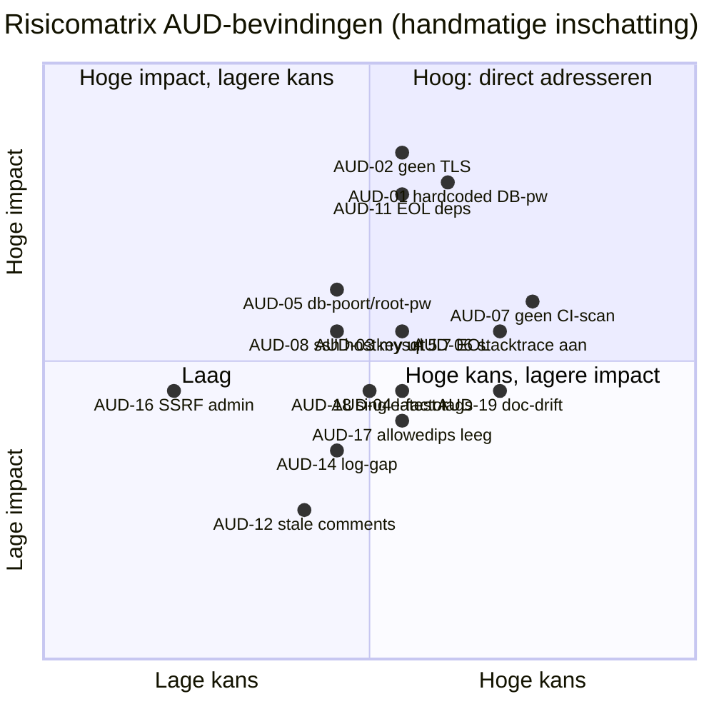
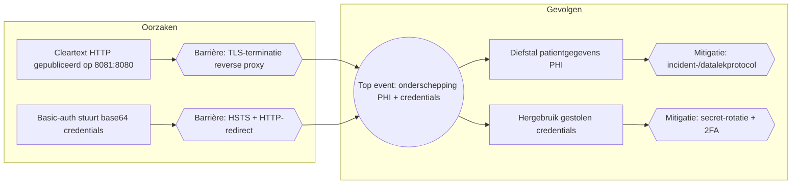
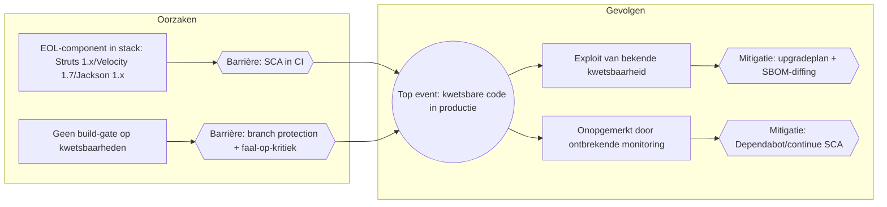

# Security- & CRA-Compliance Auditrapport — OpenMRS-module `webservices.rest`

**Object van onderzoek:** OpenMRS-module `webservices.rest` (Maven multi-module: `omod`, `omod-common`, `integration-tests`)
**Versie (module):** 3.2.0 — `pom.xml:6-7`
**Onderzochte commit:** `19d1b21a09019d2defbdcc20ca2ef961f3ad117f` (branch `Development`)
**Datum audit:** 2026-06-19
**Type audit:** *evidence-only* — elke uitspraak is herleidbaar naar een bestand:regel of een opgeslagen bijlage in `audit/bijlagen/`.
**Auditor-omgeving:** Windows 11, JDK 21, Node 22, npm/npx aanwezig; **geen** `mvn` en **geen** security-scanners lokaal beschikbaar (zie `bijlagen/tool-inventory.txt`).

> **Leeswijze (hardregel).** Dit rapport bevat uitsluitend bevindingen die met concreet projectbewijs zijn onderbouwd. Waar iets niet kon worden vastgesteld, staat dat letterlijk als **`Niet vastgesteld — [reden]`**. Ernst-niveaus zijn **handmatige inschattingen** (kwalitatief); er is **geen** CVSS berekend en er zijn **geen** CVE-nummers toegekend, omdat geen enkele SCA/SAST-tool kon draaien. CWE's zijn handmatige mappings op basis van het waargenomen codepatroon.

---

## 1. Executive Summary

De module `webservices.rest` is de REST-API-laag van OpenMRS. De auditscope omvat de broncode (676 `.java`-bestanden), de dependency-inventaris (SBOM + pom's) en de meegeleverde deployment-/CI-configuratie. Het project is herkenbaar als een onderwijs-/oefenproject (Avans Hogeschool, fork `OpenMRS13`) met **bewust ingebrachte zwakheden** die door het team zelf zijn gedocumenteerd in `documentation/`.

Belangrijkste, feitelijk vastgestelde observaties:

1. **De broncode van de module zelf is opvallend schoon** voor klassieke kwetsbaarheidsklassen: geen eigen cryptografie, geen rauwe SQL/command-injectie, geen native Java-deserialisatie, geen eigen XXE-parsers en geen uitgeschakelde TLS-validatie (handmatige SAST-sweep, `bijlagen/sast-handmatig.md`).
2. **De drie eerder gedocumenteerde "ingebrachte" kwetsbaarheden zijn in de huidige code grotendeels geremedieerd** (XSS HTML-escaped, global-property-zoek achter privilege + JSON via serializer, diagnostics-endpoint achter privilege). De bijbehorende *waarschuwende commentaarregels in de code zijn echter niet bijgewerkt* en spreken de implementatie nu tegen.
3. **Een nieuw, gestructureerd audit-logmechanisme (`RestAuditLog`) is daadwerkelijk geïmplementeerd** en goed ontworpen (log-injectie-sanitatie, geen secrets/PHI). De dekking is echter **inconsistent**: de logging ontbreekt op exact de gevoelige endpoints waarvan de projectdocumentatie claimt dat ze "opgelost" zijn.
4. **De reële, actuele risico's zitten vooral in de deployment- en CI/CD-configuratie**: een hardcoded zwak databasewachtwoord in een gecommit `docker-compose.prod.yml`, ontbrekende TLS, EOL-componenten (MySQL 5.7, en in de afhankelijkheden Struts 1.x e.a.) en het **ontbreken van elke security-scanning in de pijplijn** — terwijl de procesdocumentatie een uitgebreide beveiligde pijplijn beschrijft die in de repository **niet bestaat**.

In totaal zijn **19 bevindingen** vastgesteld (geen vooraf bepaald aantal): 3× Hoog, 8× Middel, 8× Laag/Informatief, plus een aantal expliciet benoemde **positieve controls**. Geen enkele bevinding is met een geautomatiseerde scanner bevestigd; alle ernst-classificaties zijn handmatige inschattingen.

---

## 2. Scope en Context

### 2.1 Onderzochte versie
- **Commit:** `19d1b21a09019d2defbdcc20ca2ef961f3ad117f`, branch `Development` (vastgesteld via `git rev-parse HEAD`).
- **Module-versie:** 3.2.0 (`pom.xml:6-7`); platform-afhankelijkheid `openmrs.version = 2.8.3` (`pom.xml:42`).
- **Licentie:** Mozilla Public License 2.0 (`LICENSE`, `license-header.txt`).

### 2.2 Wel onderzocht
| Onderdeel | Bron |
| :--- | :--- |
| Broncode (676 `.java`) | `git ls-files '*.java'` |
| Dependency-manifesten | `pom.xml`, `omod/pom.xml`, `omod-common/pom.xml`, `integration-tests/pom.xml` |
| SBOM (bestaand, getrackt) | `webservices-rest-sbom.json` (CycloneDX 1.5, Snyk) |
| Deployment | `deployment/environments/docker-compose.prod.yml`, `…/docker-compose.test.yml`, `deployment/secrets/*` |
| CI/CD | `bamboo-specs/bamboo.yaml` |
| Module-configuratie | `omod/src/main/resources/config.xml` |
| Projectdocumentatie (als context, geverifieerd tegen code) | `documentation/**` |

### 2.3 Niet onderzocht / buiten scope
- **Dynamische analyse (DAST/pentest):** niet uitgevoerd — de applicatie is niet gedraaid.
- **Upstream OpenMRS-core (`openmrs-api`/`openmrs-web` 2.8.3):** alleen voor zover via deze module aangeroepen; de kernplatformcode valt buiten scope (scope `provided`).
- **Runtime-/loganalyse:** niet uitgevoerd.

### 2.4 Expliciete lijst "Niet vastgesteld"
| # | Punt | Reden |
| :--- | :--- | :--- |
| NV-1 | Concrete CVE's/CVSS van dependencies | Geen SCA-tool kon draaien (snyk/osv-scanner/trivy/grype/dependency-check **afwezig**; `mvn` afwezig) — `bijlagen/tool-inventory.txt` |
| NV-2 | Volledige geautomatiseerde SAST-resultaten | CodeQL/semgrep/snyk-code/bandit/gosec **afwezig**; alleen handmatige grep-sweep uitgevoerd |
| NV-3 | Volledige, verse SBOM | `mvn` afwezig → `cdxgen` viel terug op pom-parsing en leverde slechts 4 van de 203 componenten (`bijlagen/cdxgen-run.log`); de getrackte Snyk-SBOM is als basis gebruikt |
| NV-4 | Runtime-effectiviteit van `RestAuditLog` (daadwerkelijke logoutput) | Geen runtime-/loganalyse; build kon niet lokaal draaien (geen `mvn`) |
| NV-5 | Of unit-/integratietests slagen | Build niet uitvoerbaar (geen `mvn`); ook het team meldt dit (`GAP_ANALYSE_LOGGING.md:214`) |
| NV-6 | Bestaan/effectiviteit van TLS, reverse proxy, secret-store in de *werkelijke* productieomgeving | Niet in de repo aantoonbaar; deployment-/platformzaak |
| NV-7 | Branch protection / GitHub-instellingen | Niet in de repo te bewijzen; procesdoc claimt dat dit **uit** staat (`test&productie.md:41`) |
| NV-8 | Coordinated Vulnerability Disclosure-beleid | Geen `SECURITY.md`/disclosure-policy aangetroffen (`git ls-files`) |
| NV-9 | Toepasselijkheid CRA op deze module | Juridische kwalificatie als "product met digitale elementen" is geen technische vaststelling; CRA-mapping (§7) is indicatief |

---

## 3. Audit-methodologie

### 3.1 Aanpak
1. **Fase 1 — Inventarisatie (read-only):** projectstructuur, manifesten, entrypoints, secrets/auth/crypto-locaties in kaart gebracht via `git`, `Glob`, `Grep` en `Read`.
2. **Fase 2 — Analyse & tooling:** poging tot geautomatiseerde SBOM/SCA/SAST/secret-scan; bij afwezigheid van tooling **handmatige** analyse, expliciet als zodanig gelabeld.
3. **Fase 3 — Verificatie & rapportage:** elke claim uit de projectdocumentatie is onafhankelijk getoetst tegen de actuele broncode; alleen wat in de code/config aantoonbaar is, is overgenomen.

### 3.2 Tooling — uitgevoerd / gepland-maar-niet-uitvoerbaar
| Categorie | Tool | Uitgevoerd? | Versie | Resultaat / bijlage |
| :--- | :--- | :--- | :--- | :--- |
| SBOM | `cdxgen` (via `npx @cyclonedx/cdxgen@^10`) | **Ja, maar incompleet** | cdxgen 10.x (npx) | exit 0; **4/203 componenten** (mvn ontbreekt) → `bijlagen/sbom.cdxgen.cyclonedx.json`, `bijlagen/cdxgen-run.log` |
| SBOM (bestaand) | Snyk SBOM Export (door team) | n.v.t. (niet door auditor gedraaid) | snyk-cli 1.1305.1 | getrackt artefact `webservices-rest-sbom.json` → extract in `bijlagen/sbom-componenten.md` |
| SCA | snyk / osv-scanner / trivy / grype / dependency-check | **Nee** | — | Allen afwezig (`bijlagen/tool-inventory.txt`) → vulnerabilities **Niet vastgesteld** |
| SAST | CodeQL / semgrep / snyk-code / bandit / gosec | **Nee** | — | Afwezig; **handmatige** grep-sweep i.p.v. → `bijlagen/sast-handmatig.md` |
| Secret-scan | gitleaks / trufflehog | **Nee** | — | Afwezig; **handmatige** patroon-grep i.p.v. → `bijlagen/secret-scan.txt` |
| Build/test | `mvn` | **Nee** | — | `mvn` afwezig; tests niet uitvoerbaar (NV-5) |

> Conform de hardregel is **geen** tool-output nagebootst. Waar een tool niet liep, is dat hierboven en in de bijlagen gemarkeerd.

---

## 4. Risico-analyse en bevindingen

**Ernst-schaal (kwalitatief, handmatige inschatting):** Kritiek · Hoog · Middel · Laag · Informatief.
**Bron van ernst:** voor *alle* bevindingen geldt "handmatige inschatting (geen geautomatiseerde tool)", tenzij anders vermeld.

### Overzicht
| ID | Bevinding | Ernst | Locatie (kern) |
| :--- | :--- | :--- | :--- |
| AUD-01 | Hardcoded zwak DB-wachtwoord in gecommit `docker-compose.prod.yml` | **Hoog** | `docker-compose.prod.yml:33,39` |
| AUD-02 | Geen TLS/transportbeveiliging in deployment | **Hoog** | `docker-compose.prod.yml:19-20` |
| AUD-03 | EOL-database-image `mysql:5.7` | Middel | `docker-compose.prod.yml:4` |
| AUD-04 | Ongepinde container-images (`:latest`) | Middel | `docker-compose.prod.yml:17` |
| AUD-05 | DB-poort publiek + gedeeld root/app-wachtwoord | Middel | `docker-compose.prod.yml:7-8`; `secrets/prod.env` |
| AUD-06 | Stacktrace-details standaard AAN → information disclosure | Middel | `config.xml:64-67`; `RestUtil.java:855-865` |
| AUD-07 | Geen security-scanning in CI/CD; gedocumenteerde pijplijn ontbreekt | Middel | `bamboo.yaml`; afwezigheid `.github/` |
| AUD-08 | CI-release: SSH host-key-verificatie uitgeschakeld | Middel | `bamboo.yaml:109` |
| AUD-09 | CI: `chmod -R 777` | Laag | `bamboo.yaml:39` |
| AUD-10 | Build/test op EOL JDK 8 | Laag/Info | `bamboo.yaml:13,37`; `pom.xml:43-44` |
| AUD-11 | EOL/verouderde dependencies (CVE niet geverifieerd) | **Hoog** (handmatig) | SBOM / `bijlagen/sbom-componenten.md` |
| AUD-12 | Stale security-commentaren die implementatie tegenspreken | Laag | `SessionController1_9.java:168`; `SettingsFormController.java:44-45` |
| AUD-13 | Dode/ongebruikte `token`-parameter (schijnbeveiliging) | Laag/Info | `SessionController1_9.java:172` |
| AUD-14 | Audit-logging ontbreekt op gevoelige endpoints (docs claimen "opgelost") | Laag | `SettingsFormController.java`, `SwaggerDocController.java`, `SessionController1_9.java` |
| AUD-15 | Kale `NullPointerException` als control-flow | Laag/Info | `ChangePasswordController1_8.java:84` |
| AUD-16 | Mogelijke SSRF in module-install (admin-gated, upstream) | Laag/Info | `ModuleActionResource1_8.java:159` |
| AUD-17 | IP-allowlist standaard leeg ("iedereen toegestaan") | Laag/Info | `config.xml:54-57` |
| AUD-18 | Authenticatie single-factor (HTTP Basic) | Laag/Info | `AuthorizationFilter.java:88-115` |
| AUD-19 | Documentatie spreekt de implementatie tegen (drift) | Middel | `documentation/**` vs. code |

---

### AUD-01 — Hardcoded zwak databasewachtwoord in gecommitte productie-compose
**Ernst:** Hoog (handmatig) · **CWE-798 / CWE-259 (handmatige mapping)** · **Bron:** `docker-compose.prod.yml` (getrackt: `git ls-files`), `bijlagen/secret-scan.txt` sectie A.

**Locatie & letterlijk fragment** — `deployment/environments/docker-compose.prod.yml:33` en `:39`:
```yaml
      - DB_PASSWORD=openmrs
...
      - JAVA_OPTS=-Dconnection.url=jdbc:mysql://db:3306/openmrs?... -Dconnection.username=openmrs -Dconnection.password=openmrs -Dauto_update_database=true
```
**Impact/exploiteerbaarheid:** het productie-databasewachtwoord (`openmrs`, tevens een triviaal default) staat **letterlijk in een in git gecommit bestand**. Iedereen met leestoegang tot de repository kent het productie-DB-wachtwoord. In tegenstelling tot `docker-compose.test.yml` (dat variabelen `${DB_PASSWORD}` gebruikt, regels 39/45) is de productie-compose hard gecodeerd. Dit ondermijnt de overigens correcte secret-aanpak (zie positieve control P-3).
**Remediatie:** verwijder alle hardcoded wachtwoorden uit `docker-compose.prod.yml`; gebruik uitsluitend `env_file`/secrets (zoals in test); roteer het wachtwoord; kies een sterk, uniek wachtwoord.

---

### AUD-02 — Geen TLS / transportbeveiliging in deployment
**Ernst:** Hoog (handmatig) · **CWE-319 (cleartext transmission)** · **Bron:** `docker-compose.prod.yml`, `docker-compose.test.yml`.

**Locatie & fragment** — `deployment/environments/docker-compose.prod.yml:16-20`:
```yaml
  openmrs:
    image: openmrs/openmrs-reference-application-distro:latest
    ports:
      - "8081:8080"
```
**Impact/exploiteerbaarheid:** de container publiceert HTTP (8080) zonder TLS-terminatie of reverse proxy in de compose. De module authenticeert via **HTTP Basic** (`AuthorizationFilter.java:88-115`), waarbij credentials base64-gecodeerd — *niet versleuteld* — worden meegestuurd. Bij cleartext-transport zijn zowel Basic-auth-credentials als patiëntgegevens (PHI) onderschepbaar (MITM). Het `JAVA_OPTS` bevat bovendien `connection.url=jdbc:mysql://…` zonder TLS-parameters.
**Remediatie:** TLS-terminatie via reverse proxy/ingress; HTTP→HTTPS-redirect + HSTS; poort 8080 niet direct publiceren.
**Opmerking t.o.v. documentatie:** `THREAT_MODEL.md:138` en `security.md:145` beschrijven "poort 80"; de *actuele* compose gebruikt `8081:8080` (vandaar dit op de feitelijke regel gecorrigeerd).

---

### AUD-03 — End-of-Life database-image `mysql:5.7`
**Ernst:** Middel (handmatig) · **CWE-1104 (use of unmaintained components)** · **Bron:** `docker-compose.prod.yml:4`, `docker-compose.test.yml:4`.

**Locatie & fragment** — `deployment/environments/docker-compose.prod.yml:3-4`:
```yaml
  db:
    image: mysql:5.7
```
**Impact:** MySQL 5.7 heeft het einde van de premier/extended support bereikt (gedocumenteerd: Oracle EOL oktober 2023). EOL betekent geen security-patches meer. *De exacte CVE-status is niet geverifieerd (geen scanner).* De versie zelf is hard bewijs uit het bestand; de EOL-kwalificatie is publiek gedocumenteerd algemeen feit.
**Remediatie:** migreer naar een ondersteunde versie (bijv. MySQL 8.x of MariaDB LTS) en pin de digest.

---

### AUD-04 — Ongepinde container-images (`:latest`)
**Ernst:** Middel (handmatig) · **CWE-1357 (reliance on uncontrolled component)** · **Bron:** `docker-compose.prod.yml:17`, `docker-compose.test.yml:24`.

**Fragment** — `docker-compose.prod.yml:17`:
```yaml
    image: openmrs/openmrs-reference-application-distro:latest
```
**Impact:** `:latest` is niet-reproduceerbaar; builds kunnen ongemerkt van inhoud veranderen → supply-chain-/reproduceerbaarheidsrisico en moeilijke forensiek.
**Remediatie:** pin op een specifieke versie + image-digest (`@sha256:…`).

---

### AUD-05 — DB-poort publiek geëxposeerd + gedeeld root/app-wachtwoord
**Ernst:** Middel (handmatig) · **CWE-668 / ontbrekende functiescheiding** · **Bron:** `docker-compose.prod.yml:7-8`; `deployment/secrets/prod.env` (lokaal, gitignored — `bijlagen/secret-scan.txt` sectie D).

**Fragment** — `docker-compose.prod.yml:6-8`:
```yaml
    command: --character-set-server=utf8 ... --lower_case_table_names=1
    ports:
      - "3306:3306"
```
en `deployment/secrets/prod.env:5-6,10` (lokaal aanwezig, niet gecommit):
```
MYSQL_PASSWORD=openmrs
MYSQL_ROOT_PASSWORD=openmrs
DB_PASSWORD=openmrs
```
**Impact:** de MySQL-poort 3306 wordt naar de host gepubliceerd (vergroot aanvalsoppervlak), en het **root-wachtwoord is gelijk aan het applicatie-wachtwoord** (geen functiescheiding) → compromittering van het app-account = DB-root.
**Remediatie:** DB-poort niet publiceren (alleen interne Docker-netwerktoegang); apart least-privilege app-account; sterke, unieke wachtwoorden per rol.

---

### AUD-06 — Stacktrace-details standaard AAN → information disclosure
**Ernst:** Middel (handmatig) · **CWE-209 (information exposure through an error message)** · **Bron:** `config.xml`, `RestUtil.java`.

**Locatie & fragment 1** — `omod/src/main/resources/config.xml:64-68` (registratie global property, **default `true`**):
```xml
	<globalProperty>
		<property>@MODULE_ID@.enableStackTraceDetails</property>
		<defaultValue>true</defaultValue>
		<description>If the value of this setting is "true", then the details of the stackTrace would be shown in the error response. However, the recommendation is to keep it as "false", from the Security perspective, to avoid leaking implementation details.</description>
	</globalProperty>
```
**Locatie & fragment 2** — `omod-common/.../RestUtil.java:855-865`:
```java
		map.put("code", stackTraceElement.getClassName() + ":" + stackTraceElement.getLineNumber());
		if ("true".equalsIgnoreCase(stackTraceDetailsEnabledGp)) {
			map.put("detail", ExceptionUtils.getStackTrace(ex));
		} else {
			map.put("detail", "");
		}
	} else { ... }
	map.put("rawMessage", ex.getMessage());
```
**Impact/exploiteerbaarheid:** de global property wordt **met default `true` geregistreerd** (`config.xml:66`), terwijl de beschrijving in dezelfde regel `false` aanraadt "from the Security perspective". De in-code fallback (`RestUtil.java:850`, `getGlobalProperty(..., "false")`) geldt alleen als de property *helemaal niet bestaat*; door de registratie bestaat hij wél en staat hij op `true`. Gevolg: **volledige stacktraces** worden standaard in elke foutrespons teruggegeven, plus altijd `code` = `klasse:regelnummer` (regel 855) en `rawMessage` = ruwe exceptie-message (regel 865). Dit lekt interne klassenamen, regelnummers, frameworkversies en mogelijk ingezonden data.
**Opmerking t.o.v. documentatie:** `security.md:136-140` (S-4) stelt dat de default `false` is ("goed"); de *feitelijke* config-default is `true`. Deze audit corrigeert dat op basis van `config.xml:66`.
**Remediatie:** zet `enableStackTraceDetails` default op `false`; laat `code`/`rawMessage` weg in productie; geef een generieke clientmelding en log details uitsluitend server-side.

---

### AUD-07 — Geen security-scanning in CI/CD; gedocumenteerde pijplijn bestaat niet
**Ernst:** Middel (handmatig) · **Proces-/CRA-gap** · **Bron:** `bamboo-specs/bamboo.yaml`; afwezigheid van `.github/` (`git ls-files`).

**Bewijs:** de enige aanwezige CI-definitie is `bamboo-specs/bamboo.yaml` met stages *Build and Test*, *Deploy to Maven*, *Release to Maven* — **zonder** SAST-, SCA-, secret- of SBOM-stap. Er is **geen** `.github/workflows/`-map, **geen** `deploy.yaml`, **geen** `dependabot.yml`, **geen** SonarCloud-/CodeQL-configuratie in de repository (geverifieerd via `git ls-files`).
**Tegenstelling met documentatie:** `documentation/risico evaluatie ci-cd proces.md:10-11` en `test&productie.md:3` beschrijven een GitHub Actions-pijplijn met "Security scan (SAST, SCA & SBOM)", SonarCloud en Dependabot; het team-eigen `security.md:169-175` (S-9) bevestigt zelf dat die pijplijn **niet** bestaat en dat branch protection **uit** staat.
**Impact:** kwetsbare dependencies, code-issues en gelekte secrets worden niet automatisch tegengehouden vóór deploy/release.
**Remediatie:** implementeer een CI-pijplijn met build+test+SAST+SCA+secret-scan+SBOM-generatie; faal de build op kritieke bevindingen; activeer branch protection.

---

### AUD-08 — CI-release: SSH host-key-verificatie uitgeschakeld
**Ernst:** Middel (handmatig) · **CWE-295 (improper certificate/host validation)** · **Bron:** `bamboo.yaml`.

**Fragment** — `bamboo-specs/bamboo.yaml:109`:
```
          -e GIT_SSH_COMMAND='ssh -i /root/.ssh/id_rsa -o UserKnownHostsFile=/dev/null -o StrictHostKeyChecking=no' \
```
**Impact:** in de release-job wordt SSH-host-key-verificatie volledig uitgeschakeld (`StrictHostKeyChecking=no` + `UserKnownHostsFile=/dev/null`). Hierdoor is een man-in-the-middle op de git-push (release-commit met tags) niet te detecteren.
**Remediatie:** gebruik een vastgelegde `known_hosts` met de juiste host-key; verwijder `StrictHostKeyChecking=no`.

---

### AUD-09 — CI: overmatig brede permissies (`chmod -R 777`)
**Ernst:** Laag (handmatig) · **CWE-732 (incorrect permission assignment)** · **Bron:** `bamboo.yaml`.

**Fragment** — `bamboo-specs/bamboo.yaml:39`:
```
        docker run -v m2-repo:/root/.m2/repository -v ${PWD}:/module --rm -w="/module" ${IMAGE} bash -c 'mvn clean package && chmod -R 777 .'
```
**Impact:** `chmod -R 777` op de hele workspace zet world-writable rechten; in een gedeelde build-omgeving vergroot dit het risico op manipulatie van build-artefacten. (Hier ingegeven door eigenaarschapsproblemen van Docker-volumes.)
**Remediatie:** gebruik gerichte eigenaarschaps-/permissiecorrectie (bv. `--user`/`chown` op specifieke paden) i.p.v. recursief 777.

---

### AUD-10 — Build/test op End-of-Life JDK 8
**Ernst:** Laag/Informatief (handmatig) · **Bron:** `bamboo.yaml`, `pom.xml`.

**Fragment** — `bamboo.yaml:37` en `pom.xml:43-44`:
```
        export IMAGE="maven:3.9.9-amazoncorretto-8"
```
```xml
		<maven.compiler.source>1.8</maven.compiler.source>
		<maven.compiler.target>1.8</maven.compiler.target>
```
**Impact:** de module wordt gebouwd/getest tegen Java 8. Dit is een onderhoudbaarheids- en (indirect) beveiligingsaandachtspunt; let wel: dit is grotendeels bepaald door de OpenMRS-platformcompatibiliteit (`openmrs.version 2.8.3`).
**Remediatie:** volg de OpenMRS-platformroadmap richting een ondersteunde JDK-LTS.

---

### AUD-11 — EOL/verouderde dependencies in de afhankelijkheidsstack
**Ernst:** Hoog (handmatige inschatting o.b.v. EOL-status; **CVE/CVSS Niet vastgesteld — geen SCA-tool**) · **Bron:** `webservices-rest-sbom.json` → `bijlagen/sbom-componenten.md`.

**Bewijs (versies hard uit SBOM, met purl):**
| Component | Versie | Status (publiek gedocumenteerd) |
| :--- | :--- | :--- |
| `org.apache.struts:struts-core` / `struts-taglib` / `struts-tiles` | 1.3.8 | **Struts 1.x — EOL sinds 2013** |
| `org.apache.velocity:velocity` | 1.7 | **EOL** |
| `org.codehaus.jackson:jackson-core-asl` / `jackson-mapper-asl` | 1.9.14-MULE-002 | **Jackson 1.x — EOL** |
| `org.springframework:spring-core/web/webmvc/beans` | 5.3.30 | 5.3.x (OSS-EOL-lijn) |
| `org.codehaus.groovy:groovy-all` | 2.4.21 | oude major |
| `commons-lang:commons-lang` | 2.4 | **EOL** (vervangen door `commons-lang3`) |
| `mysql:mysql-connector-java` | 8.0.30 | verouderd binnen 8.0 |
| `org.hibernate:hibernate-core` | 5.6.15.Final | 5.x |
| `xerces:xercesImpl` | 2.12.2 | te verifiëren |
| `org.yaml:snakeyaml` | 2.4 | recent (ok) |
| `org.apache.logging.log4j:log4j-core` | 2.22.1 | post-Log4Shell (ok) |

**Aanvullend codebewijs:** Jackson 1.x wordt **actief in de code gebruikt** — `SettingsFormController.java:61` instantieert `org.codehaus.jackson.map.ObjectMapper`.
**Impact/exploiteerbaarheid:** Struts 1.x/Velocity 1.7/Jackson 1.x staan bekend om kwetsbaarheidsklassen (deserialisatie, template-injectie) maar krijgen geen patches. De meeste van deze componenten komen **transitief via `openmrs-api`/`openmrs-web` 2.8.3 (`provided`)** binnen (`pom.xml:60-83`); mitigatie ligt deels upstream. **Zonder SCA zijn geen concrete CVE's bevestigd.**
**Remediatie:** voer OWASP Dependency-Check/Trivy/osv-scanner in CI; stel een upgradeplan op (eerst Struts/Velocity/Jackson 1.x), in afstemming met de platformversie; verwijder ongebruikte `commons-lang` 2.4.

---

### AUD-12 — Stale security-commentaren die de implementatie tegenspreken
**Ernst:** Laag (handmatig) · **CWE-1116 (inaccurate comments) — handmatige mapping** · **Bron:** `SessionController1_9.java`, `SettingsFormController.java`.

**Fragment 1** — `SessionController1_9.java:165-173`:
```java
	 * NOTE: No authorization check — accessible to any caller (authenticated or not).
	 */
	@RequestMapping(value = "/diag", method = RequestMethod.GET)
	@ResponseBody
	public Object getDiagnostics(@org.springframework.web.bind.annotation.RequestParam(value = "token", required = false) String token) {
		Context.requirePrivilege(RestConstants.PRIV_VIEW_RESTWS);
```
**Fragment 2** — `SettingsFormController.java:44-53`:
```java
	 * NOTE: No authorization check — any unauthenticated caller can enumerate global properties,
	 * potentially leaking sensitive configuration values (A01 Broken Access Control).
	 ...
	public String searchProperties(...) throws Exception {
		requireManageGlobalPropertiesPrivilege();
```
**Impact:** het commentaar beschrijft een kwetsbaarheid ("geen autorisatiecheck") die in de code **wél** wordt afgedwongen (`Context.requirePrivilege(...)`, resp. `requireManageGlobalPropertiesPrivilege()` → `Context.requirePrivilege("Manage Global Properties")`, `SettingsFormController.java:65`). Misleidende commentaren vergroten het risico op regressie (een ontwikkelaar die "fixt" wat al gefixt is, of de check verwijdert "omdat het commentaar zegt dat hij er niet is").
**Remediatie:** werk de commentaarregels bij zodat ze de geïmplementeerde autorisatie weergeven.

---

### AUD-13 — Dode/ongebruikte `token`-parameter (schijnbeveiliging)
**Ernst:** Laag/Informatief (handmatig) · **Bron:** `SessionController1_9.java:172`.

**Fragment** — `SessionController1_9.java:172` (de `token`-parameter wordt nergens gelezen of gevalideerd):
```java
	public Object getDiagnostics(@org.springframework.web.bind.annotation.RequestParam(value = "token", required = false) String token) {
```
**Impact:** suggereert beveiliging die er niet is (de parameter wordt niet gebruikt); verwarrend en onderhoudsrisico. De feitelijke toegangscontrole loopt via `Context.requirePrivilege` (regel 173).
**Remediatie:** verwijder de ongebruikte parameter, of implementeer en valideer hem expliciet.

---

### AUD-14 — Audit-logging ontbreekt op de gevoelige endpoints die de documentatie als "opgelost" markeert
**Ernst:** Laag (handmatig) · **Bron:** `git grep "RestAuditLog\."` (zie onder) vs. `GAP_ANALYSE_LOGGING.md` STAP 5.

**Bewijs:** `RestAuditLog` wordt aangeroepen in `AuthorizationFilter.java`, `MainResourceController.java`, `ChangePasswordController1_8.java`, `PasswordResetController2_2.java`, `ClearDbCacheController2_0.java`, `SearchIndexController2_0.java` (geverifieerd met `git grep`). Het wordt **niet** aangeroepen in:
- `SettingsFormController.java` (volledige file gelezen; `searchProperties`/`handleSubmission` bevatten geen `RestAuditLog`-aanroep),
- `SwaggerDocController.java` (volledige file gelezen; geen `RestAuditLog`-aanroep),
- `SessionController1_9.java` (`getDiagnostics`/`delete` bevatten geen `RestAuditLog`-aanroep).

`GAP_ANALYSE_LOGGING.md:172-173` (STAP 5, G4/G5) claimt echter dat juist voor `gp-search`, `session-diag`, `apidocs-debug` en `logout` **compenserende** audit-logging is toegevoegd ("Opgelost").
**Impact:** voor exact de historisch gevoelige/ingebrachte endpoints is er geen audittrail; misbruik blijft onzichtbaar — terwijl de documentatie het tegendeel suggereert. (8.15/8.16 NEN 7510; CRA "security info via logging".)
**Remediatie:** voeg de geclaimde `RestAuditLog.sensitiveAccess(...)`/`write(...)`-aanroepen daadwerkelijk toe aan deze drie controllers, of corrigeer de documentatie.

---

### AUD-15 — Kale `NullPointerException` als control-flow
**Ernst:** Laag/Informatief (handmatig) · **CWE-476-patroon / code smell** · **Bron:** `ChangePasswordController1_8.java`.

**Fragment** — `ChangePasswordController1_8.java:83-90`:
```java
		if (user == null || user.getUserId() == null) {
			throw new NullPointerException();
		} else {
			userService.changePassword(user, newPassword);
			...
		}
```
**Impact:** een `NullPointerException` wordt gebruikt om "niet gevonden" te signaleren; weliswaar opgevangen door `handleNotFound` (`:94-100`) en omgezet naar HTTP 404, maar dit is fragiel en verbergt de werkelijke intentie. Geen direct beveiligingslek (faalt naar 404).
**Remediatie:** gooi een betekenisvolle, specifieke exceptie (bv. een "object not found"-exceptie).

---

### AUD-16 — Mogelijke SSRF in module-install (admin-gated, upstream)
**Ernst:** Laag/Informatief (handmatig) · **CWE-918 (SSRF)** · **Bron:** `ModuleActionResource1_8.java`.

**Fragment** — `ModuleActionResource1_8.java:159-162`:
```java
			URL downloadUrl = new URL(installUri);
			String fileName = FilenameUtils.getName(downloadUrl.getPath());
			InputStream inputStream = ModuleUtil.getURLStream(downloadUrl);
			moduleFile = ModuleUtil.insertModuleFile(inputStream, fileName);
```
**Impact/exploiteerbaarheid:** de server haalt een door de aanroeper opgegeven URL op (klassieke SSRF-vector). De functionaliteit is echter **module-installatie**, die in OpenMRS een super-admin-privilege vereist; een actor met dat recht kan sowieso al willekeurige (module-)code uitvoeren. De marginale extra impact is daarom laag. Dit is upstream OpenMRS-functionaliteit.
**Remediatie:** indien gewenst: allowlist van toegestane download-hosts; netwerk-egress-restricties; bevestig de privilege-gate.

---

### AUD-17 — IP-allowlist standaard leeg ("iedereen toegestaan")
**Ernst:** Laag/Informatief (handmatig) · **Bron:** `config.xml`.

**Fragment** — `config.xml:53-57`:
```xml
    <globalProperty>
        <property>@MODULE_ID@.allowedips</property>
        <defaultValue></defaultValue>
        <description>A comma-separate list of IP addresses that are allowed to access the web services. An empty string allows everyone to access all ws.
```
**Impact:** de enige netwerkbegrenzing (IP-allowlist in `AuthorizationFilter`) staat standaard **open**. De filter gebruikt overigens `request.getRemoteAddr()` (`AuthorizationFilter.java:70`) — het werkelijke socket-IP, dus **niet** direct spoofbaar via `X-Forwarded-For` op applicatieniveau (positief; let wel op `RemoteIpValve`/proxyconfiguratie op platformniveau).
**Remediatie:** documenteer en, waar passend, configureer een restrictieve allowlist; borg dat een eventuele reverse proxy `X-Forwarded-For` correct afhandelt.

---

### AUD-18 — Authenticatie is single-factor (HTTP Basic)
**Ernst:** Laag/Informatief (handmatig) · **Bron:** `AuthorizationFilter.java`, `BaseRestController.java`.

**Fragment** — `AuthorizationFilter.java:103-113` en `BaseRestController.java:69`:
```java
				String decoded = new String(Base64.decodeBase64(basicAuth), Charset.forName("UTF-8"));
				...
				String[] userAndPass = decoded.split(":");
				Context.authenticate(userAndPass[0], userAndPass[1]);
```
```java
				response.addHeader("WWW-Authenticate", "Basic realm=\"OpenMRS at " + RestConstants.URI_PREFIX + "\"");
```
**Impact:** de REST-laag leunt op single-factor Basic-authenticatie. Voor een systeem dat gezondheidsgegevens verwerkt is dit een aandachtspunt (NEN 7510 A.8.5 noemt 2FA voor PHI). De module kan dit niet zelfstandig afdwingen (platform-/IdP-zaak).
**Remediatie:** 2FA/OIDC op platform-/gatewayniveau.

---

### AUD-19 — Documentatie spreekt de actuele implementatie tegen (drift)
**Ernst:** Middel (handmatig) · **Bron:** diverse `documentation/**` vs. code (zie verwijzingen).

**Bewijs (samengevat; alle individueel geverifieerd):**
| Documentclaim | Actuele code | Bewijs |
| :--- | :--- | :--- |
| Reflected XSS in `/apiDocs/debug` (S-2/T-03) | **Geremedieerd** — `HtmlUtils.htmlEscape(tag)` | `SwaggerDocController.java:28` |
| Global-property-zoek zonder autorisatie + JSON via string-concat (S-3/T-01) | **Geremedieerd** — privilege-check + `ObjectMapper` | `SettingsFormController.java:53,61,65` |
| `/session/diag` zonder autorisatie (S-1/T-02) | **Geremedieerd** — `Context.requirePrivilege(PRIV_VIEW_RESTWS)` | `SessionController1_9.java:173` |
| Stacktrace-default = `false` ("goed", S-4) | **Onjuist** — default = `true` | `config.xml:66` |
| Audit-logging op gp-search/diag/debug "Opgelost" | **Niet in code** voor die endpoints | zie AUD-14 |
| GitHub Actions security-pijplijn (CodeQL/Snyk/SonarCloud/Dependabot) | **Bestaat niet** in repo | afwezigheid `.github/` |

**Impact:** beslissers die op de documentatie afgaan, krijgen een onjuist beeld (zowel te negatief — de drie "ingebrachte" lekken zijn al gedicht — als te positief — pijplijn/logging bestaan deels niet). Voor CRA/NEN-compliance is **accurate, herleidbare documentatie** een eis op zich.
**Remediatie:** synchroniseer `documentation/**` met de actuele code (datum/commit per document); behandel security-documentatie als versioned artefact.

---

### 4.1 Positieve controls (aantoonbaar aanwezig)
| ID | Positieve control | Bewijs |
| :--- | :--- | :--- |
| P-1 | Gestructureerde audit-logging met log-injectie-sanitatie, numeriek user-id i.p.v. naam, geen secrets/PHI | `RestAuditLog.java:108-152`; geïntegreerd in `AuthorizationFilter.java:72-121`, `MainResourceController.java:77-259` |
| P-2 | Eerder gedocumenteerde lekken geremedieerd (XSS-escape, privilege-checks, serializer) | `SwaggerDocController.java:28`; `SettingsFormController.java:53,61`; `SessionController1_9.java:173` |
| P-3 | Echte secrets correct uit git gehouden | `.gitignore` (`deployment/secrets/*.env`, `*.properties`); alleen `*.example` getrackt (`git ls-files`) |
| P-4 | Module-broncode vrij van eigen crypto / rauwe SQL/command-injectie / native deserialisatie / XXE / TLS-bypass | `bijlagen/sast-handmatig.md` (patronen 1-5: geen relevante matches) |
| P-5 | CycloneDX-SBOM aanwezig (supply-chain-inventaris) | `webservices-rest-sbom.json` (203 componenten) |
| P-6 | Wachtwoord wordt nooit gelogd bij wachtwoordwijziging | `ChangePasswordController1_8.java:58-59`; `RestAuditLog`-ontwerp (`RestAuditLog.java:28-31`) |

---

## 5. SBOM en Supply Chain Security

**Primaire bron:** `webservices-rest-sbom.json` — CycloneDX **1.5**, gegenereerd door **Snyk** (`snyk-cli 1.1305.1`) op **2026-06-03**, subject `org.openmrs.module:webservices.rest@3.2.0`, **203 componenten**, **geen** `vulnerabilities`-sectie. Volledige componentenlijst: `bijlagen/sbom-componenten.md`.

**Verse SBOM-poging (deze audit):** `cdxgen` (npx) gedraaid; door het ontbreken van `mvn` viel het terug op pom-parsing en leverde slechts **4 van de 203** componenten op (`bijlagen/sbom.cdxgen.cyclonedx.json`, log `bijlagen/cdxgen-run.log`). Een volledige verse SBOM is daarom **Niet vastgesteld** (NV-3).

**Direct gedeclareerde dependencies (grondwaarheid uit de pom's):**
| Component | Versie | Scope | Bron |
| :--- | :--- | :--- | :--- |
| `commons-codec` | 1.14 | compile/provided | `pom.xml:143-145,224` |
| `com.fasterxml.jackson.core:*` | 2.19.1 (`jacksonVersion`) | provided | `pom.xml:52,162-176` |
| `jackson-dataformat-yaml` | 2.13.3 | test | `omod/pom.xml:34-37` |
| `joda-time` | 2.12.5 | compile | `omod-common/pom.xml:22-24` |
| `org.atteo:evo-inflector` | 1.2.2 | compile | `omod-common/pom.xml:28-30` |
| `io.swagger:swagger-core` | 1.6.2 | compile | `omod-common/pom.xml:34-36` |
| `org.apache.tomcat:jasper` | 6.0.53 (`apacheTomcatVersion`) | provided | `omod-common/pom.xml:15-18`; `pom.xml:50` |
| `javax.mail` | 1.6.2 | provided | `pom.xml:157-158` |
| `legacyui-omod` | 1.23.0 | provided | `pom.xml:181-182` |
| `mockito-core` | 3.12.4 | test | `pom.xml:187-188` |
| `openmrs-api`/`openmrs-web`/`openmrs-test`/`openmrs-tools` | 2.8.3 (`openmrs.version`) | provided/test | `pom.xml:42,60-140` |

**Supply-chain-observaties:**
- Het grootste deel van de zware componenten komt **transitief via het OpenMRS-platform 2.8.3 (`provided`)** en wordt op runtime door het platform geleverd; mitigatie ligt deels upstream.
- **Kwetsbaarheden in deze componenten zijn Niet vastgesteld** (geen SCA-tool; de SBOM bevat geen vuln-data). Zie AUD-11 voor de versie-/EOL-evidence.
- **Geen Software Composition Analysis in CI** (AUD-07) → geen continue bewaking van nieuwe CVE's.
- **Geen `dependabot.yml`** in de repo (terwijl de procesdocumentatie dat claimt; AUD-19).

---

## 6. Conclusie en Advies

### 6.1 Oordeel
De **module-broncode zelf** is, op de bewust ingebrachte (en inmiddels grotendeels geremedieerde) endpoints na, van degelijke beveiligingshygiëne: geen eigen crypto, geen injectie-/deserialisatiepatronen, en een goed ontworpen audit-logvoorziening. De **reële, actuele risico's** liggen in de **deployment-/CI-laag** en in **verouderde dependencies**:

- **Direct te adresseren (Hoog):** hardcoded DB-wachtwoord in productie-compose (AUD-01), ontbrekende TLS (AUD-02), en de EOL-dependencystack (AUD-11, met CVE-verificatie als vervolg).
- **Belangrijk (Middel):** stacktrace-default `true` (AUD-06), ontbrekende security-scanning in CI (AUD-07), SSH-host-keyverificatie uit (AUD-08), EOL DB-image/ongepinde images (AUD-03/04/05), en de **documentatie-drift** (AUD-19).
- **Opruimen/hardening (Laag):** stale commentaren (AUD-12), inconsistente audit-logdekking (AUD-14), dode parameter (AUD-13), NPE-flow (AUD-15) en de informatieve aandachtspunten (AUD-16/17/18).

### 6.2 Prioritering
1. **Onmiddellijk:** verwijder hardcoded credentials uit `docker-compose.prod.yml`, roteer secrets (AUD-01); schakel TLS in (AUD-02); zet `enableStackTraceDetails` default op `false` (AUD-06).
2. **Kort:** richt een CI-pijplijn in met SCA (OWASP Dependency-Check/Trivy/osv-scanner), SAST, secret-scan en SBOM-generatie; activeer branch protection (AUD-07); herstel SSH-host-keyverificatie (AUD-08). Dit dekt meteen de CVE-verificatie voor AUD-11.
3. **Middellange termijn:** upgradeplan EOL-componenten (Struts/Velocity/Jackson 1.x) in afstemming met de platformversie (AUD-11); image-/digest-pinning en DB-credentialscheiding (AUD-03/04/05); 2FA op platformniveau (AUD-18).
4. **Doorlopend:** synchroniseer documentatie met code (AUD-19); maak de audit-logdekking consistent (AUD-14); ruim code-smells/stale commentaren op (AUD-12/13/15).

### 6.3 Vervolg (bewijsvoering)
Voer met daadwerkelijke tooling (SCA + SAST + secret-scan) een herhaling uit om AUD-11 met CVE/CVSS te bevestigen en de handmatige bevindingen onafhankelijk te valideren; overweeg een geautoriseerde pentest op een test-/acceptatieomgeving voor AUD-01/02/06.

---

## 7. Bijlagen

### 7.1 Traceability matrix (bevinding ↔ control ↔ bewijs)
Controls: NEN 7510-1:2024 / ISO 27001:2023 Bijlage A (Axx) en CRA (Regulation (EU) 2024/2847) Annex I.

| Bevinding | NEN/ISO-control | CRA Annex I | Bewijs (bestand:regel / bijlage) |
| :--- | :--- | :--- | :--- |
| AUD-01 | A.8.9, A.5.17, A.8.24 | Part I (2)(a) secure-by-default | `docker-compose.prod.yml:33,39`; `bijlagen/secret-scan.txt` |
| AUD-02 | A.8.24, A.5.14 | Part I (2)(c) vertrouwelijkheid | `docker-compose.prod.yml:19-20` |
| AUD-03 | A.8.8 | Part I (1) geen bekende kwetsbaarheden | `docker-compose.prod.yml:4` |
| AUD-04 | A.8.9, A.5.23 | Part II (1) SBOM/supply chain | `docker-compose.prod.yml:17` |
| AUD-05 | A.8.2, A.8.9, A.8.20 | Part I (2)(b) toegang | `docker-compose.prod.yml:7-8`; `secrets/prod.env` |
| AUD-06 | A.8.26, A.8.28, A.5.34 | Part I (2)(a)/(g) | `config.xml:66`; `RestUtil.java:855-865` |
| AUD-07 | A.8.25, A.8.29, A.8.8 | Part II (3) tests & reviews | `bamboo.yaml`; afwezigheid `.github/` |
| AUD-08 | A.8.21, A.8.25 | Part I (2)(c) integriteit toelevering | `bamboo.yaml:109` |
| AUD-09 | A.8.9, A.8.4 | Part I (2)(b) | `bamboo.yaml:39` |
| AUD-10 | A.8.8 | Part I (1) | `bamboo.yaml:37`; `pom.xml:43-44` |
| AUD-11 | A.8.8 | Part I (1); Part II (1)(2) | `bijlagen/sbom-componenten.md`; `SettingsFormController.java:61` |
| AUD-12 | A.8.28 | Part I (2)(j) | `SessionController1_9.java:168`; `SettingsFormController.java:44-45` |
| AUD-13 | A.8.28 | Part I (2)(g) attack surface | `SessionController1_9.java:172` |
| AUD-14 | A.8.15, A.8.16 | Part I (2)(i) logging | `git grep RestAuditLog`; `GAP_ANALYSE_LOGGING.md:172-173` |
| AUD-15 | A.8.28 | Part I (2)(j) | `ChangePasswordController1_8.java:84` |
| AUD-16 | A.8.28, A.8.20 | Part I (2)(g) | `ModuleActionResource1_8.java:159` |
| AUD-17 | A.8.20, A.8.22 | Part I (2)(a) | `config.xml:54-57` |
| AUD-18 | A.8.5 | Part I (2)(b) auth | `AuthorizationFilter.java:103-113` |
| AUD-19 | A.5.37, A.8.28 | Part II (documentatie) | zie AUD-19-tabel |
| P-1 | A.8.15, A.8.16, A.8.11 | Part I (2)(i)/(e) | `RestAuditLog.java:108-152` |
| P-3 | A.8.9, A.5.17 | Part I (2)(a) | `.gitignore`; `git ls-files` |
| P-4 | A.8.28 | Part I (2)(g) | `bijlagen/sast-handmatig.md` |

### 7.2 SBOM
- `webservices-rest-sbom.json` (repo-root, getrackt; Snyk/CycloneDX 1.5; 203 componenten) — extract: `bijlagen/sbom-componenten.md`.
- `bijlagen/sbom.cdxgen.cyclonedx.json` (verse poging, **incompleet: 4 componenten**) + `bijlagen/cdxgen-run.log`.

### 7.3 SAST-output
- `bijlagen/sast-handmatig.md` — **handmatige** grep-sweep (geen geautomatiseerde SAST-tool beschikbaar). Patronen 1-5 (crypto/injectie/deserialisatie/XXE/TLS-bypass): geen relevante main-code matches; patroon 6 (`new URL`): 1 match (AUD-16).

### 7.4 Risicomatrix (kans × impact — alleen werkelijk gevonden bevindingen)
Kwalitatieve, **handmatige** scores (1-5). Rood ≥ 12 · Oranje 6-11 · Groen ≤ 5.



### 7.5 Bow-tie & STRIDE (alleen risico's uit het waargenomen aanvalsoppervlak)

**Bow-tie 1 — Onderschepping van PHI/credentials door ontbrekende TLS (AUD-02).** Gebaseerd op de feitelijke deployment (`docker-compose.prod.yml:19-20`) + Basic-auth (`AuthorizationFilter.java:103-113`).


**Bow-tie 2 — Gecompromitteerde/onveilige dependency in productie (AUD-07 + AUD-11).** Gebaseerd op SBOM-evidence en het ontbreken van CI-scanning.


**STRIDE-koppeling (AUD-bevindingen):**
| STRIDE | Relevante bevinding(en) | Bewijs |
| :--- | :--- | :--- |
| Spoofing | AUD-18 (single-factor), AUD-17 (open IP-allowlist) | `AuthorizationFilter.java:103-113`; `config.xml:54-57` |
| Tampering | AUD-08 (SSH no host-key), AUD-04 (`:latest`) | `bamboo.yaml:109`; `docker-compose.prod.yml:17` |
| Repudiation | AUD-14 (log-gap gevoelige endpoints) | `git grep RestAuditLog` |
| Information Disclosure | AUD-01, AUD-02, AUD-06 | `docker-compose.prod.yml:19-33`; `RestUtil.java:855-865` |
| Denial of Service | AUD-17 (open allowlist) + ontbrekende rate-limiting (*Niet vastgesteld in module-code*) | `config.xml:54-57` |
| Elevation of Privilege | AUD-05 (root=app-pw), AUD-16 (SSRF admin) | `secrets/prod.env`; `ModuleActionResource1_8.java:159` |

### 7.6 Snyk-rapport
**Niet uitgevoerd in deze audit** — Snyk is niet beschikbaar in de auditomgeving (`bijlagen/tool-inventory.txt`). De getrackte `webservices-rest-sbom.json` is wel **door het projectteam met Snyk** gegenereerd (metadata: `snyk-cli 1.1305.1`), maar bevat **geen** vulnerability-sectie. Een Snyk-vulnerabilityrapport is daarom **Niet vastgesteld**.

### 7.7 CRA-mapping (Regulation (EU) 2024/2847, Annex I)
> Toepasselijkheid van de CRA op deze module is een juridische kwalificatie (NV-9); onderstaande mapping is indicatief en koppelt **uitsluitend waargenomen** controls/gaps aan CRA-eisen.

**Annex I, Deel I — Essentiële cybersecurity-eigenschappen**
| CRA-eis (samengevat) | Status | Onderbouwing |
| :--- | :--- | :--- |
| (1) Geen bekende exploiteerbare kwetsbaarheden | **Niet vastgesteld** | Geen SCA; EOL-deps wel zichtbaar (AUD-11) |
| (2)(a) Secure-by-default-configuratie | **Voldoet deels niet** | AUD-06 (stacktrace `true`), AUD-01 (zwak default), AUD-17 (open allowlist) |
| (2)(b) Bescherming tegen ongeautoriseerde toegang | Gedeeltelijk | Privilege-checks + filter aanwezig (P-2); single-factor (AUD-18) |
| (2)(c) Vertrouwelijkheid (encryptie in transit) | **Voldoet niet** (deployment) | AUD-02 (geen TLS) |
| (2)(d) Integriteit | Gedeeltelijk | Audit-logging (P-1); gat AUD-14 |
| (2)(e) Dataminimalisatie | Gedeeltelijk/positief | `RestAuditLog` logt numeriek id, geen PHI (`RestAuditLog.java:108-118`) |
| (2)(f) Beschikbaarheid / DoS-weerbaarheid | **Niet vastgesteld** | `maxResults` aanwezig (`config.xml:39-48`); geen rate-limiting in module-code |
| (2)(g) Minimaliseren aanvalsoppervlak | Gedeeltelijk | Debug/diag-endpoints aanwezig (AUD-13); XSS gemitigeerd (P-2) |
| (2)(i) Security via logging/monitoring | Gedeeltelijk | P-1 aanwezig; geen log-config/retentie in module (`GAP_ANALYSE_LOGGING.md:136-139`); AUD-14 |
| (2)(j) Beveiligde updates | **Voldoet deels niet** | Geen security-gate in CI (AUD-07) |

**Annex I, Deel II — Kwetsbaarhedenbeheer**
| CRA-eis (samengevat) | Status | Onderbouwing |
| :--- | :--- | :--- |
| (1) SBOM aanwezig | Gedeeltelijk | SBOM getrackt (P-5) maar zonder vuln-data; geen continue generatie (AUD-07) |
| (2) Kwetsbaarheden tijdig verhelpen | Gedeeltelijk | Enkele fixes doorgevoerd (P-2); geen aantoonbaar proces |
| (3) Regelmatige tests & reviews | **Voldoet niet** | Geen geautomatiseerde security-tests in CI (AUD-07) |
| (4) Coordinated Vulnerability Disclosure-beleid | **Niet vastgesteld** | Geen `SECURITY.md`/disclosure-policy aangetroffen (NV-8) |
| (5) Verspreiding van security-updates | **Niet vastgesteld** | Geen release-/update-securitykanaal aantoonbaar in repo |

### 7.8 Overige bewijsstukken
- `bijlagen/tool-inventory.txt` — tool-aanwezigheid en versies.
- `bijlagen/secret-scan.txt` — handmatige secret-scan (4 secties).
- `bijlagen/sbom-componenten.md` — 203 componenten uit de Snyk-SBOM.
- `bijlagen/sast-handmatig.md` — handmatige SAST-sweep.
- `bijlagen/sbom.cdxgen.cyclonedx.json` + `bijlagen/cdxgen-run.log` — verse (incomplete) SBOM-poging.

---

## 8. Verificatie-overzicht

### 8.1 Tool/stap-status
| Stap / tool | Uitgevoerd? | Bron-bestand / bewijs |
| :--- | :--- | :--- |
| Commit-/versievaststelling | Ja | `git rev-parse HEAD` → `19d1b21…` |
| Inventarisatie projectstructuur | Ja | `git ls-files`, `Glob`, `Read` |
| Handmatige code-review (kernbestanden) | Ja | §4 (file:line-citaten) |
| Handmatige SAST-sweep | Ja | `bijlagen/sast-handmatig.md` |
| Handmatige secret-scan | Ja | `bijlagen/secret-scan.txt` |
| SBOM (Snyk, bestaand) — geanalyseerd | Ja | `bijlagen/sbom-componenten.md` |
| SBOM (cdxgen, vers) | Ja, **incompleet (4/203)** | `bijlagen/sbom.cdxgen.cyclonedx.json`, `cdxgen-run.log` |
| SCA (CVE-scan) | **Nee** | geen tool (`bijlagen/tool-inventory.txt`) |
| Geautomatiseerde SAST | **Nee** | geen tool |
| gitleaks/trufflehog secret-scan | **Nee** | geen tool |
| Snyk-vulnerabilityrapport | **Nee** | geen tool |
| Build/unit-tests | **Nee** | geen `mvn` |
| Dynamische test/pentest | **Nee** | buiten scope |

### 8.2 Alle "Niet vastgesteld"-punten
NV-1 CVE's/CVSS · NV-2 geautomatiseerde SAST · NV-3 volledige verse SBOM · NV-4 runtime-effectiviteit `RestAuditLog` · NV-5 testresultaten · NV-6 productie-TLS/secret-store · NV-7 branch protection/GitHub-instellingen · NV-8 disclosure-beleid · NV-9 CRA-toepasselijkheid. (Zie §2.4 voor reden per punt.)

---

*Einde rapport. Alle bevindingen verwijzen naar bestand:regel in de onderzochte commit of naar een opgeslagen bijlage in `audit/bijlagen/`. Ernst-niveaus zijn handmatige inschattingen; er zijn geen CVE/CVSS-waarden toegekend en geen tool-output nagebootst.*
