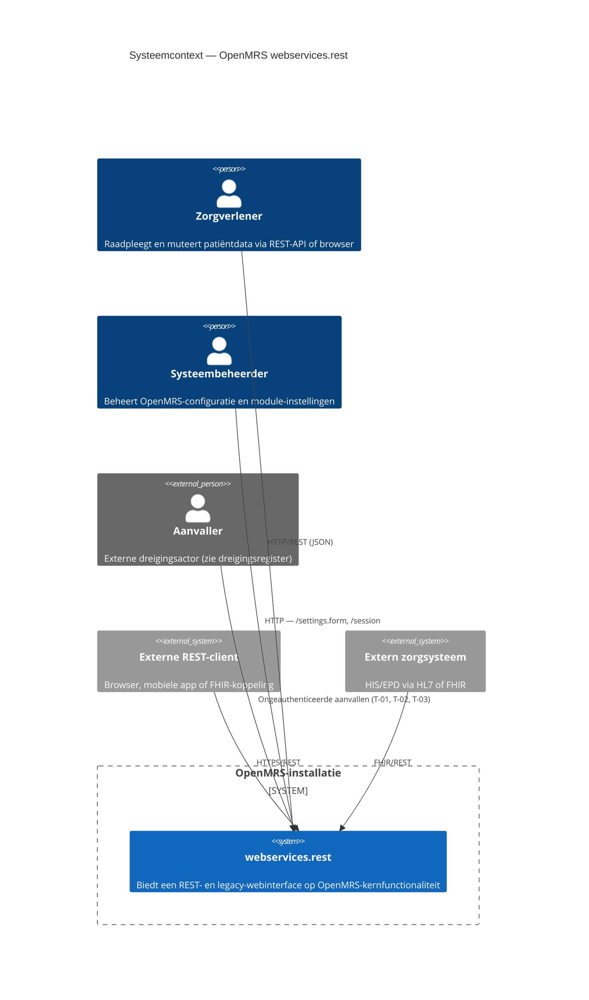
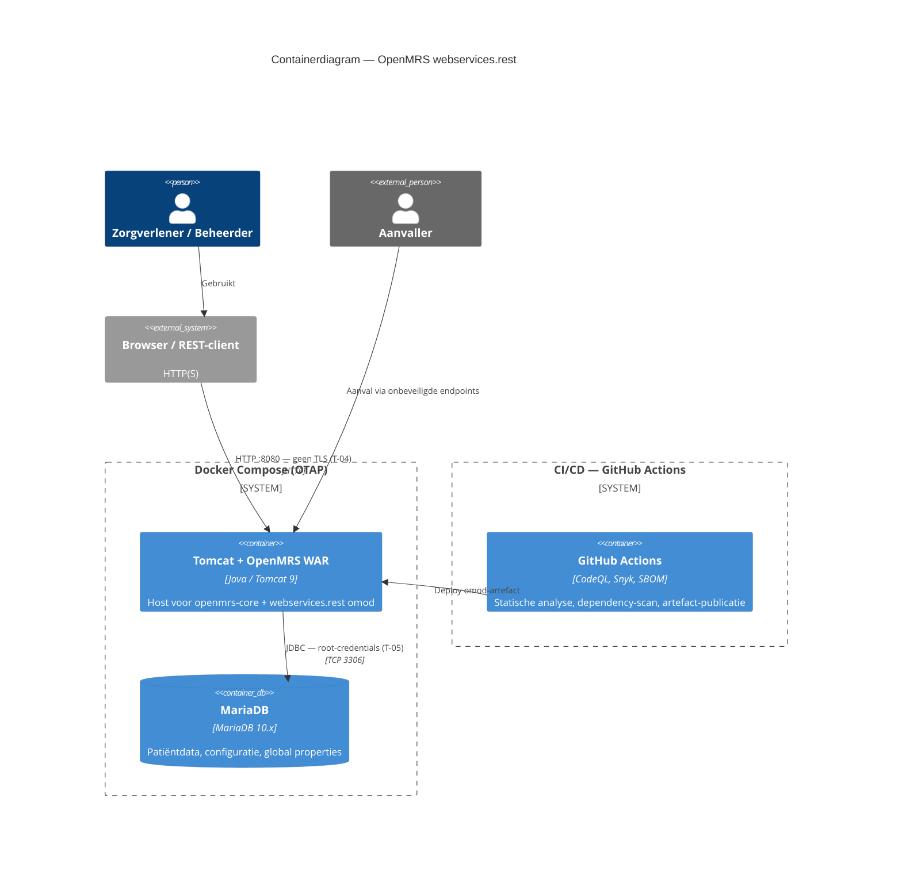
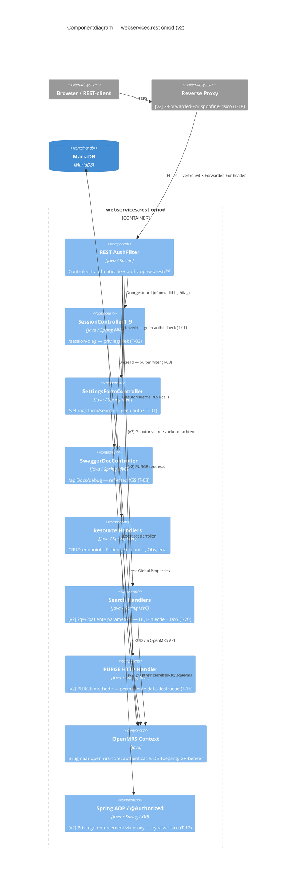

# Threat Model — OpenMRS-module `webservices.rest` (v3.2.0)

**Methodiek:** STRIDE (Spoofing, Tampering, Repudiation, Information Disclosure, Denial of Service, Elevation of Privilege)
**Object van onderzoek:** module `webservices.rest` 3.2.0 (`omod`, `omod-common`) + meegeleverde deployment-/CI-configuratie
**Norm-koppeling:** NEN 7510-2:2024 (beheersmaatregelen; control-nummering conform NEN-EN-ISO/IEC 27001:2023 Bijlage A)
**Datum eerste versie:** 14-06-2026
**Datum huidige versie:** 16-06-2026 — **Versie 2** (bijgewerkt op basis van Attack Surface Mapping)
**Status:** concept — geschikt als auditbijlage
**Relatie tot ander werk:** vult de gap-analyse (`documentation/gap-analyse/security.md`, bevindingen S-1 t/m S-10) aan met een STRIDE-lens, dreigingsactoren en een gekwantificeerd risicoregister. De gap-analyse beoordeelt drie beheersmaatregelen — **A.5.15 Toegangsbeveiliging**, **A.8.28 Veilig coderen** en **A.8.8 Beheer van technische kwetsbaarheden**.

---

## Versiehistorie

| Versie | Datum | Auteur | Wijzigingen |
| :--- | :--- | :--- | :--- |
| v1 | 14-06-2026 | — | Initieel document: STRIDE-analyse op basis van codereview |
| v2 | 16-06-2026 | — | Bijgewerkt op basis van Attack Surface Mapping: 4 nieuwe dreigingen (T-16 t/m T-19) toegevoegd, 2 bestaande dreigingen uitgebreid (T-08, T-12), nieuw Component 7 (Search Handlers) en Component 8 (PURGE-methode) toegevoegd, trust-analyse uitgebreid |

> **Leeswijzer voor wijzigingen:** alle toevoegingen en aanpassingen ten opzichte van v1 zijn gemarkeerd met **`[v2]`**.

---

> **Aannames & afbakening**
> 1. Statische codereview; geen dynamische test (pentest/DAST) uitgevoerd.
> 2. Drie endpoints wijzen op bewust ingebrachte zwakheden: `SessionController1_9.java:168` en `SettingsFormController.java:44` bevatten expliciete `NOTE`-commentaarregels; `SwaggerDocController.java:24-28` (`debug`) is een evidente XSS-injectie zonder comment. Deze worden als reële bevindingen behandeld.
> 3. Veel zware dependencies komen transitief via `openmrs-api`/`openmrs-web` 2.8.3 (`provided`); mitigatie ligt deels upstream.
> 4. Kans/impact-scores zijn kwalitatief (1–5), gebaseerd op exploiteerbaarheid en PHI-gevoeligheid; er is geen CVSS berekend.
> 5. **[v2]** De Attack Surface Mapping (aanvalsoppervlak-analyse) is meegenomen als aanvullende inputbron; hieruit zijn vier nieuwe dreigingsscenario's geïdentificeerd en zijn twee bestaande scenarios aangescherpt.

---

## STAP 1 — Systeemdiagrammen (C4)

### C4 Level 1 — Systeemcontext

### C4 Level 2 — Containerdiagram

### C4 Level 3 — Componentdiagram

---

## STAP 2 — Systeembegrip (samenvatting)

`webservices.rest` ontsluit de OpenMRS-kern-API als REST-webservices. De module is een dunne HTTP↔service-vertaallaag; business-logica en datatoegang zitten upstream in `openmrs-api`/`openmrs-web` 2.8.3 (`provided` scope).

**Belangrijkste dataflows**
- Alle `/ws/rest/*`-verkeer passeert `AuthorizationFilter` (`config.xml:83-103`): eerst IP-allowlist (`RestUtil.isIpAllowed`, `AuthorizationFilter.java:69`), dan optionele HTTP Basic-auth (`:85-117`). De filter **faalt nooit** op ontbrekende/foute credentials (`:110-114`); autorisatie wordt overgelaten aan de service-laag.
- CRUD verloopt generiek via `MainResourceController` → `RestService.getResourceByName()` → OpenMRS-service → DAO → DB.
- Twee endpoints staan **buiten** de REST-filter (andere URL-prefix `/module/webservices/rest/`): `SwaggerDocController` en `SettingsFormController`.
- **[v2]** Search Handlers worden aangestuurd via GET-parameters (`?q=`, `?patient=`, `?v=`) en vertalen gebruikersinvoer direct naar Hibernate-criteria en SQL-queries.
- **[v2]** De `PURGE` HTTP-methode, aangeboden naast `DELETE`, verwijdert data permanent uit de database — in tegenstelling tot `DELETE` dat in OpenMRS doorgaans een soft-delete (`voided`/`retired`) is.

**Trust boundaries**
1. Internet/client → REST-API (HTTP; prod-compose poort 80 **zonder TLS**, `docker-compose.prod.yml:5`).
2. Module → OpenMRS-service-laag → DB (autorisatiegrens; vertrouwt op service-privileges).
3. App-container → MySQL-container (DB-root-pw == app-pw, `docker-compose.prod.yml:21`).
4. Admin-UI-endpoints vallen onder een andere URL-prefix dan de REST-filter → eigen, deels ontbrekende, grenscontrole.
5. **[v2]** Module → Reverse proxy (vertrouwt dat `X-Forwarded-For` niet gespoofed is — zie Trust-analyse STAP 2.1).
6. **[v2]** Module → Spring AOP-proxy (vertrouwt dat `@Authorized`-checks niet omzeild worden via self-invocation).

### [v2] STAP 2.1 — Trust-analyse (uitbreiding o.b.v. Attack Surface Mapping)

De Attack Surface Mapping identificeert vier impliciete trust-relaties die het dreigingsoppervlak vergroten. Deze zijn hieronder opgenomen als aanvulling op de bestaande trust-boundaries.

| # | Vertrouwensrelatie | Risico | Nieuwe dreiging |
| :--- | :--- | :--- | :--- |
| TR-1 | Module vertrouwt dat OpenMRS Core de authenticatiecontext correct vult via `Context.getAuthenticatedUser()` | Kwetsbaarheid in Core-authenticatie wordt blindelings overgenomen | Ondersteunt T-07 |
| TR-2 | Module vertrouwt dat Spring AOP-proxy's `@Authorized`-checks waterdicht afdwingen | Direct aanroepen van een methode binnen dezelfde klasse omzeilt de proxy (*self-invocation bypass*) | **T-17** |
| TR-3 | Module vertrouwt dat de reverse proxy `X-Forwarded-For` niet toestaat te spoofen | Aanvaller spooft zijn IP en omzeilt de `webservices.rest.allowedips` IP-whitelist | **T-18** |
| TR-4 | Module vertrouwt dat data uit de database via Hibernate vrij is van kwaadaardige payloads | Opgeslagen XSS (via een andere module of route) wordt als JSON uitgeserveerd zonder her-sanitatie | **T-19** |

---

## STAP 3 — Asset-identificatie

CIA-classificatie: **C** = Confidentiality, **I** = Integrity, **A** = Availability.

| # | Asset | Type | Meest kritische CIA | Onderbouwing | Leeft in (bestand / tabel) |
|---|-------|------|---------------------|--------------|-----------------------------|
| AS-1 | Patiënt-/klinische data (PHI) | Data | **C** (dan I) | Bijzondere persoonsgegevens; onbevoegde inzage of wijziging raakt direct patiëntveiligheid en privacy | `MainResourceController.java` → OpenMRS-services; DB-tabellen `patient`, `person`, `obs`, `encounter`, `visit` |
| AS-2 | Authenticatiegegevens (credentials) | Data | **C** | Basic-auth-credentials geven volledige toegang; compromittering = identiteitsdiefstal | `AuthorizationFilter.java:86-107`; `ChangePasswordController1_8`, `PasswordResetController2_2`; tabel `users` |
| AS-3 | Sessie- & autorisatiecontext (rollen/privileges) | Systeem | **I** (dan C) | Manipulatie/lek van rollen maakt rechtenescalatie en mapping van het rechtenmodel mogelijk | `SessionController1_9.java:65-85,170-182`; `UserContext` (platform); tabellen `role`, `privilege`, `user_role` |
| AS-4 | Global properties / configuratie & secrets | Data | **C** | GP's bevatten in OpenMRS regelmatig SMTP-/API-credentials en sleutels; lek = secret disclosure | `SettingsFormController.java:55-58`; tabel `global_property` |
| AS-5 | Beschikbaarheid van de REST-API | Systeem | **A** | Zorgproces leunt op realtime API-toegang; uitval blokkeert dossierinzage | `MainResourceController` (`maxResults`-config in `config.xml:39-48`) |
| AS-6 | Audit-/logging-trail | Data | **I** | Betrouwbaarheid van logs bepaalt onweerlegbaarheid en forensische waarde | `BaseRestController.handleException`, `RestUtil.wrapErrorResponse`; platform-logging |
| AS-7 | Deployment-/infrastructuur-secrets | Data | **C** | DB-wachtwoorden; gedeeld root/app-account vergroot blast radius | `deployment/secrets/prod.env.example`, `docker-compose.prod.yml:21` |
| AS-8 | Dependency-/supply-chain-integriteit | Systeem | **I** | EOL-componenten en `:latest`-tags → ongecontroleerde, mogelijk kwetsbare code in productie | `pom.xml`, `omod*/pom.xml`, `webservices-rest-sbom.json`, `docker-compose.prod.yml:3,19` |
| **AS-9** | **[v2] Medische observatiedata (integriteit)** | **Data** | **I** | **Manipulatie van `/ws/rest/v1/observation` via POST/PUT leidt direct tot verkeerde medische beslissingen (bijv. valse lab-uitslagen)** | **`MainResourceController.java`; DB-tabel `obs`** |
| **AS-10** | **[v2] Zoekindex / HQL-querylaag** | **Systeem** | **A (dan I)** | **Search Handlers vertalen gebruikersinvoer naar Hibernate-criteria; misbruik leidt tot database-exhaustie of HQL-injectie** | **`SearchHandler` implementaties; Hibernate criteria API** |

---

## STAP 4 — STRIDE-analyse per component

### Component 1 — `AuthorizationFilter` (toegangspoort `/ws/rest/*`)

- **(S) Spoofing — single-factor Basic-auth + geslikte auth-fouten.**
  `AuthorizationFilter.java:107` authenticeert met enkel username:password; faalt een poging, dan wordt de exceptie geslikt (`:110-114`) en gaat de keten gewoon door. Eén gelekt/zwak wachtwoord = volledige impersonatie; brute-force wordt niet door de filter geremd.
  *Actor:* cybercrimineel — *motief:* toegang tot/verkoop van PHI.

- **(T) Tampering — credential-parsing met `split(":")`.**
  `AuthorizationFilter.java:106` splitst op elke `:`; wachtwoorden met `:` worden afgekapt → onverwacht auth-gedrag en mogelijke logica-omzeiling bij edge-cases.
  *Actor:* cybercrimineel — *motief:* auth-bypass.

- **(I) Information Disclosure — IP-allowlist standaard leeg.**
  `config.xml:54-58`: `allowedips` default leeg = "iedereen toegestaan". De enige netwerkgrens staat standaard open.
  *Actor:* script kiddie — *motief:* opportunistisch scannen.

- **(E) Elevation of Privilege — IP-allowlist als bitmask te ruim.**
  `RestUtil.isIpAllowed` accepteert CIDR-bitmasks (`config.xml:56-57`); een te ruime mask (`/24`) opent het hele subnet.
  *Actor:* insider — *motief:* toegang vanaf medewerkersnet.

- **[v2] (S) Spoofing — IP-whitelist bypass via `X-Forwarded-For` spoofing.**
  De module controleert het client-IP via de `webservices.rest.allowedips`-instelling op basis van het binnenkomende IP-adres. Indien de reverse proxy niet is geconfigureerd om de `X-Forwarded-For`-header te strippen/valideren, kan een aanvaller een willekeurig IP claimen en de whitelist omzeilen.
  *Actor:* cybercrimineel — *motief:* bypass van netwerkbegrenzing, zie T-18.

---

### Component 2 — `SessionController1_9` (`/rest/v1/session` + `/session/diag`)

- **(I) Information Disclosure — ongeauthenticeerd diagnostics-endpoint lekt rollen/privileges.**
  `SessionController1_9.java:170-182` (`GET /session/diag`): geen authz-check (commentaar `:168` bevestigt), retourneert bij geauthenticeerde sessie username, **rollen én privileges** (`:177-179`). De `token`-param (`:172`) is schijnbeveiliging (nergens gevalideerd).
  *Actor:* cybercrimineel — *motief:* recon, rechtenmodel in kaart brengen vóór gerichte aanval.

- **(R) Repudiation — geen audit-logging van diagnose-toegang.**
  `getDiagnostics` logt niets; toegang tot gevoelige sessie-info is niet herleidbaar.
  *Actor:* insider — *motief:* onopgemerkt verkennen.

- **(S) Spoofing — `serverTime` ondersteunt timing/replay-analyse.**
  `:175` geeft `System.currentTimeMillis()` ongeauthenticeerd prijs (laag, ondersteunend).
  *Actor:* cybercrimineel — *motief:* aanvalsondersteuning.

---

### Component 3 — `SwaggerDocController` (`/apiDocs/debug`)

- **(T) Tampering — Reflected XSS via `tag`-parameter.**
  `SwaggerDocController.java:24-28` (`return "<h1>Debugging Tag: " + tag + "</h1>"`, `:27`): zonder output-encoding, zonder `Content-Type`-beperking, zonder authz, buiten de REST-filter. `<script>`-payload wordt in de browser van het slachtoffer uitgevoerd.
  *Actor:* cybercrimineel — *motief:* sessiediefstal/CSRF-opstap richting een ingelogde beheerder.

- **(E) Elevation of Privilege — XSS in beheerderscontext.**
  Wordt de payload door een ingelogde admin geopend, dan kan via de actieve sessie geprivilegieerde actie worden uitgevoerd.
  *Actor:* cybercrimineel — *motief:* overname admin-sessie.

---

### Component 4 — `SettingsFormController` (`/settings.form/search`)

- **(I) Information Disclosure — ongeauthenticeerde global-property-zoek lekt secrets.**
  `SettingsFormController.java:50-63`: geen `Context.isAuthenticated()`-check (`:53`), retourneert naam **én waarde** van GP's die op `prefix` matchen (`:57-58`). GP's bevatten regelmatig SMTP-/API-credentials. Leeg `prefix` (default `""`, `:52`) dumpt potentieel álle properties.
  *Actor:* cybercrimineel — *motief:* secret harvesting, lateral movement.

- **(T) Tampering — JSON via string-concatenatie (JSON/response-injection).**
  `:57-58` bouwt JSON met `StringBuilder` zonder escaping; een GP-waarde met `"`/`}` breekt de structuur en maakt response-manipulatie mogelijk.
  *Actor:* cybercrimineel — *motief:* output-vergiftiging/parserverwarring bij consumers.

- **(E) Elevation of Privilege — opstap naar admin via gelekte secrets.**
  Gelekte API-/SMTP-credentials uit GP's kunnen elders rechten opleveren.
  *Actor:* cybercrimineel — *motief:* rechtenuitbreiding buiten de module.

---

### Component 5 — `MainResourceController` (generieke CRUD/PHI)

- **(I) Information Disclosure — interne details in elke foutrespons.**
  `RestUtil.wrapErrorResponse` voegt standaard `code` (`klasse:regelnummer`) en `rawMessage` toe; lekt interne structuur aan elke client.
  *Actor:* cybercrimineel — *motief:* recon.

- **(D) Denial of Service — onbegrensde upload / dure searches.**
  `MainResourceController.java:96-109` accepteert `multipart/form-data`-uploads zonder zichtbare groottebegrenzing in deze laag; ongebonden/zware searches (`:181-213`) kunnen resources uitputten. `maxResults` (`config.xml:39-48`) begrenst paginagrootte maar niet de aanvalsfrequentie.
  *Actor:* script kiddie / cybercrimineel — *motief:* verstoring zorgproces.

- **(E) Elevation of Privilege — autorisatie volledig gedelegeerd aan service-laag.**
  De controller dwingt zelf geen privilege af; een fout/zwakte in de onderliggende resource- of service-privileges resulteert direct in ongeautoriseerde CRUD op PHI.
  *Actor:* insider — *motief:* inzage/wijziging buiten bevoegdheid.

---

### Component 6 — Deployment & supply chain

- **(I) Information Disclosure — geen TLS in productie.**
  `docker-compose.prod.yml:5` publiceert poort `80:8080` zonder TLS-terminatie; PHI én Basic-auth-credentials gaan in cleartext over het netwerk.
  *Actor:* cybercrimineel (MITM) / statelijke actor — *motief:* onderschepping PHI/credentials.

- **(E) Elevation of Privilege — DB-root-pw == app-pw, geen functiescheiding.**
  `docker-compose.prod.yml:21`: `MYSQL_ROOT_PASSWORD: ${OPENMRS_DB_PASSWORD}`. Compromittering van het app-account = DB-root.
  *Actor:* cybercrimineel — *motief:* volledige DB-overname.

- **(T) Tampering — `:latest`-image-tags, geen pinning.**
  `docker-compose.prod.yml:3,19`: niet-reproduceerbare images → supply-chain-/tamper-risico.
  *Actor:* statelijke actor / cybercrimineel — *motief:* supply-chain-compromittering.

- **(E) Elevation of Privilege — EOL-dependencies (Struts 1.3.8, Velocity 1.7, Jackson 1.x, Spring 5.3.x).**
  Transitief via platform; bekende kwetsbaarheidscategorieën (deserialisatie/RCE), zonder geautomatiseerde scan in CI.
  *Actor:* cybercrimineel — *motief:* RCE/code-uitvoering.

---

### [v2] Component 7 — Search Handlers (`?q=`, `?patient=`, `?v=` parameters)

> **Nieuw in v2** — geïdentificeerd via de Attack Surface Mapping (sectie 1.2 Dynamic Search Handlers).

- **[v2] (T) Tampering / (I) Information Disclosure — HQL-injectie via query-parameters.**
  Search Handlers vertalen GET-parameters (`?q=`, `?patient=`, `?v=`) direct naar Hibernate-criteria en HQL-queries. Indien de invoer niet correct wordt gesaniteerd via de Hibernate Criteria API, kan een aanvaller de query-logica manipuleren en ongeautoriseerde data ophalen of de query-structuur corrumperen.
  *Actor:* cybercrimineel — *motief:* gegevensdiefstal PHI buiten de normale autorisatiecontext. → **T-20**

- **[v2] (D) Denial of Service — database-exhaustie via complexe zoekopdrachten.**
  Zoekopdrachten met brede of recursieve criteria kunnen leiden tot full table scans of zeer zware joins op grote datasets (patiënt-, encounter- en observatietabellen). De `webservices.rest.maxResultsAbsolute`-parameter begrenst het *resultaat* maar niet de *query-complexiteit* of het *aantal parallelle requests*.
  *Actor:* script kiddie / cybercrimineel — *motief:* verstoring van het zorgproces. → Uitbreiding van T-12.

---

### [v2] Component 8 — `PURGE` HTTP-methode

> **Nieuw in v2** — geïdentificeerd via de Attack Surface Mapping (sectie 2, High Risk Ingangen).

- **[v2] (T) Tampering — permanente data-destructie via PURGE.**
  In tegenstelling tot de `DELETE`-methode, die in OpenMRS data markeert als `voided` of `retired` (soft-delete), verwijdert de `PURGE`-methode records **permanent** uit de database. Indien een aanvaller of onbevoegde gebruiker PURGE-rechten heeft, of indien een autorisatiefout optreedt, kan PHI onomkeerbaar worden vernietigd.
  *Actor:* cybercrimineel / insider — *motief:* sabotage van medische dossiers, sporen wissen. → **T-16**

---

### [v2] Component 9 — Spring AOP / `@Authorized`-annotaties

> **Nieuw in v2** — geïdentificeerd via de Attack Surface Mapping (sectie 3.2 Trust-analyse).

- **[v2] (E) Elevation of Privilege — AOP self-invocation bypass.**
  De REST-module vertrouwt op Spring's Aspect-Oriented Programming (AOP) proxy's om `@Authorized`-annotaties af te dwingen. Wanneer een methode vanuit dezelfde klasse direct wordt aangeroepen (self-invocation), in plaats van via de Spring-bean proxy, wordt de security-check omzeild. Dit kan optreden bij interne refactoring of bij ontbrekende kennis van Spring AOP-gedrag bij developers.
  *Actor:* insider / developer — *motief:* onbedoelde of bewuste rechtenescalatie. → **T-17**

- **[v2] (I) Information Disclosure — onbedoelde data-exposure bij AOP-bypass.**
  Een omzeilde `@Authorized`-check op een read-methode geeft PHI terug zonder autorisatiecontrole.
  *Actor:* insider — *motief:* inzage in data buiten bevoegdheid.

---

### Cross-cutting

- **(R) Repudiation — geen aantoonbare security-/audittrail van gevoelige toegang.**
  Foutlogging bestaat (`BaseRestController.handleException`), maar er is geen audit-log van wie wanneer welke PHI/secret benaderde; acties zijn niet onweerlegbaar herleidbaar.
  *Actor:* insider — *motief:* sporen wissen / plausibele ontkenning.

- **(D) Denial of Service — geen rate limiting / brute-force-rem.**
  Noch `AuthorizationFilter` noch de controllers limiteren verzoekfrequentie; combineert met geslikte auth-fouten tot ongeremde brute-force.
  *Actor:* script kiddie — *motief:* verstoring / credential-stuffing.

- **[v2] (T) Tampering — Stored XSS via database-vergiftiging.**
  De REST-module vertrouwt erop dat data afkomstig uit de database (via Hibernate) geen kwaadaardige JavaScript bevat. Als via een andere module of aanvalsroute eerder XSS is opgeslagen in de database, serveer de REST-module deze payload zonder her-sanitatie als JSON uit naar clients. → **T-19**

---

## STAP 5 — Risicoregister

Score = Kans × Impact. **Rood ≥ 15 · Oranje 8–14 · Groen ≤ 7.**

Nieuwe dreigingen (v2) zijn gemarkeerd met **Nieuw**.

| ID | Dreiging | STRIDE | Actor | Kans (1-5) | Impact (1-5) | Score | Prioriteit | Versie |
|----|----------|--------|-------|:----------:|:------------:|:-----:|:----------:|:------:|
| T-01 | Ongeauthenticeerde `/settings.form/search` lekt GP-waarden (secrets) | Information Disclosure | Cybercrimineel | 5 | 5 | **25** | 🔴 Rood | v1 |
| T-02 | Ongeauthenticeerde `/session/diag` lekt rollen/privileges | Information Disclosure | Cybercrimineel | 5 | 4 | **20** | 🔴 Rood | v1 |
| T-03 | Reflected XSS via `/apiDocs/debug?tag=` | Tampering | Cybercrimineel | 4 | 4 | **16** | 🔴 Rood | v1 |
| T-04 | Geen TLS in productie → cleartext PHI + credentials | Information Disclosure | Cybercrimineel / statelijk | 3 | 5 | **15** | 🔴 Rood | v1 |
| T-05 | DB-root-pw == app-pw (geen functiescheiding) | Elevation of Privilege | Cybercrimineel | 3 | 5 | **15** | 🔴 Rood | v1 |
| T-06 | EOL-dependencies (Struts 1.x e.a.) → RCE-categorie | Elevation of Privilege | Cybercrimineel | 3 | 5 | **15** | 🔴 Rood | v1 |
| **T-16** Nieuw | **PURGE-methode toegankelijk → permanente PHI-destructie** | **Tampering** | **Cybercrimineel / insider** | **3** | **5** | **15** | **🔴 Rood** | **v2** |
| T-07 | Single-factor Basic-auth + geslikte auth-fouten (brute-force) | Spoofing | Cybercrimineel | 4 | 3 | **12** | 🟠 Oranje | v1 |
| T-08 | IP-allowlist standaard leeg ("iedereen toegestaan") | Information Disclosure | Script kiddie | 4 | 3 | **12** | 🟠 Oranje | v1 |
| **T-18** Nieuw | **IP-whitelist bypass via `X-Forwarded-For` spoofing** | **Spoofing** | **Cybercrimineel** | **3** | **4** | **12** | **🟠 Oranje** | **v2** |
| **T-20** Nieuw | **HQL-injectie via Search Handler-parameters (`?q=` e.d.)** | **Tampering / Information Disclosure** | **Cybercrimineel** | **3** | **4** | **12** | **🟠 Oranje** | **v2** |
| T-09 | Geen rate limiting / brute-force-rem | Denial of Service | Script kiddie | 3 | 3 | **9** | 🟠 Oranje | v1 |
| T-11 | JSON via string-concat in `/settings.form/search` (injection) | Tampering | Cybercrimineel | 3 | 3 | **9** | 🟠 Oranje | v1 |
| T-10 | Autorisatie volledig gedelegeerd aan service-laag | Elevation of Privilege | Insider | 2 | 4 | **8** | 🟠 Oranje | v1 |
| T-13 | `:latest`-image-tags (geen pinning) | Tampering | Statelijk / cybercrimineel | 2 | 4 | **8** | 🟠 Oranje | v1 |
| T-14 | Interne details (`code`/`rawMessage`) in foutrespons | Information Disclosure | Cybercrimineel | 4 | 2 | **8** | 🟠 Oranje | v1 |
| **T-17** Nieuw | **AOP self-invocation bypass op `@Authorized`-annotaties** | **Elevation of Privilege** | **Insider / developer** | **2** | **4** | **8** | **🟠 Oranje** | **v2** |
| T-12 | Onbegrensde upload / dure searches *(aangescherpt: incl. Search Handler-DoS)* | Denial of Service | Script kiddie | 2 | 3 | **6** | 🟢 Groen | v1 → v2 |
| T-15 | Geen audit-/security-trail van gevoelige toegang | Repudiation | Insider | 3 | 2 | **6** | 🟢 Groen | v1 |
| **T-19** Nieuw | **Stored XSS via database-vergiftiging, uitgeserveerd door REST-module** | **Tampering** | **Cybercrimineel** | **2** | **3** | **6** | **🟢 Groen** | **v2** |

---

### Onderbouwing kans/impact — nieuwe dreigingen (v2)

- **T-16 (15):** Kans 3 — vereist geauthenticeerde sessie of autorisatiefout; PURGE is een bewuste HTTP-methode. Impact 5 — permanente, onomkeerbare verwijdering van PHI; geen undo.
- **T-18 (12):** Kans 3 — vereist misconfiguratie van de reverse proxy (niet ongebruikelijk in test-/acceptatieomgevingen). Impact 4 — bypass van de enige netwerkbegrenzing (IP-whitelist) opent de REST-API voor onbeperkte toegang.
- **T-20 (12):** Kans 3 — Search Handlers ontvangen ongesaniteerde GET-parameters; Hibernate Criteria API is niet automatisch veilig bij onjuist gebruik. Impact 4 — HQL-injectie kan leiden tot ongeautoriseerde PHI-exposure of queryvervuiling.
- **T-17 (8):** Kans 2 — vereist een specifieke codepatroon (self-invocation); treedt niet op bij correct gebruik van Spring-beans. Impact 4 — directe rechtenescalatie zonder audittrail als de bypass onopgemerkt blijft.
- **T-19 (6):** Kans 2 — vereist dat eerder via een andere route XSS in de database is geïnjecteerd. Impact 3 — client-side aanval; impact afhankelijk van wie de data opvraagt en via welke client.

---

### STAP 5.1 — Koppeling met de drie beoordeelde gap-analyse-controls

| Gap-analyse-control | Onderbouwende dreigingen (dit register) | Gap-analyse-bevindingen |
| :--- | :--- | :--- |
| **A.5.15** Toegangsbeveiliging | T-01, T-02, T-10, **T-16** 🆕, **T-17** 🆕, **T-18** 🆕 | S-1, S-3 |
| **A.8.28** Veilig coderen | T-03, T-11, T-14, **T-19** 🆕, **T-20** 🆕 | S-2, S-3, S-4, S-10 |
| **A.8.8** Beheer van technische kwetsbaarheden | T-06, T-13 | S-7 |

> Nieuw in v2: A.5.15 ondersteunt nu ook T-16, T-17 en T-18 op basis van de Attack Surface Mapping. A.8.28 is uitgebreid met T-19 (Stored XSS) en T-20 (HQL-injectie via Search Handlers).

> Dreigingen buiten deze drie controls (o.a. T-04 TLS → A.8.24, T-05 DB-credentials → A.8.2, T-07 Basic-auth → A.8.5) blijven in dit threat model staan omdat een STRIDE-analyse breder is dan de drie getoetste controls.

---

## STAP 6 — Maatregelen voor de top 5 + nieuwe rode dreiging

### T-01 — Secret-lek via `/settings.form/search` (score 25, 🔴)
- **Preventief:** Endpoint verwijderen, of `Context.isAuthenticated()` + privilege (`Manage RESTWS`/`GET_GLOBAL_PROPERTIES`) afdwingen; gevoelige waarden **maskeren** en nooit teruggeven; JSON via een serializer i.p.v. concatenatie. → **A.5.15**, **A.8.11**, **A.8.28**.
- **Detectief/correctief:** Security-logging op elke aanroep van GP-zoek/-uitlezing + alert bij ongeauthenticeerde toegang; secrets uit GP halen en roteren. → **A.8.15**, **A.8.16**.

### T-02 — Rollen/privilege-lek via `/session/diag` (score 20, 🔴)
- **Preventief:** Diagnostics-endpoint verwijderen; indien nodig achter authenticatie + privilege plaatsen en **nooit** rollen/privileges teruggeven. → **A.5.15**, **A.8.3**.
- **Detectief/correctief:** Audit-logging van toegang tot sessie-/diagnose-info; anomaliedetectie op ongeauthenticeerde hits. → **A.8.15**, **A.8.16**.

### T-03 — Reflected XSS via `/apiDocs/debug` (score 16, 🔴)
- **Preventief:** Debug-endpoint verwijderen; anders input valideren + output-encoden (OWASP Java Encoder), `Content-Type` vastzetten en achter authz plaatsen. → **A.8.28**, **A.8.26**.
- **Detectief/correctief:** `Content-Security-Policy`-header + WAF-/loggingregel op verdachte `tag`-payloads. → **A.8.15**, **A.8.23**.

### T-04 — Geen TLS in productie (score 15, 🔴)
- **Preventief:** TLS-terminatie via reverse proxy/ingress; HTTP→HTTPS-redirect + HSTS; poort 80 niet direct publiceren. → **A.8.24**, **A.8.20**.
- **Detectief/correctief:** Monitoring op cleartext-verbindingen en certificaatverloop. → **A.8.16**, **A.8.29**.

### T-05 — DB-root-pw == app-pw (score 15, 🔴)
- **Preventief:** Apart, least-privilege app-DB-account scheiden van root; sterke, unieke secrets per rol. → **A.5.15**, **A.8.2**.
- **Detectief/correctief:** DB-audit op root-/admin-acties + alert; secret-rotatie en credential-scanning in CI. → **A.8.15**, **A.8.8**.

### [v2] T-16 — PURGE permanente data-destructie (score 15, 🔴)
> **Nieuw in v2** — geïdentificeerd via Attack Surface Mapping (sectie 2).

- **Preventief:** PURGE-methode globaal uitschakelen in productie via configuratie; indien nodig, restricten tot een expliciete `System Administration`-privilege-check met dubbele autorisatie. Audit-trail verplichten vóór PURGE-uitvoering. → **A.5.15 Toegangsbeveiliging**, **A.8.3 Beperking toegang tot informatie**.
- **Detectief/correctief:** Monitoring en alerting op iedere PURGE-aanroep; dagelijkse DB-backups zodat permanente verwijdering terug te draaien is via herstel. → **A.8.15 Logging**, **A.8.13 Informatieback-up**.

---

> **Vermeldenswaardig — T-06 (EOL-dependencies, score 15):** preventief OWASP Dependency-Check/Trivy in CI + upgradeplan (Struts/Velocity/Jackson 1.x), detectief continue SCA-monitoring en SBOM-diffing. → **A.8.8**, **A.8.29**.

> **[v2] Vermeldenswaardig — T-20 (HQL-injectie via Search Handlers, score 12):** preventief gebruik van de Hibernate Criteria API correct (geparametriseerde queries, nooit string-concatenatie), activeer `webservices.rest.maxResultsAbsolute` als harde bovengrens. → **A.8.28 Veilig coderen**.

> **[v2] Vermeldenswaardig — T-18 (IP-spoofing via X-Forwarded-For, score 12):** preventief reverse proxy configureren om `X-Forwarded-For` te strippen of te valideren (bijv. `RemoteIPValve` in Tomcat of Nginx `real_ip_header`). → **A.8.20 Netwerkbeveiliging**.

---

## Samenvatting & vervolg

### [v2] Samenvatting wijzigingen t.o.v. v1

| Onderdeel | Wijziging |
| :--- | :--- |
| Componentdiagram (C4 L3) | Search Handlers (Component 7), PURGE-handler (Component 8) en AOP-proxy (Component 9) toegevoegd |
| Trust-analyse | Sectie STAP 2.1 nieuw: vier impliciete trust-relaties (TR-1 t/m TR-4) geëxpliciteerd |
| Asset-tabel | AS-9 (observatiedata-integriteit) en AS-10 (zoekindex) toegevoegd |
| STRIDE-analyse | Componenten 7, 8, 9 nieuw; Component 1 uitgebreid met X-Forwarded-For scenario |
| Risicoregister | T-16 (PURGE), T-17 (AOP bypass), T-18 (IP spoofing), T-19 (Stored XSS) toegevoegd; T-12 aangescherpt |
| Control-koppeling (STAP 5.1) | A.5.15 en A.8.28 ondersteund door extra dreigingen |
| Maatregelen (STAP 6) | T-16 toegevoegd als zesde te adresseren rode dreiging |

- **7 rode dreigingen** (T-01 t/m T-06, T-16) vragen onmiddellijke actie; drie daarvan (T-01/T-02/T-03) zijn direct, ongeauthenticeerd exploiteerbaar.
- **Quick wins:** de drie ingebrachte endpoints verwijderen/beveiligen sluit T-01, T-02, T-03 én T-11 in één wijziging af; PURGE beperken (T-16) is een aanvullende snelle win met hoge impactreductie.
- **Structureel:** TLS afdwingen (T-04), credential-scheiding (T-05), SCA in CI (T-06), reverse proxy hardening voor X-Forwarded-For (T-18), Hibernate-query-sanitatie in Search Handlers (T-20), en een security-/audittrail (T-15) opzetten.
- **Validatie:** bevestig de top-7 met een geautoriseerde pentest op een test-/acceptatieomgeving (**A.8.29 Beveiligingstesten**, **A.8.34 audittests vooraf afstemmen**).