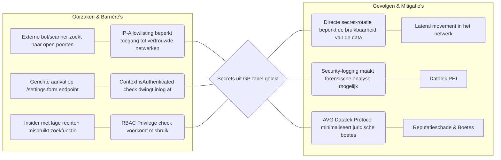
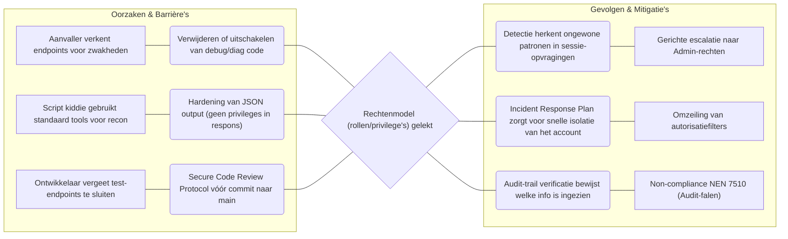

# Risk Assessment Report — OpenMRS REST Web Services Module

**Datum:** 17-06-2026  
**Project:** Module 2.4 (LU2) - Avans Hogeschool  
**Status:** Definitief (v3.0 - Herleidbaarheid naar Risicoanalyse)  

---

## 1. Introductie & Scope
Dit rapport consolideert de resultaten uit de verschillende onderzoeksdocumenten. De inhoud is direct herleidbaar naar de door de groep uitgevoerde risico-analyses, zijnde:
1.  **SysteemAnalyse.md (SA)**: Identificatie van assets en CIA-waarden.
2.  **THREAT_MODEL.md (TM)**: STRIDE-analyse, risicoregister en voorgestelde maatregelen.
3.  **Gap-analyse Security (GA)**: Compliance-toetsing aan NEN 7510 en technische bevindingen.

---

## 2. Identificatie van Gevoelige Gegevens (Kroonjuwelen)
De assets zijn geïdentificeerd in de systeemanalyse op basis van hun impact op de zorgverlening en privacy.

| Asset ID | Asset | Classificatie | Bronvermelding (Document:Sectie) |
|:---|:---|:---|:---|
| **AS-1** | Patiëntidentificatie & Medische data | **C: Hoog**, I: Hoog | `SysteemAnalyse.md`: §1.2 (Items 1-5) |
| **AS-2** | Authenticatiegegevens (Credentials) | **C: Hoog** | `SysteemAnalyse.md`: §1.2 (Item 7); `TM.md`: §3 (AS-2) |
| **AS-3** | Sessie- & autorisatiecontext | **I: Hoog** | `THREAT_MODEL.md`: §3 (AS-3) |
| **AS-4** | Global Properties & Secrets | **C: Hoog** | `THREAT_MODEL.md`: §3 (AS-4) |

---

## 3. Geprioriteerde Security Requirements (Security Backlog)
Deze requirements zijn de "Geprioriteerde security requirements" zoals gevraagd in Sprint 2, afgeleid van de hoogste risico's uit de matrix.

| ID | Requirement | Herkomst Risico | Prioriteit (Score) | NEN 7510 Control |
|:---|:---|:---|:---:|:---|
| **SR-01** | Toegangscontrole en masking op Global Properties. | TM: T-01 (Score 25) | Kritiek | A.5.15, A.8.11 |
| **SR-02** | Beperken van informatielekkage in diagnostics. | TM: T-02 (Score 20) | Hoog | A.5.15, A.8.3 |
| **SR-03** | Output encoding voor web-parameters (XSS). | TM: T-03 (Score 16) | Hoog | A.8.28 |
| **SR-04** | Implementatie van TLS voor transportbeveiliging. | TM: T-04 (Score 15) | Hoog | A.8.24 |
| **SR-05** | Functiescheiding in database-accounts. | TM: T-05 (Score 15) | Hoog | A.5.15, A.8.2 |
| **SR-06** | Upgraden van EOL/kwetsbare dependencies. | TM: T-06 (Score 15) | Hoog | A.8.8 |

---

## 4. Uitgebreide Bow-tie Analyses
De Bow-tie methodiek wordt hieronder ingezet om de beheersbaarheid van de meest kritieke risico's te onderbouwen door oorzaken en gevolgen direct te koppelen aan specifieke barrières.

### 4.1 Bow-tie 1: Ongeautoriseerde uitlezing van Systeem-secrets (T-01)
*Herkomst:* Risico T-01 uit de matrix (`TM: §5`, Score 25).

---

### 4.2 Bow-tie 2: Reconnaissance van het Rechtenmodel (T-02)
*Herkomst:* Risico T-02 uit de matrix (`TM: §5`, Score 20).

---

## 5. Risico-evaluatie & Kostenraming
Conform de criteria uit de Systeemanalyse (`SA: §3`) en de ramingseisen uit Sprint 2. De kosten zijn gebaseerd op het implementeren van de barrières uit de Bow-ties.

| Risico ID | Omschrijving | Score | Mitigatie-advies | Kosten (Inschatting) | Herleidbaarheid |
|:---|:---|:---:|:---|:---|:---|
| **T-01** | Secret-lek via GP | 25 | Implementatie B1, B2 en B3 | 8u | `TM: §6` |
| **T-02** | Rollenlek via diag | 20 | Implementatie B4 en B5 | 4u | `TM: §6` |
| **T-03** | Reflected XSS | 16 | Output-encoding | 4u | `TM: §6` |
| **T-04** | Geen TLS | 15 | Reverse Proxy (NEN A.8.24) | 4u | `GA: §5` |
| **T-05** | DB-account mix | 15 | Account-scheiding (NEN A.8.2) | 4u | `GA: §5` |
| **T-06** | EOL Dependencies | 15 | Upgrade traject (NEN A.8.8) | 8u | `GA: §3` |

**Totaal geraamde uren:** 32 uur (~ € 3.200,- op basis van interne tarieven).

---

## 5. Risico-evaluatie & Kostenraming
Conform de criteria uit de Systeemanalyse (`SA: §3`) en de ramingseisen uit Sprint 2.

| Risico ID | Omschrijving | Score | Mitigatie-advies | Kosten (Inschatting) |
|:---|:---|:---:|:---|:---|
| **T-01** | Secret-lek via GP | 25 | Zie Bow-tie 1 | 8u |
| **T-02** | Rollenlek via diag | 20 | Zie Bow-tie 2 | 4u |
| **T-03** | Reflected XSS | 16 | Output-encoding | 4u |
| **T-04** | Geen TLS | 15 | Reverse Proxy config | 4u |
| **T-05** | DB-account mix | 15 | Account-scheiding | 4u |
| **T-06** | EOL Dependencies | 15 | Upgrade traject | 8u |

**Totaal geraamde uren:** 32 uur (~ € 3.200,- op basis van interne tarieven).

---

## 6. Conclusie
De risicomatrix toont een kritiek beeld voor de vertrouwelijkheid (**C**) van systeemgegevens. De voorgestelde maatregelen in de Bow-ties zijn essentieel om te voldoen aan **NEN 7510 controls A.5.15 en A.8.28**. Uitvoering van de SR-backlog binnen de PoC is noodzakelijk om het risicoprofiel naar een acceptabel niveau te brengen.
