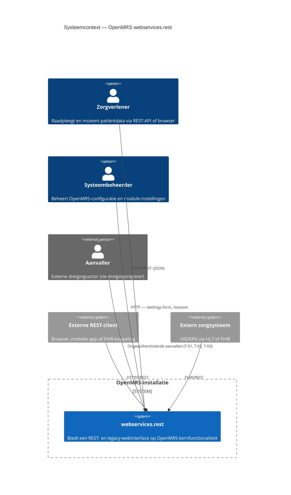
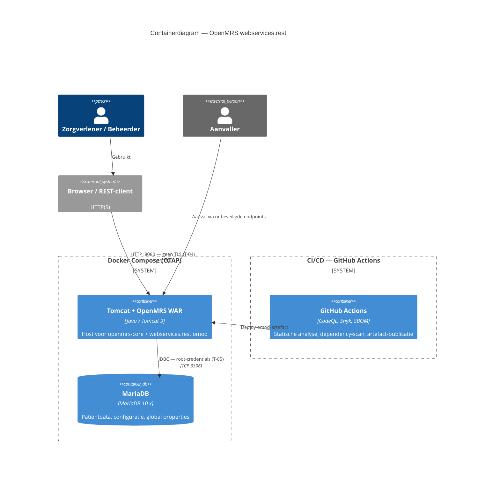
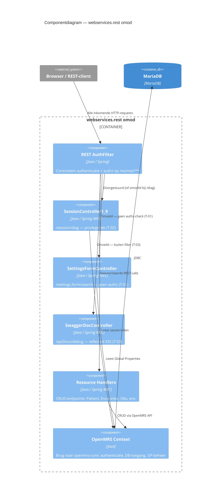

# Threat Model — OpenMRS-module `webservices.rest` (v3.2.0)

**Methodiek:** STRIDE (Spoofing, Tampering, Repudiation, Information Disclosure, Denial of Service, Elevation of Privilege)
**Object van onderzoek:** module `webservices.rest` 3.2.0 (`omod`, `omod-common`) + meegeleverde deployment-/CI-configuratie
**Norm-koppeling:** NEN 7510-2:2024 (beheersmaatregelen; control-nummering conform NEN-EN-ISO/IEC 27001:2023 Bijlage A — zelfde nummering als de gap-analyse)
**Datum:** 14-06-2026 (herzien 16-06-2026)
**Status:** concept — geschikt als auditbijlage
**Relatie tot ander werk:** vult de gap-analyse (`documentation/gap-analyse/security.md`, bevindingen S-1 t/m S-10) aan met een STRIDE-lens, dreigingsactoren en een gekwantificeerd risicoregister. De gap-analyse beoordeelt sinds de herziening van 16-06-2026 gericht **drie** beheersmaatregelen — **A.5.15 Toegangsbeveiliging**, **A.8.28 Veilig coderen** en **A.8.8 Beheer van technische kwetsbaarheden**. Dit document gebruikt dezelfde control-nummering (Bijlage A, met `A.`-prefix) en maakt de koppeling met die drie controls expliciet in STAP 4.1.

> **Aannames & afbakening**
> 1. Statische codereview; geen dynamische test (pentest/DAST) uitgevoerd.
> 2. Drie endpoints wijzen op bewust ingebrachte zwakheden: `SessionController1_9.java:168` en `SettingsFormController.java:44` bevatten expliciete `NOTE`-commentaarregels; `SwaggerDocController.java:24-28` (`debug`) is een evidente XSS-injectie zonder comment. Deze worden als reële bevindingen behandeld.
> 3. Veel zware dependencies komen transitief via `openmrs-api`/`openmrs-web` 2.8.3 (`provided`); mitigatie ligt deels upstream.
> 4. Kans/impact-scores zijn kwalitatief (1–5), gebaseerd op exploiteerbaarheid en PHI-gevoeligheid; er is geen CVSS berekend.

## STAP 1 — Systeemdiagrammen (C4)

### C4 Level 1 — Systeemcontext

### C4 Level 2 — Containerdiagram

### C4 Level 3 — Componentdiagram

---

## STAP 2 — Systeembegrip (samenvatting)

`webservices.rest` ontsluit de OpenMRS-kern-API als REST-webservices. De module is een dunne HTTP↔service-vertaallaag; business-logica en datatoegang zitten upstream in `openmrs-api`/`openmrs-web` 2.8.3 (`provided` scope).

**Belangrijkste dataflows**
- Alle `/ws/rest/*`-verkeer passeert `AuthorizationFilter` (`config.xml:83-103`): eerst IP-allowlist (`RestUtil.isIpAllowed`, `AuthorizationFilter.java:69`), dan optionele HTTP Basic-auth (`:85-117`). De filter **faalt nooit** op ontbrekende/foute credentials (`:110-114`); autorisatie wordt overgelaten aan de service-laag.
- CRUD verloopt generiek via `MainResourceController` → `RestService.getResourceByName()` → OpenMRS-service → DAO → DB.
- Twee endpoints staan **buiten** de REST-filter (andere URL-prefix `/module/webservices/rest/`): `SwaggerDocController` en `SettingsFormController`.

**Trust boundaries**
1. Internet/client → REST-API (HTTP; prod-compose poort 80 **zonder TLS**, `docker-compose.prod.yml:5`).
2. Module → OpenMRS-service-laag → DB (autorisatiegrens; vertrouwt op service-privileges).
3. App-container → MySQL-container (DB-root-pw == app-pw, `docker-compose.prod.yml:21`).
4. Admin-UI-endpoints vallen onder een andere URL-prefix dan de REST-filter → eigen, deels ontbrekende, grenscontrole.

---

## STAP 3 — Asset-identificatie

CIA-classificatie: **C** = Confidentiality, **I** = Integrity, **A** = Availability. De gemarkeerde letter is het meest kritisch voor dat asset.

| # | Asset | Type | Meest kritische CIA | Onderbouwing | Leeft in (bestand / tabel) |
|---|-------|------|---------------------|--------------|-----------------------------|
| AS-1 | Patiënt-/klinische data (PHI) | Data | **C** (dan I) | Bijzondere persoonsgegevens; onbevoegde inzage of wijziging raakt direct patiëntveiligheid en privacy | `MainResourceController.java` → OpenMRS-services; DB-tabellen `patient`, `person`, `obs`, `encounter`, `visit` |
| AS-2 | Authenticatiegegevens (credentials) | Data | **C** | Basic-auth-credentials geven volledige toegang; compromittering = identiteitsdiefstal | `AuthorizationFilter.java:86-107`; `ChangePasswordController1_8`, `PasswordResetController2_2`; tabel `users` |
| AS-3 | Sessie- & autorisatiecontext (rollen/privileges) | Systeem | **I** (dan C) | Manipulatie/lek van rollen maakt rechtenescalatie en mapping van het rechtenmodel mogelijk | `SessionController1_9.java:65-85,170-182`; `UserContext` (platform); tabellen `role`, `privilege`, `user_role` |
| AS-4 | Global properties / configuratie & secrets | Data | **C** | GP's bevatten in OpenMRS regelmatig SMTP-/API-credentials en sleutels; lek = secret disclosure | `SettingsFormController.java:55-58`; tabel `global_property` |
| AS-5 | Beschikbaarheid van de REST-API | Systeem | **A** | Zorgproces leunt op realtime API-toegang; uitval blokkeert dossierinzage | `MainResourceController` (`maxResults`-config in `config.xml:39-48`) |
| AS-6 | Audit-/logging-trail | Data | **I** | Betrouwbaarheid van logs bepaalt onweerlegbaarheid en forensische waarde | `BaseRestController.handleException`, `RestUtil.wrapErrorResponse`; platform-logging |
| AS-7 | Deployment-/infrastructuur-secrets | Data | **C** | DB-wachtwoorden; gedeeld root/app-account vergroot blast radius | `deployment/secrets/prod.env.example`, `docker-compose.prod.yml:21` |
| AS-8 | Dependency-/supply-chain-integriteit | Systeem | **I** | EOL-componenten en `:latest`-tags → ongecontroleerde, mogelijk kwetsbare code in productie | `pom.xml`, `omod*/pom.xml`, `webservices-rest-sbom.json`, `docker-compose.prod.yml:3,19` |

---

## STAP 4 — STRIDE-analyse per component

Alleen realistische dreigingen voor déze code zijn opgenomen, met codeverwijzing, dreigingsactor en motief.

### Component 1 — `AuthorizationFilter` (toegangspoort `/ws/rest/*`)

- **(S) Spoofing — single-factor Basic-auth + geslikte auth-fouten.**
  `AuthorizationFilter.java:107` authenticeert met enkel username:password; faalt een poging, dan wordt de exceptie geslikt (`:110-114`) en gaat de keten gewoon door. Eén gelekt/zwak wachtwoord = volledige impersonatie; brute-force wordt niet door de filter geremd.
  *Actor:* cybercrimineel — *motief:* toegang tot/verkoop van PHI.
- **(T) Tampering — credential-parsing met `split(":")`.**
  `AuthorizationFilter.java:106` splitst op elke `:`; wachtwoorden met `:` worden afgekapt → onverwacht auth-gedrag en mogelijke logica-omzeiling bij edge-cases.
  *Actor:* cybercrimineel — *motief:* auth-bypass.
- **(I) Information Disclosure — IP-allowlist standaard leeg.**
  `config.xml:54-58`: `allowedips` default leeg = "iedereen toegestaan". De enige netwerkgrens staat standaard open.
  *Actor:* script kiddie — *motief:* opportunistisch scannen.
- **(E) Elevation of Privilege — IP-allowlist als bitmask te ruim.**
  `RestUtil.isIpAllowed` accepteert CIDR-bitmasks (`config.xml:56-57`); een te ruime mask (`/24`) opent het hele subnet.
  *Actor:* insider — *motief:* toegang vanaf medewerkersnet.

### Component 2 — `SessionController1_9` (`/rest/v1/session` + `/session/diag`)

- **(I) Information Disclosure — ongeauthenticeerd diagnostics-endpoint lekt rollen/privileges.**
  `SessionController1_9.java:170-182` (`GET /session/diag`): geen authz-check (commentaar `:168` bevestigt), retourneert bij geauthenticeerde sessie username, **rollen én privileges** (`:177-179`). De `token`-param (`:172`) is schijnbeveiliging (nergens gevalideerd).
  *Actor:* cybercrimineel — *motief:* recon, rechtenmodel in kaart brengen vóór gerichte aanval.
- **(R) Repudiation — geen audit-logging van diagnose-toegang.**
  `getDiagnostics` logt niets; toegang tot gevoelige sessie-info is niet herleidbaar.
  *Actor:* insider — *motief:* onopgemerkt verkennen.
- **(S) Spoofing — `serverTime` ondersteunt timing/replay-analyse.**
  `:175` geeft `System.currentTimeMillis()` ongeauthenticeerd prijs (laag, ondersteunend).
  *Actor:* cybercrimineel — *motief:* aanvalsondersteuning.

### Component 3 — `SwaggerDocController` (`/apiDocs/debug`)

- **(T) Tampering — Reflected XSS via `tag`-parameter.**
  `SwaggerDocController.java:24-28` (`return "<h1>Debugging Tag: " + tag + "</h1>"`, `:27`): zonder output-encoding, zonder `Content-Type`-beperking, zonder authz, buiten de REST-filter. `<script>`-payload wordt in de browser van het slachtoffer uitgevoerd.
  *Actor:* cybercrimineel — *motief:* sessiediefstal/CSRF-opstap richting een ingelogde beheerder.
- **(E) Elevation of Privilege — XSS in beheerderscontext.**
  Wordt de payload door een ingelogde admin geopend, dan kan via de actieve sessie geprivilegieerde actie worden uitgevoerd.
  *Actor:* cybercrimineel — *motief:* overname admin-sessie.

### Component 4 — `SettingsFormController` (`/settings.form/search`)

- **(I) Information Disclosure — ongeauthenticeerde global-property-zoek lekt secrets.**
  `SettingsFormController.java:50-63`: geen `Context.isAuthenticated()`-check (`:53`), retourneert naam **én waarde** van GP's die op `prefix` matchen (`:57-58`). GP's bevatten regelmatig SMTP-/API-credentials. Leeg `prefix` (default `""`, `:52`) dumpt potentieel álle properties.
  *Actor:* cybercrimineel — *motief:* secret harvesting, lateral movement.
- **(T) Tampering — JSON via string-concatenatie (JSON/response-injection).**
  `:57-58` bouwt JSON met `StringBuilder` zonder escaping; een GP-waarde met `"`/`}` breekt de structuur en maakt response-manipulatie mogelijk.
  *Actor:* cybercrimineel — *motief:* output-vergiftiging/parserverwarring bij consumers.
- **(E) Elevation of Privilege — opstap naar admin via gelekte secrets.**
  Gelekte API-/SMTP-credentials uit GP's kunnen elders rechten opleveren.
  *Actor:* cybercrimineel — *motief:* rechtenuitbreiding buiten de module.

### Component 5 — `MainResourceController` (generieke CRUD/PHI)

- **(I) Information Disclosure — interne details in elke foutrespons.**
  `RestUtil.wrapErrorResponse` voegt standaard `code` (`klasse:regelnummer`) en `rawMessage` toe; lekt interne structuur aan elke client.
  *Actor:* cybercrimineel — *motief:* recon.
- **(D) Denial of Service — onbegrensde upload / dure searches.**
  `MainResourceController.java:96-109` accepteert `multipart/form-data`-uploads zonder zichtbare groottebegrenzing in deze laag; ongebonden/zware searches (`:181-213`) kunnen resources uitputten. `maxResults` (`config.xml:39-48`) begrenst paginagrootte maar niet de aanvalsfrequentie.
  *Actor:* script kiddie / cybercrimineel — *motief:* verstoring zorgproces.
- **(E) Elevation of Privilege — autorisatie volledig gedelegeerd aan service-laag.**
  De controller dwingt zelf geen privilege af; een fout/zwakte in de onderliggende resource- of service-privileges resulteert direct in ongeautoriseerde CRUD op PHI.
  *Actor:* insider — *motief:* inzage/wijziging buiten bevoegdheid.

### Component 6 — Deployment & supply chain

- **(I) Information Disclosure — geen TLS in productie.**
  `docker-compose.prod.yml:5` publiceert poort `80:8080` zonder TLS-terminatie; PHI én Basic-auth-credentials gaan in cleartext over het netwerk.
  *Actor:* cybercrimineel (MITM) / statelijke actor — *motief:* onderschepping PHI/credentials.
- **(E) Elevation of Privilege — DB-root-pw == app-pw, geen functiescheiding.**
  `docker-compose.prod.yml:21`: `MYSQL_ROOT_PASSWORD: ${OPENMRS_DB_PASSWORD}`. Compromittering van het app-account = DB-root.
  *Actor:* cybercrimineel — *motief:* volledige DB-overname.
- **(T) Tampering — `:latest`-image-tags, geen pinning.**
  `docker-compose.prod.yml:3,19`: niet-reproduceerbare images → supply-chain-/tamper-risico.
  *Actor:* statelijke actor / cybercrimineel — *motief:* supply-chain-compromittering.
- **(E) Elevation of Privilege — EOL-dependencies (Struts 1.3.8, Velocity 1.7, Jackson 1.x, Spring 5.3.x).**
  Transitief via platform; bekende kwetsbaarheidscategorieën (deserialisatie/RCE), zonder geautomatiseerde scan in CI.
  *Actor:* cybercrimineel — *motief:* RCE/code-uitvoering.

### Cross-cutting

- **(R) Repudiation — geen aantoonbare security-/audittrail van gevoelige toegang.**
  Foutlogging bestaat (`BaseRestController.handleException`), maar er is geen audit-log van wie wanneer welke PHI/secret benaderde; acties zijn niet onweerlegbaar herleidbaar.
  *Actor:* insider — *motief:* sporen wissen / plausibele ontkenning.
- **(D) Denial of Service — geen rate limiting / brute-force-rem.**
  Noch `AuthorizationFilter` noch de controllers limiteren verzoekfrequentie; combineert met geslikte auth-fouten tot ongeremde brute-force.
  *Actor:* script kiddie — *motief:* verstoring / credential-stuffing.

---

## STAP 5 — Risicoregister

Score = Kans × Impact. **Rood ≥ 15 · Oranje 8–14 · Groen ≤ 7.**

| ID | Dreiging | STRIDE | Actor | Kans (1-5) | Impact (1-5) | Score | Prioriteit |
|----|----------|--------|-------|:----------:|:------------:|:-----:|:----------:|
| T-01 | Ongeauthenticeerde `/settings.form/search` lekt GP-waarden (secrets) | Information Disclosure | Cybercrimineel | 5 | 5 | **25** | 🔴 Rood |
| T-02 | Ongeauthenticeerde `/session/diag` lekt rollen/privileges | Information Disclosure | Cybercrimineel | 5 | 4 | **20** | 🔴 Rood |
| T-03 | Reflected XSS via `/apiDocs/debug?tag=` | Tampering | Cybercrimineel | 4 | 4 | **16** | 🔴 Rood |
| T-04 | Geen TLS in productie → cleartext PHI + credentials | Information Disclosure | Cybercrimineel / statelijk | 3 | 5 | **15** | 🔴 Rood |
| T-05 | DB-root-pw == app-pw (geen functiescheiding) | Elevation of Privilege | Cybercrimineel | 3 | 5 | **15** | 🔴 Rood |
| T-06 | EOL-dependencies (Struts 1.x e.a.) → RCE-categorie | Elevation of Privilege | Cybercrimineel | 3 | 5 | **15** | 🔴 Rood |
| T-07 | Single-factor Basic-auth + geslikte auth-fouten (brute-force) | Spoofing | Cybercrimineel | 4 | 3 | **12** | 🟠 Oranje |
| T-08 | IP-allowlist standaard leeg ("iedereen toegestaan") | Information Disclosure | Script kiddie | 4 | 3 | **12** | 🟠 Oranje |
| T-09 | Geen rate limiting / brute-force-rem | Denial of Service | Script kiddie | 3 | 3 | **9** | 🟠 Oranje |
| T-10 | Autorisatie volledig gedelegeerd aan service-laag | Elevation of Privilege | Insider | 2 | 4 | **8** | 🟠 Oranje |
| T-11 | JSON via string-concat in `/settings.form/search` (injection) | Tampering | Cybercrimineel | 3 | 3 | **9** | 🟠 Oranje |
| T-12 | Onbegrensde upload / dure searches | Denial of Service | Script kiddie | 2 | 3 | **6** | 🟢 Groen |
| T-13 | `:latest`-image-tags (geen pinning) | Tampering | Statelijk / cybercrimineel | 2 | 4 | **8** | 🟠 Oranje |
| T-14 | Interne details (`code`/`rawMessage`) in foutrespons | Information Disclosure | Cybercrimineel | 4 | 2 | **8** | 🟠 Oranje |
| T-15 | Geen audit-/security-trail van gevoelige toegang | Repudiation | Insider | 3 | 2 | **6** | 🟢 Groen |

### Onderbouwing kans/impact (kernscores)
- **T-01 (25):** Kans 5 — ongeauthenticeerd, één GET, default `prefix=""` dumpt potentieel alles (`SettingsFormController.java:52-58`). Impact 5 — directe secret-disclosure → vervolgcompromittering.
- **T-02 (20):** Kans 5 — ongeauthenticeerd, triviaal (`SessionController1_9.java:170-179`). Impact 4 — rechtenmodel lekt; geen directe PHI maar sterke recon-opstap.
- **T-03 (16):** Kans 4 — vereist dat slachtoffer een link opent; payload triviaal (`SwaggerDocController.java:27`). Impact 4 — sessiediefstal, mogelijk admin-context.
- **T-04 (15):** Kans 3 — vereist netwerkpositie (MITM/zelfde net). Impact 5 — PHI + credentials cleartext.
- **T-05 (15):** Kans 3 — vereist eerst app-compromittering. Impact 5 — volledige DB-root.
- **T-06 (15):** Kans 3 — exploiteerbaarheid afhankelijk van runtime-blootstelling; deels upstream. Impact 5 — potentieel RCE.

### STAP 5.1 — Koppeling met de drie beoordeelde gap-analyse-controls

De gap-analyse (herziening 16-06-2026) toetst drie controls; alle drie staan daar
op *voldoet niet*. Onderstaande tabel laat zien welke STRIDE-dreigingen uit dit
register elk van die controls onderbouwen — de twee documenten beschrijven
dezelfde zwakheden vanuit een andere lens.

| Gap-analyse-control | Onderbouwende dreigingen (dit register) | Gap-analyse-bevindingen |
| :--- | :--- | :--- |
| **A.5.15** Toegangsbeveiliging | T-01, T-02 (+ T-10 ondersteunend) | S-1, S-3 |
| **A.8.28** Veilig coderen | T-03, T-11, T-14 | S-2, S-3, S-4, S-10 |
| **A.8.8** Beheer van technische kwetsbaarheden | T-06 (+ T-13 supply chain) | S-7 |

> Dreigingen buiten deze drie controls (o.a. T-04 TLS → A.8.24, T-05 DB-credentials
> → A.8.2, T-07 Basic-auth → A.8.5) blijven in dit threat model staan omdat een
> STRIDE-analyse breder is dan de drie getoetste controls; ze vallen alleen buiten
> de afgebakende compliance-toets van de gap-analyse.

---

## STAP 6 — Maatregelen voor de top 5 (hoogste score)

Per dreiging: een **preventieve** maatregel (verlaagt kans) en een **detectieve/correctieve** maatregel (verlaagt impact), gekoppeld aan NEN 7510-2:2024-controls (Bijlage A).

### T-01 — Secret-lek via `/settings.form/search` (score 25, 🔴)
- **Preventief:** Endpoint verwijderen, of `Context.isAuthenticated()` + privilege (`Manage RESTWS`/`GET_GLOBAL_PROPERTIES`) afdwingen; gevoelige waarden **maskeren** en nooit teruggeven; JSON via een serializer i.p.v. concatenatie. → **A.5.15 Toegangsbeveiliging**, **A.8.11 Maskeren van gegevens**, **A.8.28 Veilig coderen**.
- **Detectief/correctief:** Security-logging op elke aanroep van GP-zoek/-uitlezing + alert bij ongeauthenticeerde toegang; secrets uit GP halen en roteren. → **A.8.15 Logging**, **A.8.16 Monitoren van activiteiten**.

### T-02 — Rollen/privilege-lek via `/session/diag` (score 20, 🔴)
- **Preventief:** Diagnostics-endpoint verwijderen; indien nodig achter authenticatie + privilege plaatsen en **nooit** rollen/privileges teruggeven (`SessionController1_9.java:177-179` schrappen). → **A.5.15 Toegangsbeveiliging**, **A.8.3 Beperking toegang tot informatie**.
- **Detectief/correctief:** Audit-logging van toegang tot sessie-/diagnose-info; anomaliedetectie op ongeauthenticeerde hits. → **A.8.15 Logging**, **A.8.16 Monitoren van activiteiten**.

### T-03 — Reflected XSS via `/apiDocs/debug` (score 16, 🔴)
- **Preventief:** Debug-endpoint verwijderen; anders input valideren + **output-encoden** (OWASP Java Encoder, al in stack), `Content-Type` vastzetten en achter authz plaatsen. → **A.8.28 Veilig coderen**, **A.8.26 Toepassingsbeveiligingseisen**.
- **Detectief/correctief:** `Content-Security-Policy`-header + WAF-/loggingregel op verdachte `tag`-payloads; alert op script-achtige parameters. → **A.8.15 Logging**, **A.8.23 Webfiltering**.

### T-04 — Geen TLS in productie (score 15, 🔴)
- **Preventief:** TLS-terminatie via reverse proxy/ingress vóór de container; HTTP→HTTPS-redirect en HSTS; poort 80 niet direct publiceren (`docker-compose.prod.yml:5`). → **A.8.24 Gebruik van cryptografie**, **A.8.20 Netwerkbeveiliging**.
- **Detectief/correctief:** Monitoring/alert op cleartext-verbindingen en certificaatverloop; periodieke TLS-scan. → **A.8.16 Monitoren van activiteiten**, **A.8.29 Beveiligingstesten**.

### T-05 — DB-root-pw == app-pw (score 15, 🔴)
- **Preventief:** Apart, least-privilege app-DB-account scheiden van root; sterke, unieke secrets per rol (`docker-compose.prod.yml:21`). → **A.5.15 Toegangsbeveiliging**, **A.8.2 Speciale toegangsrechten**.
- **Detectief/correctief:** DB-audit op root-/admin-acties + alert; secret-rotatie en credential-scanning in CI. → **A.8.15 Logging**, **A.8.8 Beheer van technische kwetsbaarheden**.

> **Vermeldenswaardig net buiten de top 5 — T-06 (EOL-dependencies, score 15):** preventief OWASP Dependency-Check/Trivy in CI + upgradeplan (Struts/Velocity/Jackson 1.x), detectief continue SCA-monitoring en SBOM-diffing. → **A.8.8 Beheer van technische kwetsbaarheden**, **A.8.29 Beveiligingstesten**. Dit is één van de drie gericht getoetste gap-analyse-controls (zie STAP 4.1).

---

## Samenvatting & vervolg

- **6 rode dreigingen** (T-01 t/m T-06) vragen onmiddellijke actie; drie daarvan (T-01/T-02/T-03) zijn direct, ongeauthenticeerd exploiteerbaar en zijn de logische eerste pentest-scenario's.
- **Quick wins:** de drie ingebrachte endpoints verwijderen/beveiligen sluit T-01, T-02, T-03 én T-11 in één wijziging af.
- **Structureel:** TLS afdwingen (T-04), credential-scheiding (T-05), SCA in CI (T-06), en een security-/audittrail (T-15, T-02-detectie) opzetten — momenteel ontbreekt aantoonbare audit-logging.
- **Validatie:** bevestig de top-6 met een geautoriseerde pentest op een test-/acceptatieomgeving (**A.8.29 Beveiligingstesten**, **A.8.34 audittests vooraf afstemmen**).
